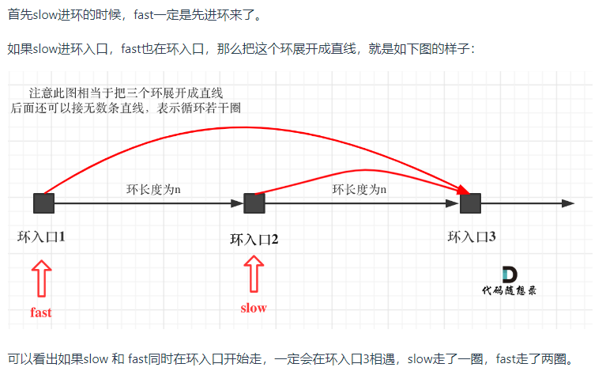
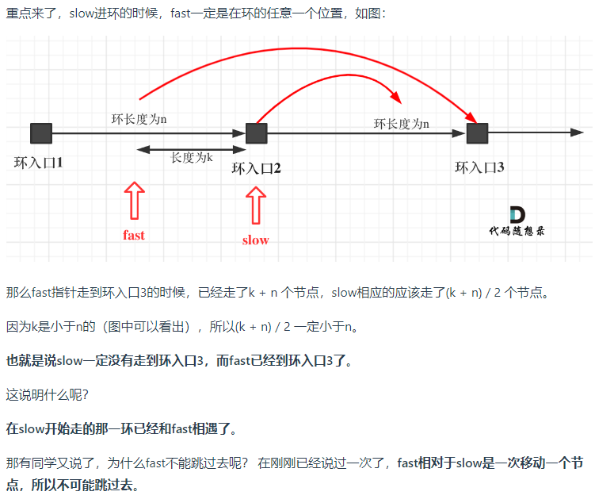
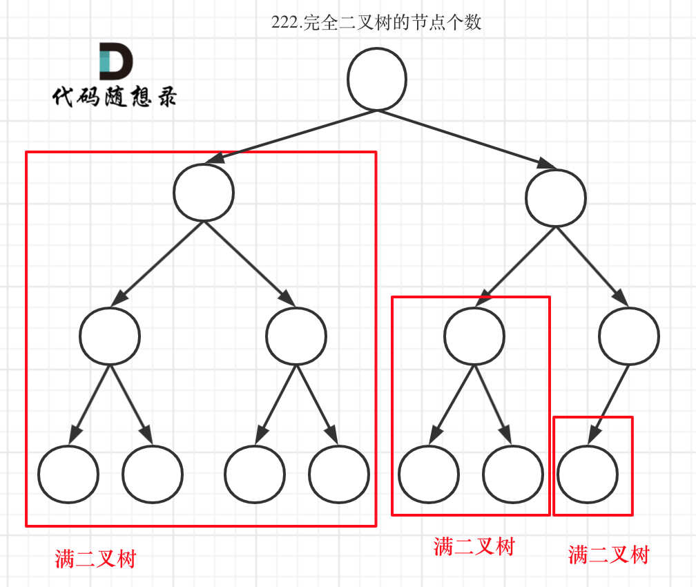
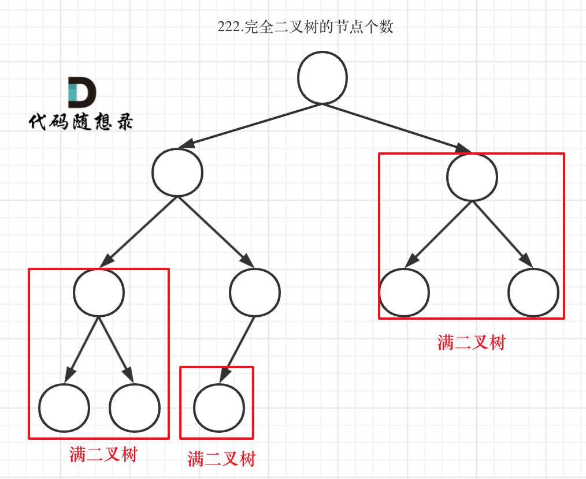
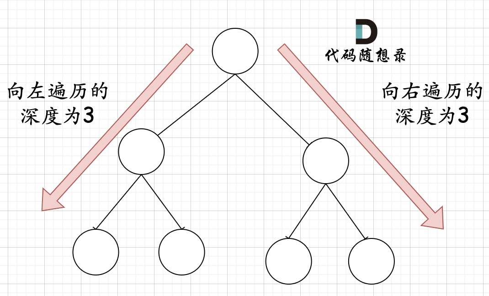
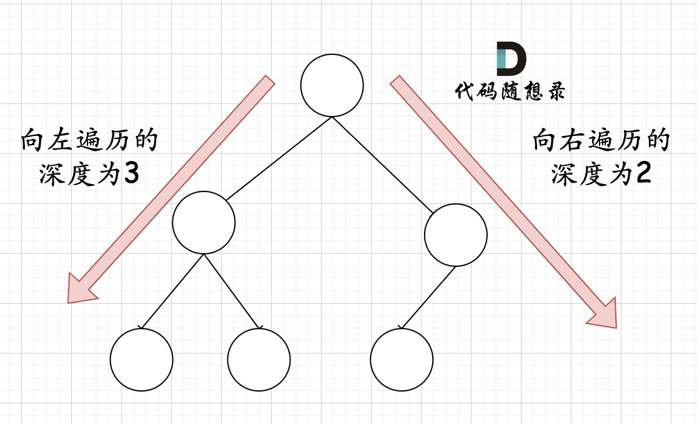
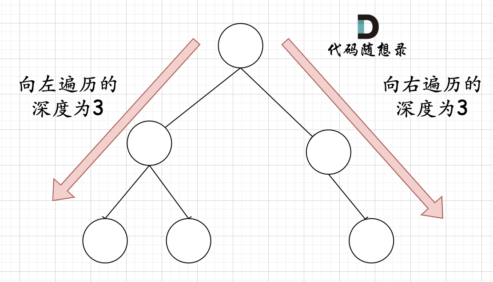
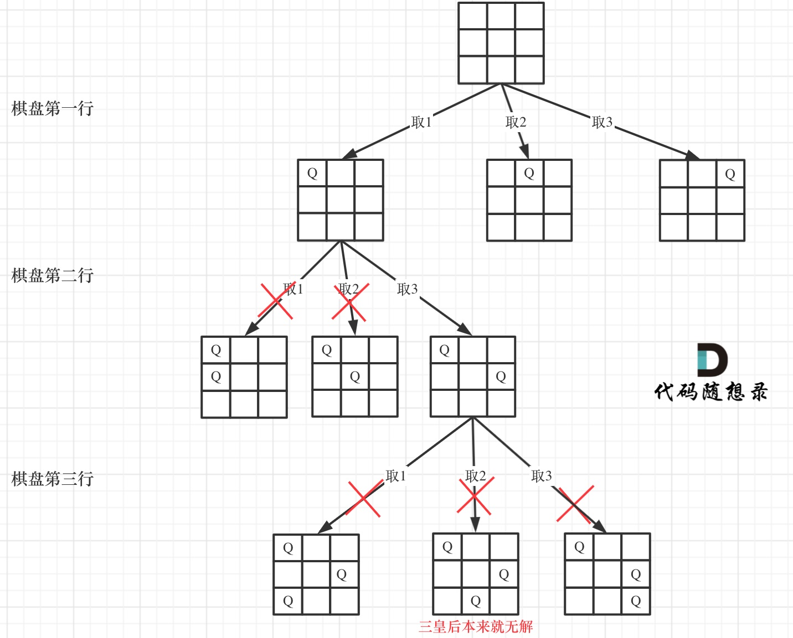
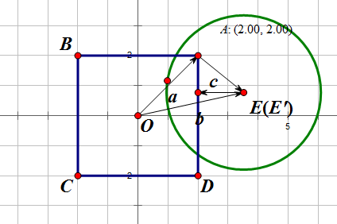

## 数组

### 二分法

```cpp
class Solution {
public:
    int search(vector<int>& nums, int target) {
        int left = 0;
        int right = nums.size() - 1; // 定义target在左闭右闭的区间里，[left, right]
        while (left <= right) { // 当left==right，区间[left, right]依然有效，所以用 <=
            int middle = left + ((right - left) / 2);// 防止溢出 等同于(left + right)/2
            if (nums[middle] > target) {
                right = middle - 1; // target 在左区间，所以[left, middle - 1]
            } else if (nums[middle] < target) {
                left = middle + 1; // target 在右区间，所以[middle + 1, right]
            } else { // nums[middle] == target
                return middle; // 数组中找到目标值，直接返回下标
            }
        }
        // 未找到目标值
        return -1;
    }
};
```

### 快慢指针

例：原地移除数组 nums 中的某个值

解：遍历 nums，nums[慢指针] = nums[快指针]

### 双指针

有些地方把快慢指针也称为双指针

我感觉虽然这么说也没错，但是快慢指针主要强调的是遍历同一个东西的步进策略有快有慢，双指针可能更多的是，比如虽然是遍历同一个东西，但是两个指针的作用完全不同，比如一个从后往前一个从前往后？

只是个人感觉

例：给定一个整数有序数组，包含负数和正数，返回他的每一个元素的平方构成的有序数组

解：双指针。两个指针分别指向原数组的头和尾，一个指针从前往后，另一个从后往前，对比所指元素的平方的大小，从后往前填到目标数组。

我有时候想，能不能相反地考虑，先找 0，然后双指针都从 0 出发，一个从 0 往左，一个往右，对比所指元素的平方的大小，从前往后填到目标数组。

### 滑动窗口

要找一个范围满足某一个条件的时候就用到

看上去跟快慢指针有点相似

但是这个思想更强调的是，你在维护一个区间，也就是窗口

有一题，最简单的时候排序之后从一端开始取一段区间

但是实际上滑动窗口遍历一遍就能完成

这题是：给定一个含有 n 个正整数的数组和一个正整数 s ，找出该数组中满足其和 ≥ s 的长度最小的 连续 子数组，并返回其长度。如果不存在符合条件的子数组，返回 0。

所以滑动窗口是 O(n) 的可能方法

### 统一原则启动自定义循环

题：给定一个正整数 n，生成一个包含 1 到 n^2 所有元素，且元素按顺时针顺序螺旋排列的正方形矩阵。

解：从 (0,0) 开始填充一圈，从 (1,1) 开始填充一圈，如此循环

一开始我还想着是，模拟一个人在不断走，只有一个大的 while，他只有一个 (0,0) 起点，然后应该只有四个规则来判断掉头

后来想想，在已经画了多层的情况下怎么判断掉头呢，或许是有点复杂

他这个，从不同的起点开始，每次只画一圈，思路就很清晰

## 链表

很多时候设计一个虚拟头节点会更方便

删除节点

设计链表

反转链表 改变每一个节点的 next 指向

两两交换链表中的节点

删除倒数第 n 个节点 快慢指针 快指针前走 n 步，然后快慢指针再同步走，直到快指针走到末尾，此时慢指针就指向了倒数第 n 个节点

链表相交 先得到两个链表的长度，然后快指针先走两个长度的差值

环形链表 

1) 判断是否有环

快慢指针，快指针每走两步，慢指针走一步

如果相遇，一定在环内，不然快指针一定先达到末尾

那么假设快慢指针都在环内，为什么他们能相遇？假设你不考虑他们指向的绝对位置，只看他们之间的相对位置，快指针是每次都靠近慢指针一步的，所以这样不断靠近，肯定是能相遇的

2) 如果有环，怎么找环的入口

假设从头结点到环形入口节点的节点数为 x。 环形入口节点到 fast 指针与 slow 指针相遇节点的节点数为 y。 从相遇节点再到环形入口节点的节点数为 z。

相遇时：slow 指针走过的节点数为: x + y， fast 指针走过的节点数：x + y + n (y + z)，n 为 fast 指针在环内走了 n 圈才遇到 slow 指针，（y+z）为一圈内节点的个数 A。

因为 fast 指针是一步走两个节点，slow 指针一步走一个节点， 所以 fast 指针走过的节点数 = slow 指针走过的节点数 * 2

(x + y) * 2 = x + y + n (y + z)

要求 x

上式转化为 x = (n - 1) * (y + z) + z

也就是，从头结点出发一个指针，从相遇节点也出发一个指针，这两个指针每次只走一个节点，那么当这两个指针相遇的时候就是环形入口的节点

补充：

这个确实要看图了





## 哈希表

### 重复出现

**当我们需要查询一个元素是否出现过，或者一个元素是否在集合里的时候，就要第一时间想到哈希法。**

题：有效的字母异位词

解：第一遍扫描源字符串，每个字符加入 map，key 为字符，value 为出现次数

但是这里，用数组作为 map 就好了！因为 ascii 字符天然地就顺序，或者说，**你在已知 key 的总体是什么样的时候，用数组来做映射更方便，也更便宜**

第二遍扫描目标字符串，从 map 中减去出现次数

最终出现 -1 或者不为 0 的次数，则不是异位词

题：两个数组的交集

解：unordered_set 获取在两个数组中都出现过的元素

题：快乐数

编写一个算法来判断一个数 n 是不是快乐数。

「快乐数」定义为：对于一个正整数，每一次将该数替换为它每个位置上的数字的平方和，然后重复这个过程直到这个数变为 1，也可能是 无限循环 但始终变不到 1。如果 可以变为  1，那么这个数就是快乐数。

如果 n 是快乐数就返回 True ；不是，则返回 False 。

示例：

输入：19

输出：true

解释：

1^2 + 9^2 = 82

8^2 + 2^2 = 68

6^2 + 8^2 = 100

1^2 + 0^2 + 0^2 = 1

解：关键是题目中说了会无限循环，那么也就是说求和的过程中，sum 会重复出现，这对解题很重要！

当我们遇到了要快速判断一个元素是否出现集合里的时候，就要考虑哈希法了。

题：两数之和

给定一个整数数组 nums 和一个目标值 target，请你在该数组中找出和为目标值的那 两个 整数，并返回他们的数组下标。

解：只遍历一遍数组，遍历的时候，先找 map 里面有没有 target - nums[i] 没有则把 nums[i] 加入

一开始我还想要不要遍历两次，第一次把所有的 nums[i] 加进去，第二次对每一个 nums[i] 找 target - nums[i]

其实没必要，一遍就好了，因为如果你找不到的话，直接加进 map 就好了，找数对这个事情，数对中的两个元素一定是一个先加入一个后找到的

### 确定一个数，剩下的数用双指针收缩

题：四数相加II

给定四个包含整数的数组列表 A , B , C , D ,计算有多少个元组 (i, j, k, l) ，使得 A[i] + B[j] + C[k] + D[l] = 0。

为了使问题简单化，所有的 A, B, C, D 具有相同的长度 N，且 0 ≤ N ≤ 500 。所有整数的范围在 -2^28 到 2^28 - 1 之间，最终结果不会超过 2^31 - 1 。

例如:

输入:

A = [ 1, 2]

B = [-2,-1]

C = [-1, 2]

D = [ 0, 2]

输出:

2

解释:

两个元组如下:

(0, 0, 0, 1) -> A[0] + B[0] + C[0] + D[1] = 1 + (-2) + (-1) + 2 = 0

(1, 1, 0, 0) -> A[1] + B[1] + C[0] + D[0] = 2 + (-1) + (-1) + 0 = 0

解：

首先定义一个 unordered_map，key 放 a 和 b 两数之和，value 放 a 和 b 两数之和出现的次数。

双层循环，遍历大A和大B数组，统计两个数组元素之和，和出现的次数，放到map中。

定义int变量count，用来统计 a+b+c+d = 0 出现的次数。

双层循环，遍历大C和大D数组，找到如果 0-(c+d) 在map中出现过的话，就用count把map中key对应的value也就是出现次数统计出来。

最后返回统计值 count 就可以了

这个不可避免的双层循环

题：三数之和

给你一个包含 n 个整数的数组 nums，判断 nums 中是否存在三个元素 a，b，c ，使得 a + b + c = 0 ？请你找出所有满足条件且不重复的三元组。

注意： 答案中不可以包含重复的三元组。

示例：

给定数组 nums = [-1, 0, 1, 2, -1, -4]，

满足要求的三元组集合为： [ [-1, 0, 1], [-1, -1, 2] ]

主要在于去重，这个我还真的没太懂

```cpp
class Solution {
public:
    vector<vector<int>> threeSum(vector<int>& nums) {
        vector<vector<int>> result;
        sort(nums.begin(), nums.end());
        // 找出a + b + c = 0
        // a = nums[i], b = nums[j], c = -(a + b)
        for (int i = 0; i < nums.size(); i++) {
            // 排序之后如果第一个元素已经大于零，那么不可能凑成三元组
            if (nums[i] > 0) {
                break;
            }
            if (i > 0 && nums[i] == nums[i - 1]) { //三元组元素a去重
                continue;
            }
            unordered_set<int> set;
            for (int j = i + 1; j < nums.size(); j++) {
                if (j > i + 2
                        && nums[j] == nums[j-1]
                        && nums[j-1] == nums[j-2]) { // 三元组元素b去重
                    continue;
                }
                int c = 0 - (nums[i] + nums[j]);
                if (set.find(c) != set.end()) {
                    result.push_back({nums[i], nums[j], c});
                    set.erase(c);// 三元组元素c去重
                } else {
                    set.insert(nums[j]);
                }
            }
        }
        return result;
    }
};
```

双指针解法也值得看：

首先将数组排序，然后有一层for循环，i从下标0的地方开始，同时定一个下标left 定义在i+1的位置上，定义下标right 在数组结尾的位置上。

依然还是在数组中找到 abc 使得a + b +c =0，我们这里相当于 a = nums[i]，b = nums[left]，c = nums[right]。

接下来如何移动left 和right呢， 如果nums[i] + nums[left] + nums[right] > 0 就说明 此时三数之和大了，因为数组是排序后了，所以right下标就应该向左移动，这样才能让三数之和小一些。

如果 nums[i] + nums[left] + nums[right] < 0 说明 此时 三数之和小了，left 就向右移动，才能让三数之和大一些，直到left与right相遇为止。

```cpp
class Solution {
public:
    vector<vector<int>> threeSum(vector<int>& nums) {
        vector<vector<int>> result;
        sort(nums.begin(), nums.end());
        // 找出a + b + c = 0
        // a = nums[i], b = nums[left], c = nums[right]
        for (int i = 0; i < nums.size(); i++) {
            // 排序之后如果第一个元素已经大于零，那么无论如何组合都不可能凑成三元组，直接返回结果就可以了
            if (nums[i] > 0) {
                return result;
            }
            // 错误去重a方法，将会漏掉-1,-1,2 这种情况
            /*
            if (nums[i] == nums[i + 1]) {
                continue;
            }
            */
            // 正确去重a方法
            if (i > 0 && nums[i] == nums[i - 1]) {
                continue;
            }
            int left = i + 1;
            int right = nums.size() - 1;
            while (right > left) {
                // 去重复逻辑如果放在这里，0，0，0 的情况，可能直接导致 right<=left 了，从而漏掉了 0,0,0 这种三元组
                /*
                while (right > left && nums[right] == nums[right - 1]) right--;
                while (right > left && nums[left] == nums[left + 1]) left++;
                */
                if (nums[i] + nums[left] + nums[right] > 0) right--;
                else if (nums[i] + nums[left] + nums[right] < 0) left++;
                else {
                    result.push_back(vector<int>{nums[i], nums[left], nums[right]});
                    // 去重逻辑应该放在找到一个三元组之后，对b 和 c去重
                    while (right > left && nums[right] == nums[right - 1]) right--;
                    while (right > left && nums[left] == nums[left + 1]) left++;

                    // 找到答案时，双指针同时收缩
                    right--;
                    left++;
                }
            }

        }
        return result;
    }
};
```

这个核心就是，先确定一个数 nums[i] 那么剩下的两个数就是用双指针收缩

细节好多：

https://programmercarl.com/0015.%E4%B8%89%E6%95%B0%E4%B9%8B%E5%92%8C.html#%E6%80%9D%E8%B7%AF

题：四数之和

题意：给定一个包含 n 个整数的数组 nums 和一个目标值 target，判断 nums 中是否存在四个元素 a，b，c 和 d ，使得 a + b + c + d 的值与 target 相等？找出所有满足条件且不重复的四元组。

注意：

答案中不可以包含重复的四元组。

示例： 给定数组 nums = [1, 0, -1, 0, -2, 2]，和 target = 0。 满足要求的四元组集合为： [ [-1, 0, 0, 1], [-2, -1, 1, 2], [-2, 0, 0, 2] ]

三数之和的双指针解法是一层for循环num[i]为确定值，然后循环内有left和right下标作为双指针，找到nums[i] + nums[left] + nums[right] == 0。

四数之和的双指针解法是两层for循环nums[k] + nums[i]为确定值，依然是循环内有left和right下标作为双指针，找出nums[k] + nums[i] + nums[left] + nums[right] == target的情况，三数之和的时间复杂度是O(n^2)，四数之和的时间复杂度是O(n^3) 。

那么一样的道理，五数之和、六数之和等等都采用这种解法。

## 字符串

题：反转字符串

解：双指针，一个从前往后，一个从后往前，两指针指向的字符互换

题：反转字符串II

题：替换数字

给定一个字符串 s，它包含小写字母和数字字符，请编写一个函数，将字符串中的字母字符保持不变，而将每个数字字符替换为number。

例如，对于输入字符串 "a1b2c3"，函数应该将其转换为 "anumberbnumbercnumber"。

对于输入字符串 "a5b"，函数应该将其转换为 "anumberb"

输入：一个字符串 s,s 仅包含小写字母和数字字符。

输出：打印一个新的字符串，其中每个数字字符都被替换为了number

样例输入：a1b2c3

样例输出：anumberbnumbercnumber

数据范围：1 <= s.length < 10000。

解：首先扩充字符串到每个数字字符替换成 "number" 之后的大小。

然后从后往前复制，遇到数字就复制 number，遇到字母就复制字母

**主要是这个，扩充字符串后，从后往前复制的，原地的思路**

### 重复利用反转函数

题：翻转字符串里的单词

给定一个字符串，逐个翻转字符串中的每个单词。

示例 1：

输入: "the sky is blue"

输出: "blue is sky the"

示例 2：

输入: "  hello world!  "

输出: "world! hello"

解释: 输入字符串可以在前面或者后面包含多余的空格，但是反转后的字符不能包括。

示例 3：

输入: "a good   example"

输出: "example good a"

解释: 如果两个单词间有多余的空格，将反转后单词间的空格减少到只含一个。

原地的思路：

移除多余空格

将整个字符串反转

将每个单词反转

题：右旋字符串

字符串的右旋转操作是把字符串尾部的若干个字符转移到字符串的前面。给定一个字符串 s 和一个正整数 k，请编写一个函数，将字符串中的后面 k 个字符移到字符串的前面，实现字符串的右旋转操作。

例如，对于输入字符串 "abcdefg" 和整数 2，函数应该将其转换为 "fgabcde"。

输入：输入共包含两行，第一行为一个正整数 k，代表右旋转的位数。第二行为字符串 s，代表需要旋转的字符串。

输出：输出共一行，为进行了右旋转操作后的字符串

解：

先整体反转一次，然后对前 k 个反转，剩下的反转

我感觉跟向量一样

已知 u,v，要得到 v,u

整体反转得到 vT, uT

两次局部反转之后得到 v, u

### KMP

## 双指针

题：移除元素 快慢指针

题：反转指针 两个指针，从前往后 从后往前

题：替换数字 扩展字符串，两个指针，从前往后 从后往前

题：翻转字符串里的单词 双指针移除多余的空格

题：反转链表 pre cur

题：删除链表的倒数第N个节点 fast 先移动 n 步

题：链表相交 经典快慢指针

题：环形链表II 经典快慢指针

题：三数之和 四数之和 固定第一个数（第一个数和第二个数之和），双指针收缩找剩下两个数

## 栈与队列

题：用栈实现队列

解：两个栈

入队，直接入栈到栈 1

主要是，在模拟出队的时候，不是从栈 2 出栈嘛

那就是，要从栈 1 把所有元素出栈后入栈到栈 2

但是可想而知，如果栈 2 里面有东西了，然后我再入队，那么这个时候，这个新元素该怎么放？

比如一开始入队了 1 2 3，现在把东西都搬到了栈 2

那么再入队 4，该怎么放到栈 2 的底部了？

实际上这是我想多了。输出栈如果为空，就把进栈数据全部导入进来（注意是全部导入），再从出栈弹出数据，如果输出栈不为空，则直接从出栈弹出数据就可以了。

题：用队列实现栈

做完“用栈实现队列”之后，会想着一个输入队列，一个输出队列，模拟栈的功能

仔细想确实不行

队列是先进先出的规则，把一个队列中的数据导入另一个队列中，数据的顺序并没有变，并没有变成先进后出的顺序。

答案依然还是要用两个队列来模拟栈，只不过没有输入和输出的关系，而是另一个队列完全用来备份的！

出栈的时候，把que1最后面的元素以外的元素都备份到que2，然后弹出最后面的元素，再把其他元素从que2导回que1。

优化：

只用一个队列

一个队列在模拟栈弹出元素的时候只要将队列头部的元素（除了最后一个元素外） 重新添加到队列尾部，此时再去弹出元素就是栈的顺序了。

题：有效的括号

题：删除字符串中的所有相邻重复项

题：逆波兰表达式求值

题：滑动窗口最大值

单调队列，维护滑动窗口内“可能成为最大值”的元素

求最大值，那么维护一个递减顺序的单调队列，队首最大

新的元素加入窗口的时候，如果队首比这个元素小，那么剩下的所有都比这个元素小，那么所有的元素都出队，然后把这个新的元素加进来

否则的话，为了维护单调性，就要判断队末尾的元素是不是大于新元素，大于才能把新的元素入队

每个时刻的滑动窗口最大值就是单调队列的队首

求滑动窗口最小值同理

题：前 K 个高频元素

先使用一个 map 统计各个元素的出现频率

然后找前 K 个大的频率

这里不用直接对所有频率排序，然后取后 K 个值，因为我们不需要这些信息

使用小顶堆，每次输出最小值，那么扔掉了 len - K 个最小值，剩下的就是 K 个最大值了

插入删除的时间复杂度都是 O(logK)，那么总共就是 O(nlogK) 

如果是对所有的频率排序，那么就是 O(nlogn) 就不好了

## 二叉树

### 二叉树的递归遍历

### 二叉树的迭代遍历

前序比较简单

```cpp
class Solution {
public:
    vector<int> preorderTraversal(TreeNode* root) {
        stack<TreeNode*> st;
        vector<int> result;
        if (root == NULL) return result;
        st.push(root);
        while (!st.empty()) {
            TreeNode* node = st.top();                       // 中
            st.pop();
            result.push_back(node->val);
            if (node->right) st.push(node->right);           // 右（空节点不入栈）
            if (node->left) st.push(node->left);             // 左（空节点不入栈）
        }
        return result;
    }
};
```

先加入 右孩子，再加入左孩子。因为这样出栈的时候才是中左右的顺序。

中序的话，入栈的顺序和访问顺序不一致，需要注意

```cpp
class Solution {
public:
    vector<int> inorderTraversal(TreeNode* root) {
        vector<int> result;
        stack<TreeNode*> st;
        TreeNode* cur = root;
        while (cur != NULL || !st.empty()) {
            if (cur != NULL) { // 指针来访问节点，访问到最底层
                st.push(cur); // 将访问的节点放进栈
                cur = cur->left;                // 左
            } else {
                cur = st.top(); // 从栈里弹出的数据，就是要处理的数据（放进result数组里的数据）
                st.pop();
                result.push_back(cur->val);     // 中
                cur = cur->right;               // 右
            }
        }
        return result;
    }
};
```

后序遍历就是对前序遍历反转一下

```cpp
class Solution {
public:
    vector<int> postorderTraversal(TreeNode* root) {
        stack<TreeNode*> st;
        vector<int> result;
        if (root == NULL) return result;
        st.push(root);
        while (!st.empty()) {
            TreeNode* node = st.top();
            st.pop();
            result.push_back(node->val);
            if (node->left) st.push(node->left); // 相对于前序遍历，这更改一下入栈顺序 （空节点不入栈）
            if (node->right) st.push(node->right); // 空节点不入栈
        }
        reverse(result.begin(), result.end()); // 将结果反转之后就是左右中的顺序了
        return result;
    }
};
```

### 二叉树的统一迭代法

还真搞不懂

### 层序遍历

```cpp
class Solution {
public:
    vector<vector<int>> levelOrder(TreeNode* root) {
        queue<TreeNode*> que;
        if (root != NULL) que.push(root);
        vector<vector<int>> result;
        while (!que.empty()) {
            int size = que.size();
            vector<int> vec;
            // 这里一定要使用固定大小size，不要使用que.size()，因为que.size是不断变化的
            for (int i = 0; i < size; i++) {
                TreeNode* node = que.front();
                que.pop();
                vec.push_back(node->val);
                if (node->left) que.push(node->left);
                if (node->right) que.push(node->right);
            }
            result.push_back(vec);
        }
        return result;
    }
};
```

102.二叉树的层序遍历(opens new window)

107.二叉树的层次遍历II(opens new window)

199.二叉树的右视图(opens new window)

637.二叉树的层平均值(opens new window)

429.N叉树的层序遍历(opens new window)

515.在每个树行中找最大值(opens new window)

116.填充每个节点的下一个右侧节点指针(opens new window)

117.填充每个节点的下一个右侧节点指针II(opens new window)

104.二叉树的最大深度(opens new window)

111.二叉树的最小深度

### 翻转二叉树

交换左右子树

也就是交换一下指针

前序遍历

### morris 遍历

线索树的一种应用

### 对称二叉树

同时遍历最顶层的根节点的左右子树

一个子树是左右中

另一个子树是右左中

```cpp
class Solution {
public:
    bool compare(TreeNode* left, TreeNode* right) {
        // 首先排除空节点的情况
        if (left == NULL && right != NULL) return false;
        else if (left != NULL && right == NULL) return false;
        else if (left == NULL && right == NULL) return true;
        // 排除了空节点，再排除数值不相同的情况
        else if (left->val != right->val) return false;

        // 此时就是：左右节点都不为空，且数值相同的情况
        // 此时才做递归，做下一层的判断
        bool outside = compare(left->left, right->right);   // 左子树：左、 右子树：右
        bool inside = compare(left->right, right->left);    // 左子树：右、 右子树：左
        bool isSame = outside && inside;                    // 左子树：中、 右子树：中 （逻辑处理）
        return isSame;

    }
    bool isSymmetric(TreeNode* root) {
        if (root == NULL) return true;
        return compare(root->left, root->right);
    }
};
```

### 最大深度最小深度

### 完全二叉树的节点个数

按照普通二叉树来做，就迭代

按照完全二叉树的性质

完全二叉树只有两种情况，情况一：就是满二叉树，情况二：最后一层叶子节点没有满。

对于情况一，可以直接用 2^树深度 - 1 来计算，注意这里根节点深度为1。

对于情况二，分别递归左孩子，和右孩子，递归到某一深度一定会有左孩子或者右孩子为满二叉树，然后依然可以按照情况1来计算。

情况一



情况二



可以看出如果整个树不是满二叉树，就递归其左右孩子，直到遇到满二叉树为止，用公式计算这个子树（满二叉树）的节点数量。

这里关键在于如何去判断一个左子树或者右子树是不是满二叉树呢？

在完全二叉树中，如果递归向左遍历的深度等于递归向右遍历的深度，那说明就是满二叉树。

如图



在完全二叉树中，如果递归向左遍历的深度不等于递归向右遍历的深度，则说明不是满二叉树，如图：



不可能出现别的情况，比如



这种情况不是完全二叉树

```cpp
class Solution {
public:
    int countNodes(TreeNode* root) {
        if (root == nullptr) return 0;
        TreeNode* left = root->left;
        TreeNode* right = root->right;
        int leftDepth = 0, rightDepth = 0; // 这里初始为0是有目的的，为了下面求指数方便
        while (left) {  // 求左子树深度
            left = left->left;
            leftDepth++;
        }
        while (right) { // 求右子树深度
            right = right->right;
            rightDepth++;
        }
        if (leftDepth == rightDepth) {
            return (2 << leftDepth) - 1; // 注意(2<<1) 相当于2^2，所以leftDepth初始为0
        }
        return countNodes(root->left) + countNodes(root->right) + 1;
    }
};
```

### 平衡二叉树

### 二叉树的所有路径

### 左叶子之和

判断当前节点是不是左叶子是无法判断的，必须要通过节点的父节点来判断其左孩子是不是左叶子

### 找树左下角的值

### 路径总和

### 从中序与后序遍历序列构造二叉树

### 最大二叉树

### 合并二叉树

### 二叉搜索树中的搜索

### 验证二叉搜索树

不能单纯的比较左节点小于中间节点，右节点大于中间节点就完事了，而是左子树都小于中间节点，右子树都大于中间节点。

### 二叉搜索树的最小绝对差

可以把二叉搜索树转化成数组，或者是在递归二叉搜索树的过程中记录前一个指针 prev，然后和当前指针 curr 做差

### 二叉搜索树中的众数

仍然用到 prev 和 curr

对当前值，判断 prev 和 curr 是不是相等，相等则 count++

count 如果等于 maxCount，那么把当前值加入 result

count 如果大于 maxCount，那么先清空 result，因为旧的 result 没有用了；再把当前值加入 result

遇到新的值，清零 count

因为二叉搜索树中序遍历是有序的，所以同一个值只会被我们连续遍历到一次，所以清空 count 无所谓

### 二叉树的最近公共祖先

感觉看别人的分析很复杂……

我觉得还是按照我自己的想法把

就是，一开始处理空指针

然后就想，如果找到了怎么办

如果都没有找到，那么怎么返回

之类的

```cpp
/**
 * Definition for a binary tree node.
 * struct TreeNode {
 *     int val;
 *     TreeNode *left;
 *     TreeNode *right;
 *     TreeNode(int x) : val(x), left(NULL), right(NULL) {}
 * };
 */
class Solution {
public:
    TreeNode* lowestCommonAncestor(TreeNode* root, TreeNode* p, TreeNode* q) {
        if(root == nullptr){
            return nullptr;
        }

        if(root == p){
            return p;
        }

        if(root == q){
            return q;
        }

        TreeNode* left_result = lowestCommonAncestor(root->left, p, q);
        TreeNode* right_result = lowestCommonAncestor(root->right, p, q);

        if(left_result == nullptr && right_result == nullptr){
            return nullptr;
        }

        if(left_result != nullptr && right_result != nullptr){
            return root;
        }

        if(left_result != nullptr){
            return left_result;
        }

        if(right_result != nullptr){
            return right_result;
        }

        return nullptr;
    }
};
```

### 二叉搜索树的最近公共祖先

如果当前节点的值在 p 与 q 之间，并且是我抵达的深度最浅的地方，那么他就肯定是公共祖先

### 二叉搜索树中的插入操作

不选择重构二叉树的方式，而是使用插入到空节点的方式

### 删除二叉搜索树中的节点

第一种情况：没找到删除的节点，遍历到空节点直接返回了

找到删除的节点

第二种情况：左右孩子都为空（叶子节点），直接删除节点， 返回NULL为根节点

第三种情况：删除节点的左孩子为空，右孩子不为空，删除节点，右孩子补位，返回右孩子为根节点

第四种情况：删除节点的右孩子为空，左孩子不为空，删除节点，左孩子补位，返回左孩子为根节点

第五种情况：左右孩子节点都不为空，则将删除节点的左子树头结点（左孩子）放到删除节点的右子树的最左面节点的左孩子上，返回删除节点右孩子为新的根节点。

### 修剪二叉搜索树

### 将有序数组转换为二叉搜索树

### 把二叉搜索树转换为累加树

## 回溯

组合问题：N个数里面按一定规则找出k个数的集合

切割问题：一个字符串按一定规则有几种切割方式

子集问题：一个N个数的集合里有多少符合条件的子集

排列问题：N个数按一定规则全排列，有几种排列方式

棋盘问题：N皇后，解数独等等

回溯法解决的问题都可以抽象为树形结构

### 组合

给定两个整数 n 和 k，返回 1 ... n 中所有可能的 k 个数的组合。

示例: 输入: n = 4, k = 2 输出: [ [2,4], [3,4], [2,3], [1,2], [1,3], [1,4], ]

解：

因为 k 个数的组合，这个 k 是不确定的，所以虽然最直接的做法是 k 层循环，但是循环的个数不确定

把这个额问题转化成路径的问题

选一个数 i 出发，剩下的路口是 i + 1 到 n

```cpp
class Solution {
public:
    vector<vector<int>> ans;
    vector<int> path;

    void backtracing(int n, int k, int start){
        if(k == 0){
            ans.push_back(path);
            return;
        }

        for(int i = start; i <= n; i++){
            path.push_back(i);
            backtracing(n, k-1, i+1);
            path.pop_back();
        }
    }

    vector<vector<int>> combine(int n, int k) {
        backtracing(n, k, 1);

        return ans;
    }
};
```

核心点我觉得是，有一个核心的状态 `path`，然后你可以在递归的时候修改它，在回溯的时候恢复他

题：组合总和III

找出所有相加之和为 n 的 k 个数的组合。组合中只允许含有 1 - 9 的正整数，并且每种组合中不存在重复的数字。

说明：

所有数字都是正整数。

解集不能包含重复的组合。

示例 1: 输入: k = 3, n = 7 输出: [[1,2,4]]

示例 2: 输入: k = 3, n = 9 输出: [[1,2,6], [1,3,5], [2,3,4]]

跟上一题差不多

题：电话号码的字母组合

题：组合总和

给定一个无重复元素的数组 candidates 和一个目标数 target ，找出 candidates 中所有可以使数字和为 target 的组合。

candidates 中的数字可以无限制重复被选取。

说明：

所有数字（包括 target）都是正整数。

解集不能包含重复的组合。

示例 1：

输入：candidates = [2,3,6,7], target = 7,

所求解集为： [ [7], [2,2,3] ]

示例 2：

输入：candidates = [2,3,5], target = 8,

所求解集为： [ [2,2,2,2], [2,3,3], [3,5] ]

解：

组合总和的变体

只是限制了路径上能取的值，思路上是一样的

题：组合总和II

给定一个数组 candidates 和一个目标数 target ，找出 candidates 中所有可以使数字和为 target 的组合。

candidates 中的每个数字在每个组合中只能使用一次。

说明： 所有数字（包括目标数）都是正整数。解集不能包含重复的组合。

题：分割回文串

把切割问题视为组合问题

从 start 到 i 这个子串，如果是回文，就是一种递归的情况

题：复原IP地址

分割回文串的变体，前者是判断，如果子串是回文，那么递归，现在是判断，如果子串是一个满足 0 到 255 的，两位或三位时不是以 0 开头的数字，那么就是满足 IP 地址格式的，那么就递归

题：子集

给定一组不含重复元素的整数数组 nums，返回该数组所有可能的子集（幂集）。

说明：解集不能包含重复的子集。

示例: 输入: nums = [1,2,3] 输出: [ [3],   [1],   [2],   [1,2,3],   [1,3],   [2,3],   [1,2],   [] ]

如果把 子集问题、组合问题、分割问题都抽象为一棵树的话，那么组合问题和分割问题都是收集树的叶子节点，而子集问题是找树的所有节点！

题：子集II

给定一个可能包含重复元素的整数数组 nums，返回该数组所有可能的子集（幂集）。

说明：解集不能包含重复的子集。

示例:

输入: [1,2,2]

输出: [ [2], [1], [1,2,2], [2,2], [1,2], [] ]

解：

先对元素进行排序，这样我们才方便通过相邻的节点来判断是否重复使用了。

同一树层上不能取值相同的两个元素

而不同树层，或者说是，某一个路径上，可以取值相同的两个元素

题：递增子序列

给定一个整型数组, 你的任务是找到所有该数组的递增子序列，递增子序列的长度至少是2。

示例:

输入: [4, 6, 7, 7]

输出: [[4, 6], [4, 7], [4, 6, 7], [4, 6, 7, 7], [6, 7], [6, 7, 7], [7,7], [4,7,7]]

说明:

给定数组的长度不会超过15。

数组中的整数范围是 [-100,100]。

给定数组中可能包含重复数字，相等的数字应该被视为递增的一种情况

解：

之前都是在取路径

现在，这里的路径就是相当于递增子序列

只是这个序列有递增的要求

题：全排列

给定一个 没有重复 数字的序列，返回其所有可能的全排列。

示例:

输入: [1,2,3]

输出: [ [1,2,3], [1,3,2], [2,1,3], [2,3,1], [3,1,2], [3,2,1] ]

解：

最简单的返回所有路径嘛！

题：全排列 II

给定一个可包含重复数字的序列 nums ，按任意顺序 返回所有不重复的全排列。

示例 1：

输入：nums = [1,1,2]

输出： [[1,1,2], [1,2,1], [2,1,1]]

示例 2：

输入：nums = [1,2,3]

输出：[[1,2,3],[1,3,2],[2,1,3],[2,3,1],[3,1,2],[3,2,1]]

提示：

1 <= nums.length <= 8

-10 <= nums[i] <= 10

解：

跟之前的一样

先对元素进行排序，这样我们才方便通过相邻的节点来判断是否重复使用了。

同一树层上不能取值相同的两个元素

而不同树层，或者说是，某一个路径上，可以取值相同的两个元素

题：重新安排行程

给定一个机票的字符串二维数组 [from, to]，子数组中的两个成员分别表示飞机出发和降落的机场地点，对该行程进行重新规划排序。所有这些机票都属于一个从 JFK（肯尼迪国际机场）出发的先生，所以该行程必须从 JFK 开始。

提示：

如果存在多种有效的行程，请你按字符自然排序返回最小的行程组合。例如，行程 ["JFK", "LGA"] 与 ["JFK", "LGB"] 相比就更小，排序更靠前

所有的机场都用三个大写字母表示（机场代码）。

假定所有机票至少存在一种合理的行程。

所有的机票必须都用一次 且 只能用一次。

示例 1：

输入：[["MUC", "LHR"], ["JFK", "MUC"], ["SFO", "SJC"], ["LHR", "SFO"]]

输出：["JFK", "MUC", "LHR", "SFO", "SJC"]

示例 2：

输入：[["JFK","SFO"],["JFK","ATL"],["SFO","ATL"],["ATL","JFK"],["ATL","SFO"]]

输出：["JFK","ATL","JFK","SFO","ATL","SFO"]

解释：另一种有效的行程是 ["JFK","SFO","ATL","JFK","ATL","SFO"]。但是它自然排序更大更靠后。

解：

现在构成路径的条件是机票相连

其实就是 <1, 2> 与 <2, 4> 这个中间的东西要匹配

用 `unordered_map<出发机场, map<到达机场, 航班次数>> targets` 表示机场是否被使用过了

题：N 皇后

皇后的走法是：可以横直斜走，格数不限。

如何将 n 个皇后放置在 n×n 的棋盘上，并且使皇后彼此之间不能相互攻击。

给你一个整数 n ，返回所有不同的 n 皇后问题 的解决方案。

每一种解法包含一个不同的 n 皇后问题 的棋子放置方案，该方案中 'Q' 和 '.' 分别代表了皇后和空位。

解：

将搜索过程抽象为一棵树



## 计算机图形学

### 检测圆与矩形相交的快速判定算法

首先，对于矩形来说，将坐标系原点移到矩形的中心，并且将从原点到第一象限的顶点的向量a求出来。


其次，无论圆心E在哪一个象限，都将其通过轴对称转换到第一象限，并且求出原点到转换后的圆心E′的向量b。


接下来是最关键的一步：算出A到E′的向量c，并且把向量c中的负值全部置为0，得到最终的向量c。

为什么这么做呢？这个做法的隐含的意义是，当 c 中的分量都是正值的时候，就和矩形的这个顶点来比较

当 c 中的分量有一个是负值的时候，就和矩形的某一个边比较。

1) 两个分量都大于 0


2) x 分量小于 0


相当于与横边比较

3) y 分量小于 0



相当于与竖边比较

4) 两个分量都小于 0

那就说明圆心一定在正方形内了

> 这个相交检测，或许是称为重叠检测更合适？因为假设一个正方形很大，圆在它的内部，也会被判断为 c 的两个分量都小于 0，都被赋 0

最终只要比较半径r与向量c的模长的大小即可，如果需要在代码中实现，则无需开方。

若c<r，则圆与矩形相交。

若c=r，则圆与矩形相切。

否则二者相离。

```cpp
bool Intersection(float2 c, float2 h, float2 p, float r) 
{
    float2 v = abs(p - c); 
    float2 u = max(v - h, 0); 
    return dot(u, u) < r * r; 
} 
```