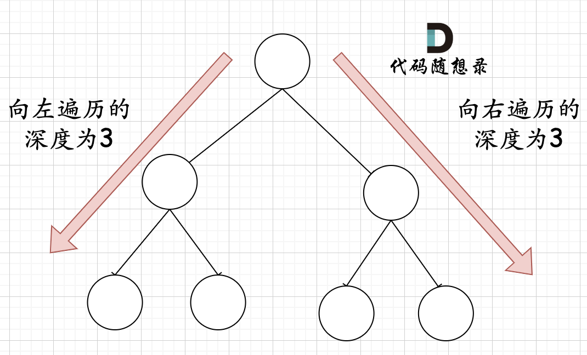

- [答题网站](#答题网站)
- [复杂度](#复杂度)
  - [时间复杂度](#时间复杂度)
  - [根据时间复杂度反推数据结构与算法](#根据时间复杂度反推数据结构与算法)
  - [空间复杂度](#空间复杂度)
- [数组](#数组)
  - [topK，分别写出范围小、范围大、范围超大（说思路）的情况](#topk分别写出范围小范围大范围超大说思路的情况)
  - [二分法](#二分法)
  - [快慢指针](#快慢指针)
  - [双指针](#双指针)
  - [滑动窗口](#滑动窗口)
  - [模拟题，在表面的逻辑中找到更方便写代码的，更有规律的逻辑](#模拟题在表面的逻辑中找到更方便写代码的更有规律的逻辑)
  - [前缀和与差分](#前缀和与差分)
    - [一维前缀和](#一维前缀和)
    - [二维前缀和](#二维前缀和)
    - [一维差分](#一维差分)
- [链表](#链表)
- [哈希表](#哈希表)
  - [重复出现](#重复出现)
  - [一次性求解困难，分步求解](#一次性求解困难分步求解)
  - [尝试使用排序来简化复杂问题](#尝试使用排序来简化复杂问题)
  - [双指针去寻找一个近似满足条件的区间，类似对滑动区间的要求](#双指针去寻找一个近似满足条件的区间类似对滑动区间的要求)
  - [外层确定基准，内层查找](#外层确定基准内层查找)
- [字符串](#字符串)
  - [重复利用反转函数](#重复利用反转函数)
  - [KMP](#kmp)
- [双指针](#双指针-1)
- [栈与队列](#栈与队列)
- [二叉树](#二叉树)
  - [数量关系](#数量关系)
  - [二叉树的递归遍历](#二叉树的递归遍历)
  - [二叉树的迭代遍历](#二叉树的迭代遍历)
  - [二叉树的统一迭代法](#二叉树的统一迭代法)
  - [层序遍历](#层序遍历)
  - [翻转二叉树](#翻转二叉树)
  - [morris 遍历](#morris-遍历)
  - [对称二叉树](#对称二叉树)
  - [最大深度最小深度](#最大深度最小深度)
  - [完全二叉树的节点个数](#完全二叉树的节点个数)
  - [平衡二叉树](#平衡二叉树)
  - [二叉树的所有路径](#二叉树的所有路径)
  - [左叶子之和](#左叶子之和)
  - [找树左下角的值](#找树左下角的值)
  - [路径总和](#路径总和)
  - [从中序与后序遍历序列构造二叉树](#从中序与后序遍历序列构造二叉树)
  - [最大二叉树](#最大二叉树)
  - [合并二叉树](#合并二叉树)
  - [二叉搜索树中的搜索](#二叉搜索树中的搜索)
  - [验证二叉搜索树](#验证二叉搜索树)
  - [二叉搜索树的最小绝对差](#二叉搜索树的最小绝对差)
  - [二叉搜索树中的众数](#二叉搜索树中的众数)
  - [二叉树的最近公共祖先](#二叉树的最近公共祖先)
  - [二叉搜索树的最近公共祖先](#二叉搜索树的最近公共祖先)
  - [二叉搜索树中的插入操作](#二叉搜索树中的插入操作)
  - [删除二叉搜索树中的节点](#删除二叉搜索树中的节点)
  - [修剪二叉搜索树](#修剪二叉搜索树)
  - [将有序数组转换为二叉搜索树](#将有序数组转换为二叉搜索树)
  - [把二叉搜索树转换为累加树](#把二叉搜索树转换为累加树)
- [并查集](#并查集)
  - [原理](#原理)
  - [模板](#模板)
  - [优化1：避免退化](#优化1避免退化)
  - [优化2：压缩路径](#优化2压缩路径)
- [回溯](#回溯)
  - [组合](#组合)
- [贪心](#贪心)
  - [基础](#基础)
    - [分发饼干](#分发饼干)
    - [摆动序列](#摆动序列)
    - [最大子序和](#最大子序和)
    - [买卖股票的最佳时机 II](#买卖股票的最佳时机-ii)
    - [跳跃游戏](#跳跃游戏)
    - [跳跃游戏 II](#跳跃游戏-ii)
    - [K次取反后最大化的数组和](#k次取反后最大化的数组和)
    - [加油站](#加油站)
    - [拆开具有独立性的规则](#拆开具有独立性的规则)
    - [柠檬水找零](#柠檬水找零)
    - [根据身高重建队列](#根据身高重建队列)
    - [用最少数量的箭引爆气球](#用最少数量的箭引爆气球)
- [动态规划](#动态规划)
  - [基础](#基础-1)
    - [斐波那契数](#斐波那契数)
    - [爬楼梯](#爬楼梯)
    - [使用最小花费爬楼梯](#使用最小花费爬楼梯)
    - [不同路径](#不同路径)
    - [不同路径 II](#不同路径-ii)
    - [整数拆分](#整数拆分)
    - [不同的二叉搜索树](#不同的二叉搜索树)
  - [旅行商问题](#旅行商问题)
    - [动态规划 + 状态压缩](#动态规划--状态压缩)
  - [背包](#背包)
    - [01 背包](#01-背包)
    - [背包 二维数组压缩成一维（滚动数组）](#背包-二维数组压缩成一维滚动数组)
    - [同时存在多个背包，但是只需要判断是否能装满其中一个背包](#同时存在多个背包但是只需要判断是否能装满其中一个背包)
    - [同时存在多个背包，尽可能均等装满各个背包](#同时存在多个背包尽可能均等装满各个背包)
  - [用一个动规状态表示一定选 i 时候的一个区间中的最优结果](#用一个动规状态表示一定选-i-时候的一个区间中的最优结果)
    - [最长递增子序列](#最长递增子序列)
    - [无重叠区间](#无重叠区间)
    - [最长数对链](#最长数对链)
    - [用最少数量的箭引爆气球](#用最少数量的箭引爆气球-1)
  - [多个维度的问题，固定其中一个维度，与怎么避免忽略了其中一个维度导致的重复问题](#多个维度的问题固定其中一个维度与怎么避免忽略了其中一个维度导致的重复问题)
    - [俄罗斯套娃信封问题](#俄罗斯套娃信封问题)
    - [堆箱子](#堆箱子)
  - [树形 DP](#树形-dp)
    - [子树大小](#子树大小)
    - [树的平衡点](#树的平衡点)
    - [树的最大独立集](#树的最大独立集)
    - [树的最小点覆盖](#树的最小点覆盖)
    - [树的最小支配集](#树的最小支配集)
- [单调栈](#单调栈)
  - [每日温度](#每日温度)
  - [下一个更大元素 I](#下一个更大元素-i)
  - [下一个更大元素II](#下一个更大元素ii)
  - [接雨水](#接雨水)
  - [柱状图中最大的矩形](#柱状图中最大的矩形)
- [图论](#图论)
  - [最小生成树](#最小生成树)
  - [最短路径](#最短路径)
  - [DFS,BFS](#dfsbfs)
    - [所有可达路径](#所有可达路径)
    - [岛屿数量](#岛屿数量)
    - [对偶问题：从边界出发而不是从点触发](#对偶问题从边界出发而不是从点触发)
    - [就地存储辅助信息](#就地存储辅助信息)
- [概率](#概率)
  - [线性规划](#线性规划)
  - [rand5() 实现 rand3(), rand5() 实现 rand7()](#rand5-实现-rand3-rand5-实现-rand7)
- [其他](#其他)
  - [超大型整数，数据结构如何设计？相加溢出怎么处理？](#超大型整数数据结构如何设计相加溢出怎么处理)
- [数据结构](#数据结构)
  - [建堆的时间复杂度是O(N)](#建堆的时间复杂度是on)
- [蓝眼睛的人](#蓝眼睛的人)

## 答题网站

[https://programmercarl.com](https://programmercarl.com)

## 复杂度

### 时间复杂度

计算机 1s 约 `10^7~10^8` 次操作，因此我们需要把程序执行的最大次数控制在这个区间，一般控制在 `3*10^7` 较为安全

例如，如果数据量为 `10^5`，那么就不能设计 `O(n^2)` 的算法

`log_2(10)` 约等于 3

### 根据时间复杂度反推数据结构与算法

1.n <= 20

`O(2^n)`: 暴力法、枚举法、DFS 时间复杂度

2.n <= 100

`O(n^3)`: 暴力法、二维前缀和、动态规划

3.n <= 10^5

`O(n)` 或 `O(nlogn)`：堆（优先队列）、排序、动态规划、树状数组、堆优化版 dijkstra、二分查找、二分答案、质数筛

4.n <= 10^9

`O(sqrt(n))` 或 `O(logn)`：判断质数、因子个数计算、二分答案、快速幂、最大公约数

5.n < 10^1000

`O(logn)` 或 `O((logn)^2)`：数位 dp

### 空间复杂度

一般内存要求 `64MB`

int `4B`，因此可以申请 `64*2^20/4=2^24` 长度的空间，近似为 `10^7`

一般申请一维数组的长度不超过 `5*10^6`，二维数组的长度不超过 `3*10^3`

## 数组

### topK，分别写出范围小、范围大、范围超大（说思路）的情况

1.范围小：直接排序

2.范围大：小顶堆

小顶堆是，父节点小于叶节点，所以如果堆里面存的是前 k 大的数的话，那么只要堆顶存的是前 k 大的数中的最小值的话，那么只要维护这个值，就可以使得堆里面一直是前 k 大

所以只要遍历 N 个数据，将元素依次加入堆中：

若堆大小小于 K，则直接加入。

若堆已满，且新元素比堆顶大，则替换堆顶并重新调整堆。

最终，堆中存的就是前 K 大的元素。

3.范围超大

无法全部存入内存，外部排序，也就是，分割文件，然后各个部分单独 topK 排序，排序结果输出为文件，最后再收集所有的 topK 排序结果再做一次 topK 就好了

### 二分法

```cpp
class Solution {
public:
    int search(vector<int>& nums, int target) {
        int left = 0;
        int right = nums.size() - 1; // 定义target在左闭右闭的区间里，[left, right]
        while (left <= right) { // 当left==right，区间[left, right]依然有效，所以用 <=
            int middle = left + ((right - left) / 2);// 防止溢出 等同于(left + right)/2
            if (nums[middle] > target) {
                right = middle - 1; // target 在左区间，所以[left, middle - 1]
            } else if (nums[middle] < target) {
                left = middle + 1; // target 在右区间，所以[middle + 1, right]
            } else { // nums[middle] == target
                return middle; // 数组中找到目标值，直接返回下标
            }
        }
        // 未找到目标值
        return -1;
    }
};
```

### 快慢指针

例：原地移除数组 nums 中的某个值

解：

慢指针：指向下一个有效元素的位置。

快指针：遍历数组，检查当前元素是否需要保留。

遍历 nums，nums[慢指针] = nums[快指针]

### 双指针

有些地方把快慢指针也称为双指针

我感觉虽然这么说也没错，但是快慢指针主要强调的是遍历同一个东西的步进策略有快有慢

双指针可能更多的是，比如虽然是遍历同一个东西，但是两个指针的作用完全不同，比如一个从后往前一个从前往后？

只是个人感觉

例：给定一个整数有序数组，包含负数和正数，返回他的每一个元素的平方构成的有序数组

解：双指针。两个指针分别指向原数组的头和尾，一个指针从前往后，另一个从后往前，对比所指元素的平方的大小，从后往前填到目标数组。

我有时候想，能不能相反地考虑，先找 0，然后双指针都从 0 出发，一个从 0 往左，一个往右，对比所指元素的平方的大小，从前往后填到目标数组。

### 滑动窗口

要找一个范围满足某一个条件的时候就用到

看上去跟快慢指针有点相似

但是这个思想更强调的是，你在维护一个区间，也就是窗口

有一题，最简单的方法是排序之后从一端开始取一段区间

但是实际上滑动窗口遍历一遍就能完成

这题是：给定一个含有 n 个正整数的数组和一个正整数 s ，找出该数组中满足其和 ≥ s 的长度最小的 连续 子数组，并返回其长度。如果不存在符合条件的子数组，返回 0。

这就是维护一个始终满足条件的滑动窗口

因为要求长度最小，所以窗口向右滑动的时候，左侧边界像弹簧那样收缩

因为窗口是滑动的，所以只要每次都收缩到最佳值，那么一定遍历了整个求解空间

滑动窗口是 O(n) 的可能方法

### 模拟题，在表面的逻辑中找到更方便写代码的，更有规律的逻辑

题：给定一个正整数 n，生成一个包含 1 到 n^2 所有元素，且元素按顺时针顺序螺旋排列的正方形矩阵。

解：从 (0,0) 开始填充一圈，从 (1,1) 开始填充一圈，如此循环

一开始我还想着是，模拟一个人在不断走，只有一个大的 while，他只有一个 (0,0) 起点，然后应该只有四个规则来判断掉头

后来想想，在已经画了多层的情况下怎么判断掉头呢，或许是有点复杂

他这个，从不同的起点开始，每次只画一圈，思路就很清晰

因为是它可以观察到隐藏的规律


如果你直接看蛇形的话就会发现转折点都是掉头，于是似乎想要做一个掉头逻辑

但是这只是表面上的逻辑

还可以我们自定义一个逻辑，比如我们看对角线上的点，我们就发现这很简单，一定是掉头之后的第一个位置嘛

之后就简单了

所以就是需要在表面的逻辑中找到更方便写代码的，更有规律的逻辑

### 前缀和与差分

前缀和是指某序列的前n项和，可以把它理解为数学上的数列的前n项和，而差分可以看成前缀和的逆运算。

若 a数组是b数组的前缀和数组，反过来我们把b数组叫做a数组的差分数组

合理的使用前缀和与差分，可以将某些复杂的问题简单化。

#### 一维前缀和

题目：输入一个长度为n的整数序列。接下来再输入m个询问，每个询问输入一对l, r。对于每个询问，输出原序列中从第l个数到第r个数的和。

暴力解法，遍历区间求和，时间复杂度 O(mn)

前缀和解法：

首先做一个预处理，定义一个sum[]数组，sum[i]代表a数组中前i个数的和。

对于每次查询，只需执行sum[r] - sum[l - 1] ，时间复杂度为O(1)

#### 二维前缀和

题目：输入一个n行m列的整数矩阵，再输入q个询问，每个询问包含四个整数x1, y1, x2, y2，表示一个子矩阵的左上角坐标和右下角坐标。对于每个询问输出子矩阵中所有数的和。


整个外围蓝色矩形面积s[i][j] = 绿色面积s[i - 1][j] + 紫色面积s[i][j - 1] - 重复加的红色的面积s[i - 1][j - 1] + 小方块的面积a[i][j]

因此得出二维前缀和预处理公式

s[i][j] = s[i - 1][j] + s[i][j - 1 ] + a[i] [j] - s[i - 1][j - 1]

找右下角的子矩阵的和是类似的思路

#### 一维差分

若 a数组是b数组的前缀和数组，反过来我们把b数组叫做a数组的差分数组

给定一个 a 数组，怎么获得他的差分数组？

```
a[0]= 0;

b[1] = a[1] - a[0];

b[2] = a[2] - a[1];

b[3] = a [3] - a[2];

...

b[n] = a[n] - a[n - 1];
```

从构造过程上看就是差分

可见，从原数组执行差分得到差分数组，或者是从差分数组执行前缀和得到原数组，都是 O(n)

那么对差分数组的单独一个元素做修改，其实是会影响到原数组中对应位置**之后**的所有元素的

后面懒得看了

## 链表

很多时候设计一个虚拟头节点会更方便

删除节点

设计链表

反转链表 改变每一个节点的 next 指向

两两交换链表中的节点

删除倒数第 n 个节点 快慢指针 快指针前走 n 步，然后快慢指针再同步走，直到快指针走到末尾，此时慢指针就指向了倒数第 n 个节点

链表相交 先得到两个链表的长度，然后快指针先走两个长度的差值

环形链表 

1) 判断是否有环

快慢指针，快指针每走两步，慢指针走一步

如果相遇，一定在环内，不然快指针一定先达到末尾

那么假设快慢指针都在环内，为什么他们能相遇？假设你不考虑他们指向的绝对位置，只看他们之间的相对位置，快指针是每次都靠近慢指针一步的，所以这样不断靠近，肯定是能相遇的

2) 如果有环，怎么找环的入口

假设从头结点到环形入口节点的节点数为 x。 环形入口节点到 fast 指针与 slow 指针相遇节点的节点数为 y。 从相遇节点再到环形入口节点的节点数为 z。

相遇时：slow 指针走过的节点数为: x + y， fast 指针走过的节点数：x + y + n (y + z)，n 为 fast 指针在环内走了 n 圈才遇到 slow 指针，（y+z）为一圈内节点的个数 A。

因为 fast 指针是一步走两个节点，slow 指针一步走一个节点， 所以 fast 指针走过的节点数 = slow 指针走过的节点数 * 2

(x + y) * 2 = x + y + n (y + z)

要求 x

上式转化为 x = (n - 1) * (y + z) + z

也就是，从头结点出发一个指针，从相遇节点也出发一个指针，这两个指针每次只走一个节点，那么当这两个指针相遇的时候就是环形入口的节点


## 哈希表

### 重复出现

**当我们需要查询一个元素是否出现过，或者一个元素是否在集合里的时候，就要第一时间想到哈希法。**

题：有效的字母异位词

给定两个字符串 s 和 t，判断它们是否是字母异位词（Anagram）。

字母异位词的定义是：两个字符串包含的字符相同，且每个字符的出现次数也相同，但字符的顺序可以不同。

解：第一遍扫描源字符串，每个字符加入 map，key 为字符，value 为出现次数

但是这里，用数组作为 map 就好了！因为 ascii 字符天然地就顺序，或者说，**你在已知 key 的总体是什么样的时候，用数组来做映射更方便，也更便宜**

第二遍扫描目标字符串，从 map 中减去出现次数

最终出现 -1 或者不为 0 的次数，则不是异位词

题：两个数组的交集

解：unordered_set 获取在两个数组中都出现过的元素

题：快乐数

编写一个算法来判断一个数 n 是不是快乐数。

「快乐数」定义为：对于一个正整数，每一次将该数替换为它每个位置上的数字的平方和，然后重复这个过程直到这个数变为 1，也可能是 无限循环 但始终变不到 1。如果 可以变为  1，那么这个数就是快乐数。

如果 n 是快乐数就返回 True ；不是，则返回 False 。

示例：

输入：19

输出：true

解释：

1^2 + 9^2 = 82

8^2 + 2^2 = 68

6^2 + 8^2 = 100

1^2 + 0^2 + 0^2 = 1

解：关键是题目中说了会无限循环，那么也就是说求和的过程中，sum 会重复出现，这对解题很重要！

因为如果不是无限循环，那么就是有限循环，虽然这是个废话

但是这里需要想到的是如果是优先循环那么我们就真的只能这么做

当我们遇到了要快速判断一个元素是否出现集合里的时候，就要考虑哈希法了。

题：两数之和

给定一个整数数组 nums 和一个目标值 target，请你在该数组中找出和为目标值的那 两个 整数，并返回他们的数组下标。

解：只遍历一遍数组，遍历的时候，先找 map 里面有没有 target - nums[i] 没有则把 nums[i] 加入

一开始我还想要不要遍历两次，第一次把所有的 nums[i] 加进去，第二次对每一个 nums[i] 找 target - nums[i]

其实没必要，一遍就好了，因为如果你找不到的话，直接加进 map 就好了，找数对这个事情，数对中的两个元素一定是一个先加入一个后找到的

### 一次性求解困难，分步求解

题：四数相加II

给定四个包含整数的数组列表 A , B , C , D ,计算有多少个元组 (i, j, k, l) ，使得 A[i] + B[j] + C[k] + D[l] = 0。

为了使问题简单化，所有的 A, B, C, D 具有相同的长度 N，且 0 ≤ N ≤ 500 。所有整数的范围在 -2^28 到 2^28 - 1 之间，最终结果不会超过 2^31 - 1 。

例如:

输入:

A = [ 1, 2]

B = [-2,-1]

C = [-1, 2]

D = [ 0, 2]

输出:

2

解释:

两个元组如下:

(0, 0, 0, 1) -> A[0] + B[0] + C[0] + D[1] = 1 + (-2) + (-1) + 2 = 0

(1, 1, 0, 0) -> A[1] + B[1] + C[0] + D[0] = 2 + (-1) + (-1) + 0 = 0

解：

首先定义一个 unordered_map，key 放 a 和 b 两数之和，value 放 a 和 b 两数之和出现的次数。

双层循环，遍历大A和大B数组，统计两个数组元素之和，和出现的次数，放到map中。

定义int变量count，用来统计 a+b+c+d = 0 出现的次数。

双层循环，遍历大C和大D数组，找到如果 0-(c+d) 在map中出现过的话，就用count把map中key对应的value也就是出现次数统计出来。

最后返回统计值 count 就可以了

这个不可避免的双层循环

这就是一次性求解比较困难，一次性求就要四重循环，分成两步的话就是两个双重循环

### 尝试使用排序来简化复杂问题

题：三数之和

给你一个包含 n 个整数的数组 nums，判断 nums 中是否存在三个元素 a，b，c ，使得 a + b + c = 0 ？请你找出所有满足条件且不重复的三元组。

注意： 答案中不可以包含重复的三元组。

示例：

给定数组 nums = [-1, 0, 1, 2, -1, -4]，

满足要求的三元组集合为： [ [-1, 0, 1], [-1, -1, 2] ]

主要在于去重，先排序这个事情还是需要的

主要是我不敢用排序，还以为时间会超

但是有的题他确实可能需要排序哦

或许可以直接交一下看看排序时间超不超，直接试探一下

排完序之后的数组找起来就比较简单了

```cpp
class Solution {
public:
    vector<vector<int>> threeSum(vector<int>& nums) {
        vector<vector<int>> result;
        sort(nums.begin(), nums.end());
        // 找出a + b + c = 0
        // a = nums[i], b = nums[j], c = -(a + b)
        for (int i = 0; i < nums.size(); i++) {
            // 排序之后如果第一个元素已经大于零，那么不可能凑成三元组
            if (nums[i] > 0) {
                break;
            }
            if (i > 0 && nums[i] == nums[i - 1]) { //三元组元素a去重
                continue;
            }
            unordered_set<int> set;
            for (int j = i + 1; j < nums.size(); j++) {
                if (j > i + 2
                        && nums[j] == nums[j-1]
                        && nums[j-1] == nums[j-2]) { // 三元组元素b去重
                    continue;
                }
                int c = 0 - (nums[i] + nums[j]);
                if (set.find(c) != set.end()) {
                    result.push_back({nums[i], nums[j], c});
                    set.erase(c);// 三元组元素c去重
                } else {
                    set.insert(nums[j]);
                }
            }
        }
        return result;
    }
};
```

### 双指针去寻找一个近似满足条件的区间，类似对滑动区间的要求

双指针解法也值得看：

首先将数组排序，然后有一层for循环，i从下标0的地方开始，同时定一个下标left 定义在i+1的位置上，定义下标right 在数组结尾的位置上。

依然还是在数组中找到 abc 使得a + b +c =0，我们这里相当于 a = nums[i]，b = nums[left]，c = nums[right]。

接下来如何移动left 和right呢， 如果nums[i] + nums[left] + nums[right] > 0 就说明 此时三数之和大了，因为数组是排序后了，所以right下标就应该向左移动，这样才能让三数之和小一些。

如果 nums[i] + nums[left] + nums[right] < 0 说明 此时 三数之和小了，left 就向右移动，才能让三数之和大一些，直到left与right相遇为止。

```cpp
class Solution {
public:
    vector<vector<int>> threeSum(vector<int>& nums) {
        vector<vector<int>> result;
        sort(nums.begin(), nums.end());
        // 找出a + b + c = 0
        // a = nums[i], b = nums[left], c = nums[right]
        for (int i = 0; i < nums.size(); i++) {
            // 排序之后如果第一个元素已经大于零，那么无论如何组合都不可能凑成三元组，直接返回结果就可以了
            if (nums[i] > 0) {
                return result;
            }
            // 错误去重a方法，将会漏掉-1,-1,2 这种情况
            /*
            if (nums[i] == nums[i + 1]) {
                continue;
            }
            */
            // 正确去重a方法
            if (i > 0 && nums[i] == nums[i - 1]) {
                continue;
            }
            int left = i + 1;
            int right = nums.size() - 1;
            while (right > left) {
                // 去重复逻辑如果放在这里，0，0，0 的情况，可能直接导致 right<=left 了，从而漏掉了 0,0,0 这种三元组
                /*
                while (right > left && nums[right] == nums[right - 1]) right--;
                while (right > left && nums[left] == nums[left + 1]) left++;
                */
                if (nums[i] + nums[left] + nums[right] > 0) right--;
                else if (nums[i] + nums[left] + nums[right] < 0) left++;
                else {
                    result.push_back(vector<int>{nums[i], nums[left], nums[right]});
                    // 去重逻辑应该放在找到一个三元组之后，对b 和 c去重
                    while (right > left && nums[right] == nums[right - 1]) right--;
                    while (right > left && nums[left] == nums[left + 1]) left++;

                    // 找到答案时，双指针同时收缩
                    right--;
                    left++;
                }
            }

        }
        return result;
    }
};
```

这个核心就是，先确定一个数 nums[i] 那么剩下的两个数就是用双指针收缩

细节好多：

https://programmercarl.com/0015.%E4%B8%89%E6%95%B0%E4%B9%8B%E5%92%8C.html#%E6%80%9D%E8%B7%AF

### 外层确定基准，内层查找

题：四数之和

题意：给定一个包含 n 个整数的数组 nums 和一个目标值 target，判断 nums 中是否存在四个元素 a，b，c 和 d ，使得 a + b + c + d 的值与 target 相等？找出所有满足条件且不重复的四元组。

注意：

答案中不可以包含重复的四元组。

示例： 给定数组 nums = [1, 0, -1, 0, -2, 2]，和 target = 0。 满足要求的四元组集合为： [ [-1, 0, 0, 1], [-2, -1, 1, 2], [-2, 0, 0, 2] ]

三数之和的双指针解法是一层 for 循环 num[i] 为确定值，然后循环内有left和right下标作为双指针，找到 `nums[i] + nums[left] + nums[right] == 0`。

四数之和的双指针解法是两层 for 循环 `nums[k] + nums[i]` 为确定值，依然是循环内有 left 和 right 下标作为双指针，找出 `nums[k] + nums[i] + nums[left] + nums[right] == target` 的情况，三数之和的时间复杂度是 `O(n^2)`，四数之和的时间复杂度是 `O(n^3)` 。

那么一样的道理，五数之和、六数之和等等都采用这种解法。

## 字符串

题：反转字符串

解：双指针，一个从前往后，一个从后往前，两指针指向的字符互换

题：反转字符串II

题：替换数字

给定一个字符串 s，它包含小写字母和数字字符，请编写一个函数，将字符串中的字母字符保持不变，而将每个数字字符替换为number。

例如，对于输入字符串 "a1b2c3"，函数应该将其转换为 "anumberbnumbercnumber"。

对于输入字符串 "a5b"，函数应该将其转换为 "anumberb"

输入：一个字符串 s,s 仅包含小写字母和数字字符。

输出：打印一个新的字符串，其中每个数字字符都被替换为了number

样例输入：a1b2c3

样例输出：anumberbnumbercnumber

数据范围：1 <= s.length < 10000。

解：首先扩充字符串到每个数字字符替换成 "number" 之后的大小。

然后从后往前复制，遇到数字就复制 number，遇到字母就复制字母

**主要是这个，扩充字符串后，从后往前复制的，原地的思路**

>这不就是快慢指针吗，为什么这种题我之前都要记

### 重复利用反转函数

题：翻转字符串里的单词

给定一个字符串，逐个翻转字符串中的每个单词。

示例 1：

输入: "the sky is blue"

输出: "blue is sky the"

示例 2：

输入: "  hello world!  "

输出: "world! hello"

解释: 输入字符串可以在前面或者后面包含多余的空格，但是反转后的字符不能包括。

示例 3：

输入: "a good   example"

输出: "example good a"

解释: 如果两个单词间有多余的空格，将反转后单词间的空格减少到只含一个。

原地的思路：

移除多余空格

将整个字符串反转

将每个单词反转

题：右旋字符串

字符串的右旋转操作是把字符串尾部的若干个字符转移到字符串的前面。给定一个字符串 s 和一个正整数 k，请编写一个函数，将字符串中的后面 k 个字符移到字符串的前面，实现字符串的右旋转操作。

例如，对于输入字符串 "abcdefg" 和整数 2，函数应该将其转换为 "fgabcde"。

输入：输入共包含两行，第一行为一个正整数 k，代表右旋转的位数。第二行为字符串 s，代表需要旋转的字符串。

输出：输出共一行，为进行了右旋转操作后的字符串

解：

先整体反转一次，然后对前 k 个反转，剩下的反转

我感觉跟向量一样

已知 u,v，要得到 v,u

整体反转得到 vT, uT

两次局部反转之后得到 v, u

### KMP

## 双指针

题：移除元素 快慢指针

题：反转指针 两个指针，从前往后 从后往前

题：替换数字 扩展字符串，两个指针，从前往后 从后往前

题：翻转字符串里的单词 双指针移除多余的空格

题：反转链表 pre cur

题：删除链表的倒数第N个节点 fast 先移动 n 步

题：链表相交 经典快慢指针

题：环形链表II 经典快慢指针

题：三数之和 四数之和 固定第一个数（第一个数和第二个数之和），双指针收缩找剩下两个数

## 栈与队列

题：用栈实现队列

解：两个栈

入队，直接入栈到 stack in

主要是，在模拟出队的时候，不是从 stack out 出栈嘛

那就是，要从 stack in 把所有元素出栈后入栈到 stack out

但是可想而知，如果 stack out 里面有东西了，然后我再入队，那么这个时候，这个新元素该怎么放？

比如一开始入队了 1 2 3，现在把东西都搬到了 stack out

那么再入队 4，该怎么放到 stack out 的底部了？

实际上这是我想多了。并不是一直要维护 stack out 为 stack in 的全部转入的

在弹出的死后如果为空，就把 stack in 数据全部导入进来（注意是全部导入），再从 stack out 弹出数据，如果 stack out 不为空，则直接从 stack out 弹出数据就可以了，不用动 stack in，仍然可以满足队列性质。

只有在 stack out 里面没有元素时才从 stack in 转过来

题：用队列实现栈

做完“用栈实现队列”之后，会想着一个输入队列，一个输出队列，模拟栈的功能

仔细想确实不行

队列是先进先出的规则，把一个队列中的数据导入另一个队列中，数据的顺序并没有变，并没有变成先进后出的顺序。

答案依然还是要用两个队列来模拟栈，只不过没有输入和输出的关系，而是另一个队列完全用来备份的！

出栈的时候，把que1最后面的元素以外的元素都备份到que2，然后弹出最后面的元素，再把其他元素从que2导回que1。

优化：

只用一个队列

一个队列在模拟栈弹出元素的时候只要将队列头部的元素（除了最后一个元素外） 重新添加到队列尾部，此时再去弹出元素就是栈的顺序了。

题：有效的括号

题：删除字符串中的所有相邻重复项

题：逆波兰表达式求值

题：滑动窗口最大值

单调队列，维护滑动窗口内“可能成为最大值”的元素

求最大值，那么维护一个递减顺序的单调队列，队首最大

新的元素加入窗口的时候，如果队首比这个元素小，那么剩下的所有都比这个元素小，那么所有的元素都出队，然后把这个新的元素加进来

否则的话，为了维护单调性，就要判断队末尾的元素是不是大于新元素，大于才能把新的元素入队

每个时刻的滑动窗口最大值就是单调队列的队首

求滑动窗口最小值同理

题：前 K 个高频元素

先使用一个 map 统计各个元素的出现频率

然后找前 K 个大的频率

这里不用直接对所有频率排序，然后取后 K 个值，因为我们不需要这些信息

使用小顶堆，每次输出最小值，那么扔掉了 len - K 个最小值，剩下的就是 K 个最大值了

插入删除的时间复杂度都是 O(logK)，那么总共就是 O(nlogK) 

如果是对所有的频率排序，那么就是 O(nlogn) 就不好了

## 二叉树

### 数量关系

n0 表示度为 0 的节点

n1,n2 类似

n 为总节点数

n=n0+n1+n2

一共有 n-1 个边

n1 会引出一条边，n2 会引出两条边

结果是 n1+2n2=n-1

得到 n=n1+2n2+1

### 二叉树的递归遍历

### 二叉树的迭代遍历

前序比较简单

```cpp
class Solution {
public:
    vector<int> preorderTraversal(TreeNode* root) {
        stack<TreeNode*> st;
        vector<int> result;
        if (root == NULL) return result;
        st.push(root);
        while (!st.empty()) {
            TreeNode* node = st.top();                       // 中
            st.pop();
            result.push_back(node->val);
            if (node->right) st.push(node->right);           // 右（空节点不入栈）
            if (node->left) st.push(node->left);             // 左（空节点不入栈）
        }
        return result;
    }
};
```

先加入 右孩子，再加入左孩子。因为这样出栈的时候才是中左右的顺序。

中序的话，入栈的顺序和访问顺序不一致，需要注意

```cpp
class Solution {
public:
    vector<int> inorderTraversal(TreeNode* root) {
        vector<int> result;
        stack<TreeNode*> st;
        TreeNode* cur = root;
        while (cur != NULL || !st.empty()) {
            if (cur != NULL) { // 指针来访问节点，访问到最底层
                st.push(cur); // 将访问的节点放进栈
                cur = cur->left;                // 左
            } else {
                cur = st.top(); // 从栈里弹出的数据，就是要处理的数据（放进result数组里的数据）
                st.pop();
                result.push_back(cur->val);     // 中
                cur = cur->right;               // 右
            }
        }
        return result;
    }
};
```

后序遍历就是对前序遍历反转一下

```cpp
class Solution {
public:
    vector<int> postorderTraversal(TreeNode* root) {
        stack<TreeNode*> st;
        vector<int> result;
        if (root == NULL) return result;
        st.push(root);
        while (!st.empty()) {
            TreeNode* node = st.top();
            st.pop();
            result.push_back(node->val);
            if (node->left) st.push(node->left); // 相对于前序遍历，这更改一下入栈顺序 （空节点不入栈）
            if (node->right) st.push(node->right); // 空节点不入栈
        }
        reverse(result.begin(), result.end()); // 将结果反转之后就是左右中的顺序了
        return result;
    }
};
```

### 二叉树的统一迭代法

还真搞不懂

### 层序遍历

```cpp
class Solution {
public:
    vector<vector<int>> levelOrder(TreeNode* root) {
        queue<TreeNode*> que;
        if (root != NULL) que.push(root);
        vector<vector<int>> result;
        while (!que.empty()) {
            int size = que.size();
            vector<int> vec;
            // 这里一定要使用固定大小size，不要使用que.size()，因为que.size是不断变化的
            for (int i = 0; i < size; i++) {
                TreeNode* node = que.front();
                que.pop();
                vec.push_back(node->val);
                if (node->left) que.push(node->left);
                if (node->right) que.push(node->right);
            }
            result.push_back(vec);
        }
        return result;
    }
};
```

102.二叉树的层序遍历(opens new window)

107.二叉树的层次遍历II(opens new window)

199.二叉树的右视图(opens new window)

637.二叉树的层平均值(opens new window)

429.N叉树的层序遍历(opens new window)

515.在每个树行中找最大值(opens new window)

116.填充每个节点的下一个右侧节点指针(opens new window)

117.填充每个节点的下一个右侧节点指针II(opens new window)

104.二叉树的最大深度(opens new window)

111.二叉树的最小深度

### 翻转二叉树

交换左右子树

也就是交换一下指针

前序遍历

### morris 遍历

线索树的一种应用

### 对称二叉树

同时遍历最顶层的根节点的左右子树

一个子树是左右中

另一个子树是右左中

```cpp
class Solution {
public:
    bool compare(TreeNode* left, TreeNode* right) {
        // 首先排除空节点的情况
        if (left == NULL && right != NULL) return false;
        else if (left != NULL && right == NULL) return false;
        else if (left == NULL && right == NULL) return true;
        // 排除了空节点，再排除数值不相同的情况
        else if (left->val != right->val) return false;

        // 此时就是：左右节点都不为空，且数值相同的情况
        // 此时才做递归，做下一层的判断
        bool outside = compare(left->left, right->right);   // 左子树：左、 右子树：右
        bool inside = compare(left->right, right->left);    // 左子树：右、 右子树：左
        bool isSame = outside && inside;                    // 左子树：中、 右子树：中 （逻辑处理）
        return isSame;

    }
    bool isSymmetric(TreeNode* root) {
        if (root == NULL) return true;
        return compare(root->left, root->right);
    }
};
```

### 最大深度最小深度

### 完全二叉树的节点个数

按照普通二叉树来做，就迭代

按照完全二叉树的性质

完全二叉树只有两种情况，情况一：就是满二叉树，情况二：最后一层叶子节点没有满。

对于情况一，可以直接用 2^树深度 - 1 来计算，注意这里根节点深度为1。

对于情况二，分别递归左孩子，和右孩子，递归到某一深度一定会有左孩子或者右孩子为满二叉树，然后依然可以按照情况1来计算。

情况一


情况二


可以看出如果整个树不是满二叉树，就递归其左右孩子，直到遇到满二叉树为止，用公式计算这个子树（满二叉树）的节点数量。

这里关键在于如何去判断一个左子树或者右子树是不是满二叉树呢？

在完全二叉树中，如果递归向左遍历的深度等于递归向右遍历的深度，那说明就是满二叉树。

如图



在完全二叉树中，如果递归向左遍历的深度不等于递归向右遍历的深度，则说明不是满二叉树，如图：


不可能出现别的情况，比如


这种情况不是完全二叉树

```cpp
class Solution {
public:
    int countNodes(TreeNode* root) {
        if (root == nullptr) return 0;
        TreeNode* left = root->left;
        TreeNode* right = root->right;
        int leftDepth = 0, rightDepth = 0; // 这里初始为0是有目的的，为了下面求指数方便
        while (left) {  // 求左子树深度
            left = left->left;
            leftDepth++;
        }
        while (right) { // 求右子树深度
            right = right->right;
            rightDepth++;
        }
        if (leftDepth == rightDepth) {
            return (2 << leftDepth) - 1; // 注意(2<<1) 相当于2^2，所以leftDepth初始为0
        }
        return countNodes(root->left) + countNodes(root->right) + 1;
    }
};
```

### 平衡二叉树

### 二叉树的所有路径

### 左叶子之和

判断当前节点是不是左叶子是无法判断的，必须要通过节点的父节点来判断其左孩子是不是左叶子

### 找树左下角的值

### 路径总和

### 从中序与后序遍历序列构造二叉树

### 最大二叉树

### 合并二叉树

### 二叉搜索树中的搜索

### 验证二叉搜索树

不能单纯的比较左节点小于中间节点，右节点大于中间节点就完事了，而是左子树都小于中间节点，右子树都大于中间节点。

### 二叉搜索树的最小绝对差

可以把二叉搜索树转化成数组，或者是在递归二叉搜索树的过程中记录前一个指针 prev，然后和当前指针 curr 做差

### 二叉搜索树中的众数

仍然用到 prev 和 curr

对当前值，判断 prev 和 curr 是不是相等，相等则 count++

count 如果等于 maxCount，那么把当前值加入 result

count 如果大于 maxCount，那么先清空 result，因为旧的 result 没有用了；再把当前值加入 result

遇到新的值，清零 count

因为二叉搜索树中序遍历是有序的，所以同一个值只会被我们连续遍历到一次，所以清空 count 无所谓

### 二叉树的最近公共祖先

感觉看别人的分析很复杂……

我觉得还是按照我自己的想法把

就是，一开始处理空指针

然后就想，如果找到了怎么办

如果都没有找到，那么怎么返回

之类的

```cpp
/**
 * Definition for a binary tree node.
 * struct TreeNode {
 *     int val;
 *     TreeNode *left;
 *     TreeNode *right;
 *     TreeNode(int x) : val(x), left(NULL), right(NULL) {}
 * };
 */
class Solution {
public:
    TreeNode* lowestCommonAncestor(TreeNode* root, TreeNode* p, TreeNode* q) {
        if(root == nullptr){
            return nullptr;
        }

        if(root == p){
            return p;
        }

        if(root == q){
            return q;
        }

        TreeNode* left_result = lowestCommonAncestor(root->left, p, q);
        TreeNode* right_result = lowestCommonAncestor(root->right, p, q);

        if(left_result == nullptr && right_result == nullptr){
            return nullptr;
        }

        if(left_result != nullptr && right_result != nullptr){
            return root;
        }

        if(left_result != nullptr){
            return left_result;
        }

        if(right_result != nullptr){
            return right_result;
        }

        return nullptr;
    }
};
```

### 二叉搜索树的最近公共祖先

如果当前节点的值在 p 与 q 之间，并且是我抵达的深度最浅的地方，那么他就肯定是公共祖先

### 二叉搜索树中的插入操作

不选择重构二叉树的方式，而是使用插入到空节点的方式

### 删除二叉搜索树中的节点

第一种情况：没找到删除的节点，遍历到空节点直接返回了

找到删除的节点

第二种情况：左右孩子都为空（叶子节点），直接删除节点， 返回NULL为根节点

第三种情况：删除节点的左孩子为空，右孩子不为空，删除节点，右孩子补位，返回右孩子为根节点

第四种情况：删除节点的右孩子为空，左孩子不为空，删除节点，左孩子补位，返回左孩子为根节点

第五种情况：左右孩子节点都不为空，则将删除节点的左子树头结点（左孩子）放到删除节点的右子树的最左面节点的左孩子上，返回删除节点右孩子为新的根节点。

### 修剪二叉搜索树

### 将有序数组转换为二叉搜索树

### 把二叉搜索树转换为累加树

## 并查集

### 原理

用一个树来表示一个集合

合并：两个树合并

查找两个节点是否属于同一个集合：查找两个节点所在的树的根节点是否相同

### 模板

用数组来实现并查集

```cpp
int n = 1005; // n根据题目中节点数量而定，一般比节点数量大一点就好
vector<int> father = vector<int> (n, 0); // C++里的一种数组结构

// 并查集初始化
void init() {
    for (int i = 0; i < n; ++i) {
        father[i] = i;
    }
}
// 并查集里寻根的过程
int find(int u) {
    return u == father[u] ? u : father[u] = find(father[u]); // 路径压缩
}

// 判断 u 和 v是否找到同一个根
bool isSame(int u, int v) {
    u = find(u);
    v = find(v);
    return u == v;
}

// 将v->u 这条边加入并查集
void join(int u, int v) {
    u = find(u); // 寻找u的根
    v = find(v); // 寻找v的根
    if (u == v) return ; // 如果发现根相同，则说明在一个集合，不用两个节点相连直接返回
    father[v] = u;
}
```

### 优化1：避免退化

### 优化2：压缩路径

## 回溯

组合问题：N个数里面按一定规则找出k个数的集合

切割问题：一个字符串按一定规则有几种切割方式

子集问题：一个N个数的集合里有多少符合条件的子集

排列问题：N个数按一定规则全排列，有几种排列方式

棋盘问题：N皇后，解数独等等

回溯法解决的问题都可以抽象为树形结构

### 组合

给定两个整数 n 和 k，返回 1 ... n 中所有可能的 k 个数的组合。

示例: 输入: n = 4, k = 2 输出: [ [2,4], [3,4], [2,3], [1,2], [1,3], [1,4], ]

解：

因为 k 个数的组合，这个 k 是不确定的，所以虽然最直接的做法是 k 层循环，但是循环的个数不确定

把这个额问题转化成路径的问题

选一个数 i 出发，剩下的路口是 i + 1 到 n

```cpp
class Solution {
public:
    vector<vector<int>> ans;
    vector<int> path;

    void backtracing(int n, int k, int start){
        if(k == 0){
            ans.push_back(path);
            return;
        }

        for(int i = start; i <= n; i++){
            path.push_back(i);
            backtracing(n, k-1, i+1);
            path.pop_back();
        }
    }

    vector<vector<int>> combine(int n, int k) {
        backtracing(n, k, 1);

        return ans;
    }
};
```

核心点我觉得是，有一个核心的状态 `path`，然后你可以在递归的时候修改它，在回溯的时候恢复他

题：组合总和III

找出所有相加之和为 n 的 k 个数的组合。组合中只允许含有 1 - 9 的正整数，并且每种组合中不存在重复的数字。

说明：

所有数字都是正整数。

解集不能包含重复的组合。

示例 1: 输入: k = 3, n = 7 输出: [[1,2,4]]

示例 2: 输入: k = 3, n = 9 输出: [[1,2,6], [1,3,5], [2,3,4]]

跟上一题差不多

题：电话号码的字母组合

题：组合总和

给定一个无重复元素的数组 candidates 和一个目标数 target ，找出 candidates 中所有可以使数字和为 target 的组合。

candidates 中的数字可以无限制重复被选取。

说明：

所有数字（包括 target）都是正整数。

解集不能包含重复的组合。

示例 1：

输入：candidates = [2,3,6,7], target = 7,

所求解集为： [ [7], [2,2,3] ]

示例 2：

输入：candidates = [2,3,5], target = 8,

所求解集为： [ [2,2,2,2], [2,3,3], [3,5] ]

解：

组合总和的变体

只是限制了路径上能取的值，思路上是一样的

题：组合总和II

给定一个数组 candidates 和一个目标数 target ，找出 candidates 中所有可以使数字和为 target 的组合。

candidates 中的每个数字在每个组合中只能使用一次。

说明： 所有数字（包括目标数）都是正整数。解集不能包含重复的组合。

题：分割回文串

把切割问题视为组合问题

从 start 到 i 这个子串，如果是回文，就是一种递归的情况

题：复原IP地址

分割回文串的变体，前者是判断，如果子串是回文，那么递归，现在是判断，如果子串是一个满足 0 到 255 的，两位或三位时不是以 0 开头的数字，那么就是满足 IP 地址格式的，那么就递归

题：子集

给定一组不含重复元素的整数数组 nums，返回该数组所有可能的子集（幂集）。

说明：解集不能包含重复的子集。

示例: 输入: nums = [1,2,3] 输出: [ [3],   [1],   [2],   [1,2,3],   [1,3],   [2,3],   [1,2],   [] ]

如果把 子集问题、组合问题、分割问题都抽象为一棵树的话，那么组合问题和分割问题都是收集树的叶子节点，而子集问题是找树的所有节点！

题：子集II

给定一个可能包含重复元素的整数数组 nums，返回该数组所有可能的子集（幂集）。

说明：解集不能包含重复的子集。

示例:

输入: [1,2,2]

输出: [ [2], [1], [1,2,2], [2,2], [1,2], [] ]

解：

先对元素进行排序，这样我们才方便通过相邻的节点来判断是否重复使用了。

同一树层上不能取值相同的两个元素

而不同树层，或者说是，某一个路径上，可以取值相同的两个元素

题：递增子序列

给定一个整型数组, 你的任务是找到所有该数组的递增子序列，递增子序列的长度至少是2。

示例:

输入: [4, 6, 7, 7]

输出: [[4, 6], [4, 7], [4, 6, 7], [4, 6, 7, 7], [6, 7], [6, 7, 7], [7,7], [4,7,7]]

说明:

给定数组的长度不会超过15。

数组中的整数范围是 [-100,100]。

给定数组中可能包含重复数字，相等的数字应该被视为递增的一种情况

解：

之前都是在取路径

现在，这里的路径就是相当于递增子序列

只是这个序列有递增的要求

题：全排列

给定一个 没有重复 数字的序列，返回其所有可能的全排列。

示例:

输入: [1,2,3]

输出: [ [1,2,3], [1,3,2], [2,1,3], [2,3,1], [3,1,2], [3,2,1] ]

解：

最简单的返回所有路径嘛！

题：全排列 II

与子集 II 相同

同一树层上不能取值相同的两个元素

而不同树层，或者说是，某一个路径上，可以取值相同的两个元素

题：重新安排行程

给定一个机票的字符串二维数组 [from, to]，子数组中的两个成员分别表示飞机出发和降落的机场地点，对该行程进行重新规划排序。所有这些机票都属于一个从 JFK（肯尼迪国际机场）出发的先生，所以该行程必须从 JFK 开始。

提示：

如果存在多种有效的行程，请你按字符自然排序返回最小的行程组合。例如，行程 ["JFK", "LGA"] 与 ["JFK", "LGB"] 相比就更小，排序更靠前

所有的机场都用三个大写字母表示（机场代码）。

假定所有机票至少存在一种合理的行程。

所有的机票必须都用一次 且 只能用一次。

示例 1：

输入：[["MUC", "LHR"], ["JFK", "MUC"], ["SFO", "SJC"], ["LHR", "SFO"]]

输出：["JFK", "MUC", "LHR", "SFO", "SJC"]

示例 2：

输入：[["JFK","SFO"],["JFK","ATL"],["SFO","ATL"],["ATL","JFK"],["ATL","SFO"]]

输出：["JFK","ATL","JFK","SFO","ATL","SFO"]

解释：另一种有效的行程是 ["JFK","SFO","ATL","JFK","ATL","SFO"]。但是它自然排序更大更靠后。

解：

现在构成路径的条件是机票相连

其实就是 <1, 2> 与 <2, 4> 这个中间的东西要匹配

用 `unordered_map<出发机场, map<到达机场, 航班次数>> targets` 表示机场是否被使用过了

题：N 皇后

皇后的走法是：可以横直斜走，格数不限。

如何将 n 个皇后放置在 n×n 的棋盘上，并且使皇后彼此之间不能相互攻击。

给你一个整数 n ，返回所有不同的 n 皇后问题 的解决方案。

每一种解法包含一个不同的 n 皇后问题 的棋子放置方案，该方案中 'Q' 和 '.' 分别代表了皇后和空位。

解：

将搜索过程抽象为一棵树


题：解数独

二维递归

## 贪心

### 基础

#### 分发饼干

假设你是一位很棒的家长，想要给你的孩子们一些小饼干。但是，每个孩子最多只能给一块饼干。

对每个孩子 i，都有一个胃口值  g[i]，这是能让孩子们满足胃口的饼干的最小尺寸；并且每块饼干 j，都有一个尺寸 s[j] 。如果 s[j] >= g[i]，我们可以将这个饼干 j 分配给孩子 i ，这个孩子会得到满足。你的目标是尽可能满足越多数量的孩子，并输出这个最大数值。

示例  1:

输入: g = [1,2,3], s = [1,1]

输出: 1 

解释:你有三个孩子和两块小饼干，3 个孩子的胃口值分别是：1,2,3。虽然你有两块小饼干，由于他们的尺寸都是 1，你只能让胃口值是 1 的孩子满足。所以你应该输出 1。

示例  2:

输入: g = [1,2], s = [1,2,3]

输出: 2

解释:你有两个孩子和三块小饼干，2 个孩子的胃口值分别是 1,2。你拥有的饼干数量和尺寸都足以让所有孩子满足。所以你应该输出 2.

提示：

1 <= g.length <= 3 * 10^4

0 <= s.length <= 3 * 10^4

1 <= g[i], s[j] <= 2^31 - 1

题解：

贪心，两种思路

1.尽可能让大胃口吃到大的饼干

2.尽可能让小胃口吃到小的饼干

那么 for 遍历胃口，内部维护一个 index，通过 if 判断是否吃掉了饼干

就不用二重循环了

尽可能让大胃口吃到大的饼干为例：

```cpp
class Solution {
public:
    int findContentChildren(vector<int>& g, vector<int>& s) {
        sort(g.begin(), g.end());
        sort(s.begin(), s.end());
        int index = s.size() - 1; // 饼干数组的下标
        int result = 0;
        for (int i = g.size() - 1; i >= 0; i--) { // 遍历胃口
            if (index >= 0 && s[index] >= g[i]) { // 遍历饼干
                result++;
                index--;
            }
        }
        return result;
    }
};
```

#### 摆动序列

如果连续数字之间的差严格地在正数和负数之间交替，则数字序列称为摆动序列。第一个差（如果存在的话）可能是正数或负数。少于两个元素的序列也是摆动序列。

例如， [1,7,4,9,2,5] 是一个摆动序列，因为差值 (6,-3,5,-7,3)  是正负交替出现的。相反, [1,4,7,2,5]  和  [1,7,4,5,5] 不是摆动序列，第一个序列是因为它的前两个差值都是正数，第二个序列是因为它的最后一个差值为零。

给定一个整数序列，返回作为摆动序列的最长子序列的长度。 通过从原始序列中删除一些（也可以不删除）元素来获得子序列，剩下的元素保持其原始顺序。

示例 1:

输入: [1,7,4,9,2,5]

输出: 6

解释: 整个序列均为摆动序列。

示例 2:

输入: [1,17,5,10,13,15,10,5,16,8]

输出: 7

解释: 这个序列包含几个长度为 7 摆动序列，其中一个可为[1,17,10,13,10,16,8]。

示例 3:

输入: [1,2,3,4,5,6,7,8,9]

输出: 2

题解 1

动规

因为之前一直在写最长递增子序列

所以现在这个题一说要求子序列，我就直接按照之前的思路来写了

```cpp
class Solution {
public:
    int wiggleMaxLength(vector<int>& nums) {
        int n = nums.size();
        if (n < 2) {
            return n;
        }

        vector<int> dp(n, 1);
        vector<int> diff(n, INT_MIN);

        int ans = 0;
        for (int i = 0; i < n; ++i) {
            int maxLength = 0;
            int maxLengthIndex = -1;
            for (int j = 0; j < i; ++j) {
                if ((diff[j] == INT_MIN && nums[i] != nums[j]) || diff[j] * (nums[i] - nums[j]) < 0) {
                    maxLengthIndex = dp[j] > maxLength ? j : maxLengthIndex;
                    maxLength = dp[j] > maxLength ? dp[j] : maxLength;
                }
            }

            dp[i] = maxLength + 1;
            diff[i] = maxLengthIndex >= 0 ? nums[i] - nums[maxLengthIndex] : INT_MIN;

            ans = ans < dp[i] ? dp[i] : ans;
        }

        return ans;
    }
};
```

虽然 o(n^2) 但是居然没有超时

解法 2 贪心

就是一路找转折点

每一步都只找转折点，就是贪心

```cpp
class Solution {
public:
    int wiggleMaxLength(vector<int>& nums) {
        int n = nums.size();
        if (n < 2) {
            return n;
        }

        int prediff = nums[1] - nums[0];
        int ans = prediff == 0 ? 0 : 1;

        int diff = 0;

        for(int i = 2; i < n; ++i){
            diff = nums[i] - nums[i - 1];

            if(diff == 0){
                continue;
            }

            if(prediff == 0){
                prediff = diff;
                ++ans;
                continue;
            }

            if(prediff * diff < 0){
                prediff = diff;
                ++ans;
            }
        }

        // 末尾
        ++ans;

        return ans;
    }
};
```

#### 最大子序和

给定一个整数数组 nums ，找到一个具有最大和的连续子数组（子数组最少包含一个元素），返回其最大和。

示例:

输入: [-2,1,-3,4,-1,2,1,-5,4]

输出: 6

解释:  连续子数组  [4,-1,2,1] 的和最大，为  6。

局部最优：当前“连续和”为负数的时候立刻放弃，从下一个元素重新计算“连续和”，因为负数加上下一个元素 “连续和”只会越来越小。

#### 买卖股票的最佳时机 II

给定一个数组，它的第 i 个元素是一支给定股票第 i 天的价格。

设计一个算法来计算你所能获取的最大利润。你可以尽可能地完成更多的交易（多次买卖一支股票）。

注意：你不能同时参与多笔交易（你必须在再次购买前出售掉之前的股票）。

示例略

解：

每一步都选择与下一步之间利润为正

只按单位时间段来看而不考虑长时间


#### 跳跃游戏

给定一个非负整数数组，你最初位于数组的第一个位置。

数组中的每个元素代表你在该位置可以跳跃的最大长度。

判断你是否能够到达最后一个位置。

示例略

解法：

关键在于可跳的覆盖范围

#### 跳跃游戏 II

给定一个非负整数数组，你最初位于数组的第一个位置。

数组中的每个元素代表你在该位置可以跳跃的最大长度。

你的目标是使用最少的跳跃次数到达数组的最后一个位置。

示例略

解法：

查看每一步的最远覆盖距离

如果这一步的最远覆盖距离小于结尾序号，那么就查看下一步的最远覆盖距离

如此循环

#### K次取反后最大化的数组和

给定一个整数数组 A，我们只能用以下方法修改该数组：我们选择某个索引 i 并将 A[i] 替换为 -A[i]，然后总共重复这个过程 K 次。（我们可以多次选择同一个索引 i。）

以这种方式修改数组后，返回数组可能的最大和。

示例略

解法：

先把所有的负数转变成正数

如果还有剩，就反复转变最小的

#### 加油站

在一条环路上有 N 个加油站，其中第 i 个加油站有汽油 gas[i] 升。

你有一辆油箱容量无限的的汽车，从第 i 个加油站开往第 i+1 个加油站需要消耗汽油 cost[i] 升。你从其中的一个加油站出发，开始时油箱为空。

如果你可以绕环路行驶一周，则返回出发时加油站的编号，否则返回 -1。

说明:

如果题目有解，该答案即为唯一答案。

输入数组均为非空数组，且长度相同。

输入数组中的元素均为非负数。

示例 1: 

输入:

gas = [1,2,3,4,5]

cost = [3,4,5,1,2]

输出: 3 

解释:

从 3 号加油站(索引为 3 处)出发，可获得 4 升汽油。此时油箱有 = 0 + 4 = 4 升汽油

开往 4 号加油站，此时油箱有 4 - 1 + 5 = 8 升汽油

开往 0 号加油站，此时油箱有 8 - 2 + 1 = 7 升汽油

开往 1 号加油站，此时油箱有 7 - 3 + 2 = 6 升汽油

开往 2 号加油站，此时油箱有 6 - 4 + 3 = 5 升汽油

开往 3 号加油站，你需要消耗 5 升汽油，正好足够你返回到 3 号加油站。

因此，3 可为起始索引。

示例 2: 输入:

gas = [2,3,4]

cost = [3,4,3]

输出: -1

解释: 你不能从 0 号或 1 号加油站出发，因为没有足够的汽油可以让你行驶到下一个加油站。我们从 2 号加油站出发，可以获得 4 升汽油。 此时油箱有 = 0 + 4 = 4 升汽油。开往 0 号加油站，此时油箱有 4 - 3 + 2 = 3 升汽油。开往 1 号加油站，此时油箱有 3 - 3 + 3 = 3 升汽油。你无法返回 2 号加油站，因为返程需要消耗 4 升汽油，但是你的油箱只有 3 升汽油。因此，无论怎样，你都不可能绕环路行驶一周。

解法 1：暴力方法

从每一个位置起步模拟一圈，那么时间复杂度是 $O(n^2)$

解法 2：贪心方法 1

情况一：如果gas的总和小于cost总和，那么无论从哪里出发，一定是跑不了一圈的

情况二：rest[i] = gas[i]-cost[i]为一天剩下的油，i从0开始计算累加到最后一站，如果累加没有出现负数，说明从0出发，油就没有断过，那么0就是起点。

情况三：如果累加的最小值是负数，汽车就要从非0节点出发，从后向前，看哪个节点能把这个负数填平，能把这个负数填平的节点就是出发节点。

```cpp
class Solution {
public:
    int canCompleteCircuit(vector<int>& gas, vector<int>& cost) {
        int curSum = 0;
        int min = INT_MAX; // 从起点出发，油箱里的油量最小值
        for (int i = 0; i < gas.size(); i++) {
            int rest = gas[i] - cost[i];
            curSum += rest;
            if (curSum < min) {
                min = curSum;
            }
        }
        if (curSum < 0) return -1;  // 情况1
        if (min >= 0) return 0;     // 情况2
                                    // 情况3
        for (int i = gas.size() - 1; i >= 0; i--) {
            int rest = gas[i] - cost[i];
            min += rest;
            if (min >= 0) {
                return i;
            }
        }
        return -1;
    }
};
```

> 主要是这个从前往后和从后往前的找法
> 
> 让我知道了，即使逻辑上是环形的结构，但是完成某个目标的时候也不一定要环形遍历

> 总油量减去总消耗大于等于零那么一定可以跑完一圈
> 
> 这个……要证明吗……不知道怎么证，听上去是比较自然的

解法 3：贪心 3

首先如果总油量减去总消耗大于等于零那么一定可以跑完一圈，说明 各个站点的加油站 剩油量rest[i]相加一定是大于等于零的。

每个加油站的剩余量rest[i]为gas[i] - cost[i]。

i从0开始累加rest[i]，和记为curSum，一旦curSum小于零，说明[0, i]区间都不能作为起始位置，因为这个区间选择任何一个位置作为起点，到i这里都会断油，那么起始位置从i+1算起，再从0计算curSum。

```cpp
class Solution {
public:
    int canCompleteCircuit(vector<int>& gas, vector<int>& cost) {
        int curSum = 0;
        int totalSum = 0;
        int start = 0;
        for (int i = 0; i < gas.size(); i++) {
            curSum += gas[i] - cost[i];
            totalSum += gas[i] - cost[i];
            if (curSum < 0) {   // 当前累加rest[i]和 curSum一旦小于0
                start = i + 1;  // 起始位置更新为i+1
                curSum = 0;     // curSum从0开始
            }
        }
        if (totalSum < 0) return -1; // 说明怎么走都不可能跑一圈了
        return start;
    }
};
```

> 他这个就不是明显的，每走一步都要体现贪心，而是没走一个符合条件的区间

#### 拆开具有独立性的规则

题：分发糖果

老师想给孩子们分发糖果，有 N 个孩子站成了一条直线，老师会根据每个孩子的表现，预先给他们评分。

你需要按照以下要求，帮助老师给这些孩子分发糖果：

每个孩子至少分配到 1 个糖果。

相邻的孩子中，评分高的孩子必须获得更多的糖果。

那么这样下来，老师至少需要准备多少颗糖果呢？

示例 1:

输入: [1,0,2]

输出: 5

解释: 你可以分别给这三个孩子分发 2、1、2 颗糖果。

示例 2:

输入: [1,2,2]

输出: 4

解释: 你可以分别给这三个孩子分发 1、2、1 颗糖果。第三个孩子只得到 1 颗糖果，这已满足上述两个条件。

解法：

一开始我的想法是如果比两边的大，那么就取两边的最大值再加 1

```cpp
class Solution {
public:
    int candy(vector<int>& ratings) {
        int n = ratings.size();

        vector<int> candy(n, 1);

        int ans = 0;
        for (int i = 0; i < n; ++i) {
            if (i > 0) {
                if (ratings[i - 1] < ratings[i]) {
                    candy[i] = candy[i - 1] + 1;
                }
            }

            if (i + 1 < n) {
                if (ratings[i] > ratings[i + 1]) {
                    candy[i] = max(candy[i], candy[i + 1] + 1);
                }
            }
        }

        for (int i = 0; i < n; ++i) {
            ans += candy[i];
        }

        return ans;
    }
};
```

但是这样是错的，其实你大概像也知道，你是按照一个顺序从前往后遍历的，那么确定的只有你前面的信息，你后面的信息你是不知道的

比如 4 2 1

在遍历到 4 的时候，发现自己比 2 大，所以自己分的糖果要比 2 多，但是这个时候还不知道 2 分到了多少糖果

他这里有一个很好的独立性就是，每个节点的信息可以是从前往后和从后往前的信息的叠加

所以我们按照之前的思路，从前往后走一遍，从后往前再走一遍就好了

```cpp
class Solution {
public:
    int candy(vector<int>& ratings) {
        int n = ratings.size();

        vector<int> candy(n, 1);

        int ans = 0;
        for (int i = 1; i < n; ++i) {
            if (ratings[i - 1] < ratings[i]) {
                candy[i] = candy[i - 1] + 1;
            }
        }

        for (int i = n - 2; i >= 0; --i) {
            if (ratings[i] > ratings[i + 1]) {
                candy[i] = max(candy[i], candy[i + 1] + 1);
            }
        }

        for (int i = 0; i < n; ++i) {
            ans += candy[i];
        }

        return ans;
    }
};
```

> 具体这个性质怎么证明……我也不知道

#### 柠檬水找零

在柠檬水摊上，每一杯柠檬水的售价为 5 美元。

顾客排队购买你的产品，（按账单 bills 支付的顺序）一次购买一杯。

每位顾客只买一杯柠檬水，然后向你付 5 美元、10 美元或 20 美元。你必须给每个顾客正确找零，也就是说净交易是每位顾客向你支付 5 美元。

注意，一开始你手头没有任何零钱。

如果你能给每位顾客正确找零，返回 true ，否则返回 false 。

示例 1：

输入：[5,5,5,10,20]

输出：true

解释：

前 3 位顾客那里，我们按顺序收取 3 张 5 美元的钞票。

第 4 位顾客那里，我们收取一张 10 美元的钞票，并返还 5 美元。

第 5 位顾客那里，我们找还一张 10 美元的钞票和一张 5 美元的钞票。

由于所有客户都得到了正确的找零，所以我们输出 true。

示例 2：

输入：[5,5,10]

输出：true

示例 3：

输入：[10,10]

输出：false

示例 4：

输入：[5,5,10,10,20]

输出：false

解释：

前 2 位顾客那里，我们按顺序收取 2 张 5 美元的钞票。

对于接下来的 2 位顾客，我们收取一张 10 美元的钞票，然后返还 5 美元。

对于最后一位顾客，我们无法退回 15 美元，因为我们现在只有两张 10 美元的钞票。

由于不是每位顾客都得到了正确的找零，所以答案是 false。

提示：

0 <= bills.length <= 10000

bills[i] 不是 5 就是 10 或是 20

解法：

必须按顺序支付

情况一：账单是5，直接收下。

情况二：账单是10，消耗一个5，增加一个10

情况三：账单是20，优先消耗一个10和一个5，如果不够，再消耗三个5

因为 10 只能给 20 找零，而 5 可以给 10 和 20 找零

所以情况三这里就是贪心，每一步都要选择使得求解空间最大的步

#### 根据身高重建队列

假设有打乱顺序的一群人站成一个队列，数组 people 表示队列中一些人的属性（不一定按顺序）。每个 people[i] = [hi, ki] 表示第 i 个人的身高为 hi ，前面 正好 有 ki 个身高大于或等于 hi 的人。

请你重新构造并返回输入数组 people 所表示的队列。返回的队列应该格式化为数组 queue ，其中 queue[j] = [hj, kj] 是队列中第 j 个人的属性（queue[0] 是排在队列前面的人）。

示例 1：

输入：`people = [[7,0],[4,4],[7,1],[5,0],[6,1],[5,2]]`

输出：`[[5,0],[7,0],[5,2],[6,1],[4,4],[7,1]]`

解释：

编号为 0 的人身高为 5 ，没有身高更高或者相同的人排在他前面。

编号为 1 的人身高为 7 ，没有身高更高或者相同的人排在他前面。

编号为 2 的人身高为 5 ，有 2 个身高更高或者相同的人排在他前面，即编号为 0 和 1 的人。

编号为 3 的人身高为 6 ，有 1 个身高更高或者相同的人排在他前面，即编号为 1 的人。

编号为 4 的人身高为 4 ，有 4 个身高更高或者相同的人排在他前面，即编号为 0、1、2、3 的人。

编号为 5 的人身高为 7 ，有 1 个身高更高或者相同的人排在他前面，即编号为 1 的人。

因此 `[[5,0],[7,0],[5,2],[6,1],[4,4],[7,1]]` 是重新构造后的队列。

示例 2：

输入：`people = [[6,0],[5,0],[4,0],[3,2],[2,2],[1,4]]`

输出：`[[4,0],[5,0],[2,2],[3,2],[1,4],[6,0]]`

提示：

1 <= people.length <= 2000

0 <= hi <= 10^6

0 <= ki < people.length

题目数据确保队列可以被重建

解法：

> 一开始我完全没有想到这是类似分糖果一样的，需要排序？
>
> 完全看不出排序？
>
> 之后发现他这个“前面有 k 个更大的值”就是蕴含了排序，但是我居然看不出来

类似分糖果，有两个维度可以排序

先按照身高排序

然后遍历排序后的数组，按照 k 来插入到结果数组中

例如：

排序完的people： `[[7,0], [7,1], [6,1], [5,0], [5,2]，[4,4]]`

插入的过程：

插入[7,0]：`[[7,0]]`

插入[7,1]：`[[7,0],[7,1]]`

插入[6,1]：`[[7,0],[6,1],[7,1]]`

插入[5,0]：`[[5,0],[7,0],[6,1],[7,1]]`

插入[5,2]：`[[5,0],[7,0],[5,2],[6,1],[7,1]]`

插入[4,4]：`[[5,0],[7,0],[5,2],[6,1],[4,4],[7,1]]`

这个插入可以用链表

#### 用最少数量的箭引爆气球

每一箭都射重叠次数最多的气球

## 动态规划

### 基础

确定dp数组（dp table）以及下标的含义

确定递推公式

dp数组如何初始化

确定遍历顺序

举例推导dp数组

#### 斐波那契数

状态方程给你写出来了

`F(0) = 0，F(1) = 1 F(n) = F(n - 1) + F(n - 2)`

#### 爬楼梯

爬第 i 阶台阶的时候，步数来自于之前跨了一步的和之前跨了两步的

那么就跟斐波那契很像

`F(0) = 1，F(1) = 1 F(n) = F(n - 1) + F(n - 2)`

#### 使用最小花费爬楼梯

跳楼梯的时候多了一个花费，就是多考虑一下

也就是 `dp[i] = min(dp[i - 1] + cost[i - 1], dp[i - 2] + cost[i - 2]);`

#### 不同路径

每一条路径都来自左边和上面，到达当前位置的路径数量就是这两个方向的路径数量之和

所以是 `dp[i][j] = dp[i - 1][j] + dp[i][j - 1]`

#### 不同路径 II

存在障碍物

障碍物的位置的 dp 一直是 0

#### 整数拆分

给定一个正整数 n，将其拆分为至少两个正整数的和，并使这些整数的乘积最大化。返回你可以获得的最大乘积。

示例 1:

输入: 2

输出: 1

解释: 2 = 1 + 1, 1 × 1 = 1。

示例 2:

输入: 10

输出: 36

解释: 10 = 3 + 3 + 4, 3 × 3 × 4 = 36。

说明: 你可以假设 n 不小于 2 且不大于 58。

`dp[i]` 是正整数 i 拆分成若干个正整数的和之后，获得的最大乘积

那么前后之间的关系就是，i 可以拆成 j 和 i - j

假设 j 是不再拆分的，那么 i - j 可能是可以拆分的

那么如果 i - j 不拆分，可能的乘积是 `i*(i-j)`

如果 i - j 拆分，可能的乘积是 `i*dp[i - j]`

所以状态转移公式就是 `dp[i] = max(dp[i], max((i - j) * j, dp[i - j] * j));`

因为他这里的 j 是从 1 到 i-1 吧，所以我们可以假设 j 不可分

毕竟过程是对称的

#### 不同的二叉搜索树

n = 1 和 n = 2


n = 3


他们之间的联系


dp[3]，就是 元素1为头结点搜索树的数量 + 元素2为头结点搜索树的数量 + 元素3为头结点搜索树的数量

元素1为头结点搜索树的数量 = 右子树有2个元素的搜索树数量 * 左子树有0个元素的搜索树数量

元素2为头结点搜索树的数量 = 右子树有1个元素的搜索树数量 * 左子树有1个元素的搜索树数量

元素3为头结点搜索树的数量 = 右子树有0个元素的搜索树数量 * 左子树有2个元素的搜索树数量

有2个元素的搜索树数量就是dp[2]。

有1个元素的搜索树数量就是dp[1]。

有0个元素的搜索树数量就是dp[0]。

所以dp[3] = dp[2] * dp[0] + dp[1] * dp[1] + dp[0] * dp[2]

所以状态转移方程 `dp[i] += dp[j - 1] * dp[i - j];`

```cpp
for (int i = 1; i <= n; i++) {
    for (int j = 1; j <= i; j++) {
        dp[i] += dp[j - 1] * dp[i - j];
    }
}
```

这个推导还挺难的

还有就是，把空树视为 dp[0] 的思路

我自己想我就把空树想成了特殊情况，就找不到这个统一的规律

### 旅行商问题

题目：

一个售货员必须访问n个城市，恰好访问每个城市一次，并最终回到出发城市。

售货员从城市i到城市j的旅行费用是一个整数，旅行所需的全部费用是他旅行经过的的各边费用之和，而售货员希望使整个旅行费用最低。

（等价于求图的最短哈密尔顿回路问题）

令G=(V, E)是一个带权重的有向图，顶点集V=(v0, v1, ..., vn-1)。从图中任一顶点vi出发，经图中所有其他顶点一次且只有一次，最后回到同一顶点vi的最短路径。

解法：

#### 动态规划 + 状态压缩

dp[i][V] 表示，从点 i 出发，经过集合 V 回到选定的起始点的最小花费

> 我一开始以为是从点 i 出发，回到点 i，实际上并不是

起始点可以任取，因为是在找一个环路

以四个点为例

```
dp[0][{1,2,3}] = min{cost[0][1] + dp[1]{2,3},
                     cost[0][2] + dp[2]{1,3},
                     cost[0][3] + dp[3]{1,2}}
```

```
dp[1][{2,3}] = min{cost[1][2] + dp[2]{3},
                   cost[1][3] + dp[3]{1}}
```

```
dp[2]{3} = cost[2][3] + cost[3][0]
```

但是顶点状态不方便索引

所以使用状态压缩的方法

把是否经过某个点用 0 或 1 表示，不经过表示 0，经过表示 1

那么每一个点的经过状态都可以用 01 表示。将所有的点的经过状态排成一列，就可以将状态转化为整数

那么第 i 个城市的二进制为 `1 << i`

从集合中剔除城市 i 就是 `x ^ (1 << i)`

### 背包

#### 01 背包

题：01背包理论基础

dp 是二维数组，i 表示尝试放入第几个物品，j 表示当前背包容量

> 感觉这种方法对于重量非常大的时候很不友好啊

dp[i][j] 表示从下标为[0-i]的物品里任意取，放进容量为j的背包，价值总和最大是多少。

于是我们写一个双重循环，外层遍历 i，内层遍历 j

每当尝试放入一个新物品的时候，我们都有两种选择，放或者不放

如果不放，那么 dp[i][j] = dp[i-1][j]

如果放，那么要判断放了之后，可能的最大价值是多少

放是需要空间的，怎么处理这个空间是最关键的。**要有回退状态的概念**

实际上，如果你要放一个物品，那么你要对之前的状态 dp[i-1][j] 再做一个回退，回退到容量为 j-weight[i] 的时候

这个时候就是，在尝试放第 i-1 物品的时候，背包容量被空出来给你尝试放新东西的时候的最大价值

于是你要对比的是，“空出来 weight[i] 时的最大价值 + 新物品 i 的价值”与“没有放新物品时的最大价值”

所以递归公式： `dp[i][j] = max(dp[i - 1][j], dp[i - 1][j - weight[i]] + value[i]);`

初始化要初始化 i = 0 和 j = 0 的时候

#### 背包 二维数组压缩成一维（滚动数组）

二维数组压缩成一维

因为之前如果是二维序列的话，仅仅是向上 i-1 比较，与旧数据比较，不断尝试放物品

现在仅仅是一维的话，那就只能一直与新数据比较，不断尝试放物品

于是这是第一个问题，**二维数组压缩成一维之后，很可能遇见信息丢失的问题**

对于背包问题，就会发现，如果背包容量从小到大遍历，那么如果物品重量为 1，背包容量也每次增加 1，那么每当背包容量增加的时候，都会认为可以新放这个物品了，于是就重复放入这个物品

其实对于这种情况，要不然就用两个一维数组，保留上一个时间步的信息，要不就是坚持只使用一个一维数组，再想别的方法

别的方法的话，具体问题具体思考。这里是因为，更新的时候，寻找背包被空出来的时候的价值，是往背包容量减少的方向找的

如果在“背包容量减少的方向”的状态被更新了，但是当前处理的状态还没有更新，那么就会出现错误

旧状态的更新需要以同一回合的旧状态作为依据，所以我们不从“背包容量减少的方向”来更新状态，而是从反方向来更新状态，这样就可以正确处理了

#### 同时存在多个背包，但是只需要判断是否能装满其中一个背包

题：分割等和子集

给定一个只包含正整数的非空数组。是否可以将这个数组分割成两个子集，使得两个子集的元素和相等。

注意: 每个数组中的元素不会超过 100 数组的大小不会超过 200

示例 1:

输入: [1, 5, 11, 5]

输出: true

解释: 数组可以分割成 [1, 5, 5] 和 [11].

示例 2:

输入: [1, 2, 3, 5]

输出: false

解释: 数组不能分割成两个元素和相等的子集.

提示：

1 <= nums.length <= 200

1 <= nums[i] <= 100

可以用回溯，每一个值有两种可能，时间复杂度 O(2^n) 会超时

套用 01 背包

一个商品如果可以重复多次放入是完全背包，而只能放入一次是 01 背包

套用思路

1. 背包的体积为sum / 2

2. 背包要放入的商品（集合里的元素）重量为元素的数值，价值也为元素的数值

3. 背包如果正好装满，说明找到了总和为 sum / 2 的子集。

4. 背包中每一个元素是不可重复放入。

`dp[target] == target` 时表示找到了解

#### 同时存在多个背包，尽可能均等装满各个背包

题：最后一块石头的重量

有一堆石头，每块石头的重量都是正整数。

每一回合，从中选出任意两块石头，然后将它们一起粉碎。假设石头的重量分别为 x 和 y，且 x <= y。那么粉碎的可能结果如下：

如果 x == y，那么两块石头都会被完全粉碎；

如果 x != y，那么重量为 x 的石头将会完全粉碎，而重量为 y 的石头新重量为 y-x。

最后，最多只会剩下一块石头。返回此石头最小的可能重量。如果没有石头剩下，就返回 0。

示例：

输入：[2,7,4,1,8,1]

输出：1

解释：

组合 2 和 4，得到 2，所以数组转化为 [2,7,1,8,1]，

组合 7 和 8，得到 1，所以数组转化为 [2,1,1,1]，

组合 2 和 1，得到 1，所以数组转化为 [1,1,1]，

组合 1 和 1，得到 0，所以数组转化为 [1]，这就是最优值。

提示：

1 <= stones.length <= 30

1 <= stones[i] <= 1000

解法：

要求剩下的最小石头，就需要尽可能分成的两组均等大小

```cpp
vector<int> dp(N, 0);
for(int i = 0; i < stones.size(); ++i){
    for(int j = target; j >= 0; --j){
        dp[j] = max(dp[j], dp[j - stones[i]] + stones[i])
    }
}
```

那么背包的最大大小就是所有石头的总重的二分之一

算到最后，`dp[target]` 就是容量为二分之一的总重的背包装载的石头的重量

那么 `sum - dp[target]` 就是另外一堆石头的重量

那么 `sum - dp[target] - dp[target]` 就是两堆石头的重量的差值

### 用一个动规状态表示一定选 i 时候的一个区间中的最优结果

#### 最长递增子序列

给你一个整数数组 nums ，找到其中最长严格递增子序列的长度。

子序列 是由数组派生而来的序列，删除（或不删除）数组中的元素而不改变其余元素的顺序。例如，[3,6,2,7] 是数组 [0,3,1,6,2,2,7] 的子序列。

示例 1：

输入：nums = [10,9,2,5,3,7,101,18]

输出：4

解释：最长递增子序列是 [2,3,7,101]，因此长度为 4 。

示例 2：

输入：nums = [0,1,0,3,2,3]

输出：4

示例 3：

输入：nums = [7,7,7,7,7,7,7]

输出：1

提示：

1 <= nums.length <= 2500

-104 <= nums[i] <= 104
 
进阶：

你能将算法的时间复杂度降低到 O(n log(n)) 吗?

动规

`dp[i]` 表示考虑第 0 到 i 个元素，选取第 i 个数字结尾的最长递增子序列的长度

于是更新一个新的 i 的时候，往后找，看看那些比自己 nums[i] 还小的数的 dp 值，取其中最大的 + 1

> `dp[i]` 可以表示一个范围。其实你可以发现，即使你一开始什么都不知道，dp 数组的序号 i 很多时候，他虽然只是一个数，但是却表示了一个范围
>
> 因为这就是 dp 的意义，就是他一个数是要表示一个状态的，而这个状态是和旧的状态之间是要有联系的，是有因果关系的，所以如果一个数按照一个规则表示一个范围，那就是相当于这一个属考虑到了它的历史

> 我们一般的想法是，选择 0 为第一个数，选择 1 为第一个数……这样从前往后来算
>
> `dp[i]` 这样其实是从后往前来思考，因为 dp 数组需要有一个递增的 i，按照一般的，表示一个范围的这个规则，他应该表示，从 0 到 i，并且这个范围不断增大
> 
> 那么我们从前往后地来算，变化的是范围的左边界
>
> 现在这个 dp 数组表示的范围的变化是右边界
>
> 所以变化的那个数的选择是从后往前选取

#### 无重叠区间

给定一个区间的集合 intervals ，其中 intervals[i] = [starti, endi] 。返回 需要移除区间的最小数量，使剩余区间互不重叠 。

示例 1:

输入: `intervals = [[1,2],[2,3],[3,4],[1,3]]`

输出: 1

解释: 移除 [1,3] 后，剩下的区间没有重叠。

示例 2:

输入: `intervals = [ [1,2], [1,2], [1,2] ]`

输出: 2

解释: 你需要移除两个 [1,2] 来使剩下的区间没有重叠。

示例 3:

输入: `intervals = [ [1,2], [2,3] ]`

输出: 0

解释: 你不需要移除任何区间，因为它们已经是无重叠的了。

提示:

1 <= intervals.length <= 10^5

intervals[i].length == 2

-5 * 10^4 <= start_i < end_i <= 5 * 10^4

动规解法：

我是按照最长递增子序列的思考来的

去掉最少数量的区间，其实就是在求无重叠区间序列的长度的最大值

然后每次找比当前区间序号 i 更小的，能够跟自己拼接的区间的 dp 之间的最大值，再 + 1 表示拼接上

动规解法超时了

#### 最长数对链

是一样的

只是这题表明了，两个区间 [a, b] [c, d] 能连接起来的条件是 b < c 而不是 b <= c

所以之前的代码要稍做修改

#### 用最少数量的箭引爆气球

有一些球形气球贴在一堵用 XY 平面表示的墙面上。墙面上的气球记录在整数数组 points ，其中 points[i] = [xstart, xend] 表示水平直径在 xstart 和 xend 之间的气球。你不知道气球的确切 y 坐标。

一支弓箭可以沿着 x 轴从不同点 完全垂直 地射出。在坐标 x 处射出一支箭，若有一个气球的直径的开始和结束坐标为 xstart，xend， 且满足  xstart ≤ x ≤ xend，则该气球会被 引爆 。可以射出的弓箭的数量 没有限制 。 弓箭一旦被射出之后，可以无限地前进。

给你一个数组 points ，返回引爆所有气球所必须射出的 最小 弓箭数 

示例 1：

输入：`points = [[10,16],[2,8],[1,6],[7,12]]`

输出：2

解释：气球可以用2支箭来爆破:

- 在x = 6处射出箭，击破气球[2,8]和[1,6]。

- 在x = 11处发射箭，击破气球[10,16]和[7,12]。

示例 2：

输入：`points = [[1,2],[3,4],[5,6],[7,8]]`

输出：4

解释：每个气球需要射出一支箭，总共需要4支箭。

示例 3：

输入：`points = [[1,2],[2,3],[3,4],[4,5]]`

输出：2

解释：气球可以用2支箭来爆破:

- 在x = 2处发射箭，击破气球[1,2]和[2,3]。

- 在x = 4处射出箭，击破气球[3,4]和[4,5]。
 

提示:

1 <= points.length <= 10^5

points[i].length == 2

-2^31 <= xstart < xend <= 2^31 - 1

题解：

最少数量的箭，就是要求各个气球尽可能重叠起来的，最小的不重叠的区间数

那么其实可以用 dp 来保存每一堆堆叠起来的气球

首先，我觉得，每一堆中保存的都应该是，范围最小的那个，这样的话，新来的气球要和范围最小的那个比较，才能确保这堆气球一定能被最小范围内的那个箭击中这一整堆

之后发现不对，其实每一堆应该保存的是公共部分，就是各个气球的交集

那么怎么维护各个区间的交集，比如有新的区间进来了，那似乎旧的区间比如已经有 n 个气球聚成一堆，要不要先把旧的那一堆拆开，然后把拆分成的其中一个部分与新的合并？

之后才发现官方题解就是贪心

每一次引爆最多的气球

他这个思想仍然是，引爆气球的数量受到公共交集的约束

但是，它的思想是，最优方法之中，箭的位置也不会固定，那么其实如果我移动箭的位置，都约定箭的位置在某个位置，也不影响解的正确

那么我就直接约定，所有箭都移动到公共交集的最右端

那么其实每一次，我就直接取数组第一个元素的气球，然后直接取它的最右端开始判断，然后之后的气球就开始判断它的最左端是不是小于我的最右端，小于，那么我就能射中，大于，那么这些气球就不属于我的范围内了

同时，我如果发现了这个最左端大于目前的最右端的气球 B，那么就直接表示我这一堆已经找完了，我该下一批气球了，并且这个气球 B 的最右端就是我下一批的最右端

这种思想的核心就是首先你要根据题意知道这个解会有无穷种情况，然后他给了一种约定，根据这个约定，就从无穷个解中确定了一个唯一解，然后对于现有的 nums，因为你给的约束，你也就可以快速地从现有的 nums 中确定解

这个贪心，好神奇，这是第一次让我感觉到了贪心的正确性

### 多个维度的问题，固定其中一个维度，与怎么避免忽略了其中一个维度导致的重复问题

#### 俄罗斯套娃信封问题

给你一个二维整数数组 envelopes ，其中 envelopes[i] = [wi, hi] ，表示第 i 个信封的宽度和高度。

当另一个信封的宽度和高度都比这个信封大的时候，这个信封就可以放进另一个信封里，如同俄罗斯套娃一样。

请计算 最多能有多少个 信封能组成一组“俄罗斯套娃”信封（即可以把一个信封放到另一个信封里面）。

注意：不允许旋转信封。

示例 1：

输入：`envelopes = [[5,4],[6,4],[6,7],[2,3]]`

输出：3

解释：最多信封的个数为 3, 组合为: [2,3] => [5,4] => [6,7]。

示例 2：

输入：`envelopes = [[1,1],[1,1],[1,1]]`

输出：1
 
提示：

1 <= envelopes.length <= 10^5

envelopes[i].length == 2

1 <= wi, hi <= 10^5

解法 1

我想的用动态规划

还是延续之前的思路

```cpp
class Solution {
public:
    int maxEnvelopes(vector<vector<int>>& envelopes) {
        int n = envelopes.size();
        if(n == 0){
            return 0;
        }

        sort(envelopes.begin(), envelopes.end(),
             [](vector<int>& lhs, vector<int>& rhs) -> bool {
                 return lhs[0] > rhs[0];
             });

        int ans = 0;

        int* dp = new int[n]{1};

        dp[0] = 1;
        for (int i = 0; i < n; ++i) {
            int maxLength = 0;
            for (int j = 0; j < i; ++j) {
                if (envelopes[j][0] > envelopes[i][0] && envelopes[j][1] > envelopes[i][1]) {
                    maxLength = max(dp[j], maxLength);
                }
            }
            dp[i] = maxLength + 1;
            ans = max(dp[i], ans);
        }

        return ans;
    }
};
```

但是超时

官方解法：

想要同时控制两个维度并不容易

所以我们要尝试先固定一个维度

> 这种涉及到多个维度，先固定其中一个维度的思路，是很合理的，但是之前我都没细想
>
> 一般来说，我们应该期望固定一个维度之后，剩下的 n - 1 个维度上问题变化成一个子问题？

然后这个信封问题如果固定一个维度，那么剩下的维度就会直接变成最长递增子序列的问题！

那么什么是所谓的“固定一个维度”呢？其实就是，让我们在选择剩下的维度的时候，不管怎么行动，那个我们被固定的维度都不会影响到我们，这样就可以称为“固定”

而题目是要求，信封之间是包含关系，所以如果我们先在第一个维度上排序，那么之后我们在第二个维度上操作的时候，第一个维度就不会干扰了

比如你在第二个维度上从前往后找或者从后往前找，你都是为了找第二个维度上递增，所以你肯定满足第一个维度的条件，所以你就不用关心了

还有一个问题就是，固定某一个维度的时候，如果这个维度上存在相同的值该怎么办？

比如我们把这个维度从小到大排序，存在一种可能产生错误的情况：

排完序的结果为 [(w,h)]=[(1,1),(1,2),(1,3),(1,4)]，由于这些信封的 w 值都相同，不存在一个信封可以装下另一个信封，那么我们只能在其中选择 1 个信封。然而如果我们完全忽略 w 维度，剩下的 h 维度为 [1,2,3,4]，这是一个严格递增的序列，那么我们就可以选择所有的 4 个信封了，这就产生了错误。

因此，我们必须要保证对于每一种 w 值，我们最多只能选择 1 个信封。

我们可以将 h 值作为排序的第二关键字进行降序排序，这样一来，对于每一种 w 值，其对应的信封在排序后的数组中是按照 h 值递减的顺序出现的，那么这些 h 值不可能组成长度超过 1 的严格递增的序列，这就从根本上杜绝了错误的出现。

因此我们就可以得到解决本题需要的方法：

首先我们将所有的信封按照 w 值第一关键字升序、h 值第二关键字降序进行排序；

随后我们就可以忽略 w 维度，求出 h 维度的最长严格递增子序列，其长度即为答案。

下面简单提及两种计算最长严格递增子序列的方法，更详细的请参考上文提到的题目以及对应的官方题解。

解法一

跟我熟悉的那个，遍历 0~i 之中取满足条件的最长的子序列一样

```cpp
class Solution {
public:
    int maxEnvelopes(vector<vector<int>>& envelopes) {
        int n = envelopes.size();
        if(n == 0){
            return 0;
        }

        sort(envelopes.begin(), envelopes.end(),
             [](vector<int>& lhs, vector<int>& rhs) -> bool {
                 return lhs[0] < rhs[0] || (lhs[0] == rhs[0] && lhs[1] > rhs[1]);
             });

        int ans = 0;

        int* dp = new int[n]{1};

        dp[0] = 1;
        for (int i = 0; i < n; ++i) {
            int maxLength = 0;
            for (int j = 0; j < i; ++j) {
                if (envelopes[j][1] < envelopes[i][1]) {
                    maxLength = max(dp[j], maxLength);
                }
            }
            dp[i] = maxLength + 1;
            ans = max(dp[i], ans);
        }

        return ans;
    }
};
```

仍然是超时

解法 2 基于二分查找的动态规划

其实一开始这个在 最长递增子序列 里面，它就是那个被称为贪心的思路

思路也可以回去看

```cpp
class Solution {
public:
    int maxEnvelopes(vector<vector<int>>& envelopes) {
        int n = envelopes.size();
        if(n == 0){
            return 0;
        }

        sort(envelopes.begin(), envelopes.end(),
             [](vector<int>& lhs, vector<int>& rhs) -> bool {
                 return lhs[0] < rhs[0] || (lhs[0] == rhs[0] && lhs[1] > rhs[1]);
             });

        int ans = 0;

        vector<int> d;

        for (int i = 0; i < n; ++i) {
            int num = envelopes[i][1];
            if(d.size() == 0 || d[d.size() - 1] < num){
                d.push_back(num);
            }
            else{
                auto it = lower_bound(d.begin(), d.end(), num);
                *it = num;
            }
        }

        return d.size();
    }
};
```

#### 堆箱子

堆箱子。给你一堆n个箱子，箱子宽 wi、深 di、高 hi。箱子不能翻转，将箱子堆起来时，下面箱子的宽度、高度和深度必须大于上面的箱子。实现一种方法，搭出最高的一堆箱子。箱堆的高度为每个箱子高度的总和。

输入使用数组[wi, di, hi]表示每个箱子。

示例1:

 输入：`box = [[1, 1, 1], [2, 2, 2], [3, 3, 3]]`

 输出：6

示例2:

 输入：`box = [[1, 1, 1], [2, 3, 4], [2, 6, 7], [3, 4, 5]]`
 
 输出：10

提示:

箱子的数目不大于3000个。

解法：

一开始我还在想，是不是要先排序前两维

但是似乎我不能同时排序这两个维度

试了一下，会报错，invalid comparator，上网搜的是，似乎是我的比较器不是严格弱排序的

```cpp
#include <iostream>
#include <vector>
#include <algorithm>
#include <string>
using namespace std;

class Solution {
public:
    int pileBox(vector<vector<int>>& box) {
        int n = box.size();
        if (n == 0) {
            return 0;
        }

        sort(box.begin(), box.end(),
            [](vector<int>& lhs, vector<int>& rhs) -> bool {
                return lhs[0] > rhs[0] ||
                    (lhs[0] == rhs[0] && lhs[2] < rhs[2]) ||
                    lhs[1] > rhs[1] ||
                    (lhs[1] == rhs[1] && lhs[2] < rhs[2]);
            });

        int ans = 0;

        vector<int> d;

        for (int i = 0; i < n; ++i) {
            int num = box[i][2];
            if (d.size() == 0 || d[d.size() - 1] > num) {
                d.push_back(num);
            }
            else {
                auto it = upper_bound(d.begin(), d.end(), num);
                *it = num;
            }
        }

        int height = 0;
        for (auto element : d) {
            height += element;
        }
        return height;
    }
};

int main() {
    Solution solution;
    vector<vector<int>> pairs = { {3, 1, 4}, {10, 16, 15}, {9, 10, 20}, {8, 9, 8}, {19, 7, 8}, {10, 8, 2}, {18, 16, 6}, {8, 4, 9}, {13, 1, 10}, {18, 4, 6}, {14, 8, 16}, {13, 18, 2}, {17, 10, 16}, {4, 6, 6}, {11, 17, 7}, {1, 8, 7}, {16, 10, 15}, {18, 18, 4}, {7, 2, 12}, {1, 7, 3}, {8, 5, 4}, {15, 4, 9}, {16, 7, 6}, {12, 13, 20}, {2, 4, 3}, {12, 13, 20}, {1, 2, 13}, {16, 20, 11}, {14, 4, 17}, {16, 15, 8}, {15, 18, 17}, {4, 4, 8}, {5, 18, 1}, {16, 10, 10}, {17, 19, 13}, {18, 20, 13}, {17, 5, 19}, {5, 2, 17}, {7, 13, 13}, {9, 11, 12}, {11, 10, 12}, {10, 16, 5}, {4, 3, 18}, {18, 11, 18}, {14, 14, 16}, {18, 1, 14}, {7, 5, 19}, {10, 15, 11}, {2, 11, 8}, {6, 8, 17}, {12, 1, 12}, {8, 4, 17}, {13, 14, 11}, {17, 20, 11}, {15, 10, 15}, {7, 6, 19}, {14, 13, 15}, {11, 9, 12}, {19, 14, 2}, {14, 11, 8}, {4, 2, 18}, {12, 20, 15}, {2, 12, 18}, {16, 6, 9} };
    
    cout << solution.pileBox(pairs) << endl;
}
// 64 位输出请用 printf("%lld")
```

正确解法

既然不能同时处理两维

那就只处理一个维度

其实在只排序一个维度的时候，不顺便把另外一个维度按照相反的排序也可以

只排序一个维度，那么剩下的就变成了一个二维的最长递增序列了

其实回顾一下一维递增序列的原理，就可以写出二维的

之前一维的情况下，dp[i] 表示 0~i 的范围内，一定选取第 i 个元素时的长度

现在这个二维的情况下，那 dp[i][j] 就表示，一定选取第 i 和第 j 个……？

这……没有什么意义啊，选取两个不同的值的意义在哪里

哦，后来才发现，别人的题解也就是，单纯视为了一个二维的，然后用一次排序固定了其中一维，剩下的就是跟最长递增子序列一样

也就是条件判断复杂了一点

```cpp
class Solution {
public:
    int pileBox(vector<vector<int>>& box) {
        int n = box.size();
        if (n == 0) {
            return 0;
        }

        sort(box.begin(), box.end(),
             [](vector<int>& lhs, vector<int>& rhs) -> bool {
                 return lhs[0] > rhs[0];
             });

        vector<int> dp = vector<int>(n, 0);

        for(int i = 0; i < n; ++i){
            dp[i] = box[i][2];
        }

        int ans = 0;
        for (int i = 0; i < n; ++i) {
            int maxHeight = box[i][2];
            for(int j = 0; j < i; ++j){
                if(box[j][0] > box[i][0] && box[j][1] > box[i][1] && box[j][2] > box[i][2]){
                    maxHeight = max(maxHeight, dp[j] + box[i][2]);
                }
            }
            dp[i] = maxHeight;
            ans = max(ans, dp[i]);
        }

        return ans;
    }
};
```

为什么可以这么做？因为他看上去是个三维的，本质上还真的就是一个只有一个一维约束的

比如我选择一个长度作为约束，那么其实之后的东西，不用再排序，他本身就是，完全定义的

类似 Solidworks 里面那个“完全定义”

单独排序一个维度，其他的维度就已经会被限定死了，就直接等价一维的最长递增子序列了

为了会是直接限定死了……我不知道什么数学描述或者证明

### 树形 DP

#### 子树大小

给你一棵有 n 个点的树（0 号点为根节点），求以 i 为根的子树的大小。

解法：每个树节点对应一个 dp 值，递归遍历

遍历到节点就给这个节点的 dp 值 + 1，最后本节点的 dp 值是左右子树的 dp 值的和

#### 树的平衡点

给你一个有 n 个点的树，求树的平衡点和删除平衡点后最大子树的节点数。所谓平衡点，指的是树中的一个点，删掉该点，使剩下的若干个连通块中，最大的连通块的块大小最少

解法：先用求子树大小的思路，求出每个节点作为父节点的树的大小

然后删去这个节点的最大连通块，就是自己手底下各个子树的大小，以及把自己作为父节点的树删了剩下的部分 `n-dp[i]`，之间的最大值


#### 树的最大独立集

有 n 名职员，编号为 1∼n ，他们的关系就像一棵以老板为根的树，父节点就是子节点的直接上司。每个职员有一个快乐指数，用整数 Hi 给出，现在要召开一场周年庆宴会，不过，没有职员愿意和直接上司一起参会。在满足这个条件的前提下，主办方希望邀请一部分职员参会，使得所有参会职员的快乐指数总和最大，求这个最大值。（没有上司的舞会）

解法：

设 dp 为本人去或不去时，在以自己为父节点的树中能产生的最大快乐指数总和

即 dp[i][0] 表示不去，dp[i][1] 表示去

那么自己不去时，dp[i][0] 为各个子节点去或不去的 dp 中的最大值的和

自己去的时候，dp[i][1] 为各个子节点不去的 dp 的和 + 自己的快乐指数

> 一开始还以为找集合一定要跳着找
>
> 原来是通过递归遍历也可以

#### 树的最小点覆盖

给你一个有 n 个点的树，每两个点之间至多只有一条边。如果在一个结点上放一个士兵，那他能看守与之相连的边，问最少放多少个兵，才能把所有的边能看守住。

解法：

与上一题类似

设每个节点至少需要放置的士兵为 dp，每个节点有放和不放两种可能，于是 `dp[i][0]` 表示该节点不放士兵时，以其为父节点的树最少放多少个兵，`dp[i][1]` 表示该节点放士兵时，最少需要放的士兵数

`dp[i][0]` 时，子节点必须放

`dp[i][1]` 时，子节点可以放也可以不放

#### 树的最小支配集

给你一个有 n 个点的树，每两个点之间至多只有一条边。如果在第 i 个点部署信号塔，就可以让它和所有与它相连的点都收到信号。求最少部署多少个信号塔能让所有点都能收到信号

解法：

之前是影响边，现在是影响点

与上一题类似，设每个节点至少需要放置的物体为 dp，每个节点有放和不放两种可能，于是 `dp[i][0]` 表示该节点放物体，`dp[i][1]` 表示不放？之后发现我想错了

`dp[i][0]` 为选取该点的最小数量

`dp[i][1]` 为不选取该点，并且其连接的子节点会选的最小数量

`dp[i][2]` 为不选取该点，与其连接子节点也不选的最小数量

> 这个主要思路就是，找出所有该节点“满足约束”或“不满足题目约束，但是可以继续递归”的情况
>
> `dp[i][0]` 和 `dp[i][1]` 就是满足“满足约束”
>
> `dp[i][2]` 是“不满足题目约束，但是可以继续递归”

`dp[i][0]` 是各个子节点的三个情况的最小值，节点之间求和

`dp[i][1]` 是各个子节点的放物体 `dp[k][0]` 之间的最小值

`dp[i][2]` 是各个子节点的两种不放物体的情况的最小值，节点之间求和

## 单调栈

### 每日温度

请根据每日 气温 列表，重新生成一个列表。对应位置的输出为：要想观测到更高的气温，至少需要等待的天数。如果气温在这之后都不会升高，请在该位置用 0 来代替。

例如，给定一个列表 temperatures = [73, 74, 75, 71, 69, 72, 76, 73]，你的输出应该是 [1, 1, 4, 2, 1, 1, 0, 0]。

提示：气温 列表长度的范围是 [1, 30000]。每个气温的值的均为华氏度，都是在 [30, 100] 范围内的整数。

解法：

入门题，把气温压入栈，来了一个更高的气温就出栈，使得栈里面从底部到顶部是递减的，这样就能知道各个气温的更高的时候的天数了

### 下一个更大元素 I

nums1 中数字 x 的 下一个更大元素 是指 x 在 nums2 中对应位置 右侧 的 第一个 比 x 大的元素。

给你两个 没有重复元素 的数组 nums1 和 nums2 ，下标从 0 开始计数，其中nums1 是 nums2 的子集。

对于每个 0 <= i < nums1.length ，找出满足 nums1[i] == nums2[j] 的下标 j ，并且在 nums2 确定 nums2[j] 的 下一个更大元素 。如果不存在下一个更大元素，那么本次查询的答案是 -1 。

返回一个长度为 nums1.length 的数组 ans 作为答案，满足 ans[i] 是如上所述的 下一个更大元素 。

 

示例 1：

输入：nums1 = [4,1,2], nums2 = [1,3,4,2].
输出：[-1,3,-1]
解释：nums1 中每个值的下一个更大元素如下所述：
- 4 ，用加粗斜体标识，nums2 = [1,3,4,2]。不存在下一个更大元素，所以答案是 -1 。
- 1 ，用加粗斜体标识，nums2 = [1,3,4,2]。下一个更大元素是 3 。
- 2 ，用加粗斜体标识，nums2 = [1,3,4,2]。不存在下一个更大元素，所以答案是 -1 。
示例 2：

输入：nums1 = [2,4], nums2 = [1,2,3,4].
输出：[3,-1]
解释：nums1 中每个值的下一个更大元素如下所述：
- 2 ，用加粗斜体标识，nums2 = [1,2,3,4]。下一个更大元素是 3 。
- 4 ，用加粗斜体标识，nums2 = [1,2,3,4]。不存在下一个更大元素，所以答案是 -1 。
 

提示：

1 <= nums1.length <= nums2.length <= 1000
0 <= nums1[i], nums2[i] <= 104
nums1和nums2中所有整数 互不相同
nums1 中的所有整数同样出现在 nums2 中
 

进阶：你可以设计一个时间复杂度为 O(nums1.length + nums2.length) 的解决方案吗？

解法：

nums2 找下一个更大值，像每日温度那样，找到的结果放到 map 里面，nums1 遍历一遍，从 map 中找到对应的更大值

### 下一个更大元素II

给定一个循环数组 nums （ nums[nums.length - 1] 的下一个元素是 nums[0] ），返回 nums 中每个元素的 下一个更大元素 。

数字 x 的 下一个更大的元素 是按数组遍历顺序，这个数字之后的第一个比它更大的数，这意味着你应该循环地搜索它的下一个更大的数。如果不存在，则输出 -1 。

 

示例 1:

输入: nums = [1,2,1]
输出: [2,-1,2]
解释: 第一个 1 的下一个更大的数是 2；
数字 2 找不到下一个更大的数； 
第二个 1 的下一个最大的数需要循环搜索，结果也是 2。
示例 2:

输入: nums = [1,2,3,4,3]
输出: [2,3,4,-1,4]
 

提示:

1 <= nums.length <= 104
-109 <= nums[i] <= 109

解法：

还是之前的找下一个更大元素，只是遍历 nums 两遍

### 接雨水

给定 n 个非负整数表示每个宽度为 1 的柱子的高度图，计算按此排列的柱子，下雨之后能接多少雨水。

示例 1：


输入：height = [0,1,0,2,1,0,1,3,2,1,2,1]
输出：6
解释：上面是由数组 [0,1,0,2,1,0,1,3,2,1,2,1] 表示的高度图，在这种情况下，可以接 6 个单位的雨水（蓝色部分表示雨水）。 
示例 2：

输入：height = [4,2,0,3,2,5]
输出：9
 

提示：

n == height.length
1 <= n <= 2 * 104
0 <= height[i] <= 105

解法：

先找更大元素一遍

然后开始遍历元素找更大元素，找的过程中遇到了 -1 就跳过

每次找到了更大元素之后，遍历区间算出雨水。算完一次雨水之后从这次找到的更大元素的下一个元素开始找起

### 柱状图中最大的矩形

给定 n 个非负整数，用来表示柱状图中各个柱子的高度。每个柱子彼此相邻，且宽度为 1 。

求在该柱状图中，能够勾勒出来的矩形的最大面积。

示例 1:


输入：heights = [2,1,5,6,2,3]
输出：10
解释：最大的矩形为图中红色区域，面积为 10
示例 2：


输入： heights = [2,4]
输出： 4
 

提示：

1 <= heights.length <=105
0 <= heights[i] <= 104

解法：

对于每一个柱子，取他的高度作为基准高度，往两边找看看他最远能延伸多远

于是其实就是找每个柱子左右最近的小于它高度的柱子，那么再往回缩一点就是，都是比基准高度高的柱子了

那么就是 基准高度高的柱子数量*高度=面积

于是两遍单调栈找两个方向上更小的数  

## 图论

### 最小生成树

**1.定义**：图 G 的所有生成树中各边权值之和最小的生成树

| 最小生成树的 |            |
| :----------: | :--------: |
|     树形     |   不唯一   |
| 边的权值之和 | 唯一且最小 |

> G 的最小生成树的边数为 n - 1，若最小生成数不唯一，则 G 的边数一定大于 n - 1

**2.生成最小生成树的贪心思想**

有各边 (u, v), u ∈ U, v ∈ V - U

其中权值最小的边 ($u_i, v_i$) 必然位于一棵 G 的最小生成树中

**3.Prim**

1. 初始任取一顶点加入 `T`

2. 选择一个与当前 `T` 中顶点集合距离最近的顶点，和相应的边加入 `T`

3. 重复2. 直至所有顶点加入 `T`

**4.Krusal**

1. 初始 `n` 个顶点各自单独成为连通分量加入 `T`

2. 选择未被选过，边依附的两个顶点落在 `T` 中不同的连通分量，且权值最小的边加入 `T`

3. 重复2. 直至所有顶点加入 `T`

**5.对比**

|            T(n)            |                  Prim                  |                Krusal                 |
| :------------------------: | :------------------------------------: | :-----------------------------------: |
| 每次选择权值最小的点（边） |           $o(\vert V \vert)$           |  用堆存放边，$o(log(\vert E \vert))$  |
|     选择点（边）的次数     |           $o(\vert V \vert)$           |   并查集描述 T，$o(\vert E \vert)$    |
|             总             |         $o({\vert V \vert}^2)$         | $o(\vert E \vert log(\vert E \vert))$ |
|           适用性           | 不依赖于 $\vert E \vert$，适用于边稠密 |        适用于边稀疏而顶点较多         |

### 最短路径

**1.Dijkstra**

1. 初始化：集合 `S = {0}`，`dist[i] = arcs[0][i], i = 1, 2, ..., n-1`

2. 从顶点集合 `V-S` 中选出 $v_j$，满足 `dist[j] = min{ dist[j] | v_i ∈ V-S}`，加入 `S`，然后对所有 $v_k$ ∈ `V-S` 更新 `dist[k] = min{ dist[k], dist[j] + arcs[j][k]}`

3. 重复2. 直至所有顶点加入 `S`

**2.Floya**

1. 初始化：`A^(n)[i][j] = arcs[i][j]`

2. 考虑第 `k` 个中间顶点 `A^(k)[i][j] = min{ A^(k-1)[i][j], A^(k-1)[i][k]+A^(k-1)[k][j], k = 0, 1, ..., n-1}`

**3.对比**

|           算法            |             用处             | 边权值条件 |         回路条件         |                                   T(n)                                    |
| :-----------------------: | :--------------------------: | :--------: | :----------------------: | :-----------------------------------------------------------------------: |
|            BFS            |     无权图的单源最短路径     |            |          可回路          | 邻接矩阵 $o({\vert V \vert}^2)$ 邻接表 $o(\vert V \vert + \vert E \vert)$ |
|         Dijkstra          |     带权图的单源最短路径     |     >0     |          可回路          |                          $o({\vert V \vert}^2)$                           |
|           Floya           | 带权图的每对顶点间的最短路径 |            | 不可有包含负权值边的回路 |                          $o({\vert V \vert}^3)$                           |
| 每个顶点作为源点 Dijkstra | 带权图的每对顶点间的最短路径 |     >0     |          可回路          |                          $o({\vert V \vert}^3)$                           |

求解源点到某个特定顶点的最短路径

= 求解源点到所有顶点的最短路径

### DFS,BFS

#### 所有可达路径

遍历一遍结束

#### 岛屿数量

题目描述：

给定一个由 1（陆地）和 0（水）组成的矩阵，你需要计算岛屿的数量。岛屿由水平方向或垂直方向上相邻的陆地连接而成，并且四周都是水域。你可以假设矩阵外均被水包围。

输入描述：

第一行包含两个整数 N, M，表示矩阵的行数和列数。

后续 N 行，每行包含 M 个数字，数字为 1 或者 0。

输出描述：

输出一个整数，表示岛屿的数量。如果不存在岛屿，则输出 0。

输入示例：

4 5
1 1 0 0 0
1 1 0 0 0
0 0 1 0 0
0 0 0 1 1
输出示例：

3

提示信息


根据测试案例中所展示，岛屿数量共有 3 个，所以输出 3。

数据范围：

1 <= N, M <= 50

思路：从没有遍历过的起点触发开始遍历，来找岛，遍历过的元素设置 flag

延申题：岛屿的最大面积、孤岛的总面积、沉没孤岛

#### 对偶问题：从边界出发而不是从点触发

水流问题

题目描述：

现有一个 N × M 的矩阵，每个单元格包含一个数值，这个数值代表该位置的相对高度。矩阵的左边界和上边界被认为是第一组边界，而矩阵的右边界和下边界被视为第二组边界。

矩阵模拟了一个地形，当雨水落在上面时，水会根据地形的倾斜向低处流动，但只能从较高或等高的地点流向较低或等高并且相邻（上下左右方向）的地点。我们的目标是确定那些单元格，从这些单元格出发的水可以达到第一组边界和第二组边界。

输入描述：

第一行包含两个整数 N 和 M，分别表示矩阵的行数和列数。

后续 N 行，每行包含 M 个整数，表示矩阵中的每个单元格的高度。

输出描述：

输出共有多行，每行输出两个整数，用一个空格隔开，表示可达第一组边界和第二组边界的单元格的坐标，输出顺序任意。

输入示例：

5 5
1 3 1 2 4
1 2 1 3 2
2 4 7 2 1
4 5 6 1 1
1 4 1 2 1
输出示例：

0 4
1 3
2 2
3 0
3 1
3 2
4 0
4 1
提示信息：


图中的蓝色方块上的雨水既能流向第一组边界，也能流向第二组边界。所以最终答案为所有蓝色方块的坐标。

数据范围：

1 <= M, N <= 50

解法：

暴力从每个点出发判断是否能够到达两组边界的话，会判断 n^2 个点，每个点往四周遍历需要遍历 n^2 个点，所以一共是 O(n^4) 的时间复杂度，会超时

于是转换为对偶问题：寻找从两组边界出发都能到达的那些点

时间复杂度是 4n*n^2

#### 就地存储辅助信息

建造最大岛屿

题目描述：

给定一个由 1（陆地）和 0（水）组成的矩阵，你最多可以将矩阵中的一格水变为一块陆地，在执行了此操作之后，矩阵中最大的岛屿面积是多少。

岛屿面积的计算方式为组成岛屿的陆地的总数。岛屿是被水包围，并且通过水平方向或垂直方向上相邻的陆地连接而成的。你可以假设矩阵外均被水包围。

输入描述：

第一行包含两个整数 N, M，表示矩阵的行数和列数。之后 N 行，每行包含 M 个数字，数字为 1 或者 0，表示岛屿的单元格。

输出描述：

输出一个整数，表示最大的岛屿面积。

输入示例：

4 5
1 1 0 0 0
1 1 0 0 0
0 0 1 0 0
0 0 0 1 1
输出示例

6

提示信息


对于上面的案例，有两个位置可将 0 变成 1，使得岛屿的面积最大，即 6。


数据范围：

1 <= M, N <= 50。

第一遍搜索找到各个岛屿，找完一个岛屿就给这个岛屿编号，然后在各个位置存上这个岛屿的面积

第二遍搜索每个点，向四个方向看，统计找到的不同编号的岛屿的面积的和，取 max


## 概率

### 线性规划

题：假设玩家一次攻击造成5~25的随机伤害(浮点数均匀分布)，他两次攻击击倒一个35点生命敌人的概率为：


P = (15 * 15 / 2)/(20 * 20) = 9/32

题：把一条长为 1 的线段任意分成三段，则这三段能构成三角形的概率为


完全基于几何意义推出来的线性规划

### rand5() 实现 rand3(), rand5() 实现 rand7()

通过 rand5 实现 rand3

rand5 的取值为 [1,2,3,4,5] 的值，但是 rand3 的取值 [1,2,3]

由此可得，当 rand5 随机到 4，5 时可以重新随机，因为每次随机到的概率是相同的。所以随机到 [1,2,3] 的概率也是相同的，随机也符合 rand3 的随机数。

但是通过 rand5 怎么求 rand7 呢？因为 rand7 为 [1,2,3,4,5,6,7]，但是 rand5 仅仅是 [1,2,3,4,5]

根据上面 rand5 得到 rand3 就可以知道，随机数比当前大就可以。

所以我们要比当前大的数，并且概率相同。

不妨我们 rand5 - 1 得到 [0,1,2,3,4] 的数，再乘以 5 得到 [0,5,10,15,20] 这五个数的随机数。

这时我们可以把 rand5+(rand5 - 1) * 5，两部分分别是 [1,2,3,4,5] 和 [0,5,10,15,20]。分别相加得到 [1,2,3,4,5,6,7,8,9,10,11,12,13,14,15,16,17,18,19,20,21,22,23,24,25]，此时我们发现 [1-25] 没有相同的数，都是等概率的。

所以我们可以求出 rand7 了，可以优化得到 [1-3] 为 rand7 的 [4,6] 为 rand7 的 2。以此类推 [19-21] 为随机数的 7，[22-25] 是重新随机。

## 其他

### 超大型整数，数据结构如何设计？相加溢出怎么处理？

利用 bitmap 存储每一个 bit 的信息

相加溢出可以和硬件 ALU 一样做上、下溢并设置 overflow flag

追问：如果需要保证结果正确呢？

可以用类似 vector 的变长线性容器来存储 bitmap，在溢出的时候适当延长 bitmap 的位数

## 数据结构

### 建堆的时间复杂度是O(N)

从上到下建堆，那就是插入 N 次，那确实是一般以为的 O(NlogN)

但是从下到上建堆，时间复杂度是 O(N)

证明：

1. 具有 N 个元素的平衡二叉树，树高为 $\log_2 N$，我们设这个变量为 h。

2. 最下层非叶节点的元素，只需做一次线性运算便可以确定大根，而这一层具有2^(h-1)个元素，我们假定O(1)=1，那么这一层元素所需时间为2^(h-1) × 1。

3. 由于是bottom-top建立堆，因此在调整上层元素的时候，并不需要同下层所有元素做比较，只需要同其中之一分支作比较，而作比较次数则是树的高度减去当前节点的高度。因此，第x层元素的计算量为2^(x) × (h-x)。

4. 又以上通项公式可得知，构造树高为h的二叉堆的精确时间复杂度为：

S = 0 + 2^(h-1) × 1 + 2^(h-2) × 2 + ... + 2 × (h-2) + 1 × (h-1) ①

通过观察第四步得出的公式可知，该求和公式为等差数列和等比数列的乘积，因此用错位相减法求解，给公式左右两侧同时乘以2，可知：

2S = 2^h × 1 + 2^(h-1) × 2+ ... +2 × (h-1) + 0 ②

②-① 得

S = 2^h × 1 + (2^(h-1) + 2^(h-2) + ... + 2) - (h - 1)

= 2 × (1-2^h)/(1-2) - (h - 1) = 2 × (2^h - 1) - (h - 1)

= 2^(h+1) - h - 1

代入 $h = \log_2 N$ 得

$S = 2N-\log_2 N-1$

## 蓝眼睛的人

[https://zhuanlan.zhihu.com/p/422536681](https://zhuanlan.zhihu.com/p/422536681)