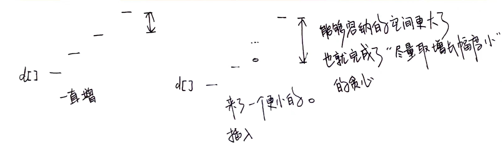

用于存放一些感觉复杂的，不想看的，但是又舍不得自己写的，笔记

## 最长递增子序列

为什么单独开一类……因为从这题延伸出来的，我在笔试遇到了，但是我不会写

给你一个整数数组 nums ，找到其中最长严格递增子序列的长度。

子序列 是由数组派生而来的序列，删除（或不删除）数组中的元素而不改变其余元素的顺序。例如，[3,6,2,7] 是数组 [0,3,1,6,2,2,7] 的子序列。

示例 1：

输入：nums = [10,9,2,5,3,7,101,18]

输出：4

解释：最长递增子序列是 [2,3,7,101]，因此长度为 4 。

示例 2：

输入：nums = [0,1,0,3,2,3]

输出：4

示例 3：

输入：nums = [7,7,7,7,7,7,7]

输出：1

提示：

1 <= nums.length <= 2500

-104 <= nums[i] <= 104
 
进阶：

你能将算法的时间复杂度降低到 O(n log(n)) 吗?

解法 1：动规

核心在于对 `dp[i]` 的更新

最长递增子序列中，需要取子序列，所以不能排序

但是这里需要判断是否能相连接上，最简单的方法就是只判断能否连接到尾部

那么只要是区间不断递增地连接上来，我就可以只判断连接到尾部

> 我自己记得东西我怎么看不懂了

解法 2：贪心

贪心解法更巧妙

[https://leetcode.cn/problems/longest-increasing-subsequence/solutions/147667/zui-chang-shang-sheng-zi-xu-lie-by-leetcode-soluti/](https://leetcode.cn/problems/longest-increasing-subsequence/solutions/147667/zui-chang-shang-sheng-zi-xu-lie-by-leetcode-soluti/)

核心思想是：如果我们要使上升子序列尽可能的长，则我们需要让序列上升得尽可能慢，因此我们希望每次在上升子序列最后加上的那个数尽可能的小。

一开始我看到这个想法，我还以为那我就遍历 nums n 次，然后每一次选一个 nums 中比我最后一次选的值更小的数

但是它要求的是子序列，那么数的顺序是不能变的

如果要求顺序不可变，那么其实就不合理了……因为那你直接一次排序，不就能取到整个排序后的数组了？毕竟每次你要找一个最小增长，而已经递增的序列完美满足你的要求

所以不是我这么想

那么现在就是，我之后就想，遍历 n 次，每一次取 nums 第 i 个值为起点，然后往后找 nums 中每个元素，判断每个元素的时候都尽量取最小增长

但是其实，我不知道怎么样才能得到最小增长

然后看了他的题解

他首先是假设了一个新的关系，就是

数组 d[i]，表示长度为 i 的最长上升子序列的末尾元素的最小值

设当前已求出的最长上升子序列的长度为 len 初始时为 1 从前往后遍历数组 nums，在遍历到 nums[i] 时

1. 如果 `nums[i] > d[len]` 则直接加入到 `d` 数组末尾，并更新 `len++`

2. 否则，在 `d` 数组中二分查找，找到第一个比 `nums[i]` 小的数 `d[k]`，并更新 `d[k + 1] = nums[i]`

其实就是，d 数组是当前找到的上升子序列

然后它的更新就是，不像一般的，插入到数组中的数就是最终答案

他这里是，插入的数，之后可能会被替换，为什么被替换，因为你要找增长幅度最小

但是怎么找？只要我每一个数都是容许内的最小，那么之后的数的增长幅度就可以比较小，因为我拉大了和后面的数之间的差距，之后可能有更多的比较小的数可以排在我后面

同时我这个在容许内尽可能小的数，也与它之前的数的差距会尽可能小

那么完成这个容许内的最小的方法，就是在现有的子序列中找到一个刚好大于它的数，并替换掉



> 不懂怎么证明，get 不到从零开始的思路，不想看

## 无重叠区间

给定一个区间的集合 intervals ，其中 intervals[i] = [starti, endi] 。返回 需要移除区间的最小数量，使剩余区间互不重叠 。

示例 1:

输入: `intervals = [[1,2],[2,3],[3,4],[1,3]]`

输出: 1

解释: 移除 [1,3] 后，剩下的区间没有重叠。

示例 2:

输入: `intervals = [ [1,2], [1,2], [1,2] ]`

输出: 2

解释: 你需要移除两个 [1,2] 来使剩下的区间没有重叠。

示例 3:

输入: `intervals = [ [1,2], [2,3] ]`

输出: 0

解释: 你不需要移除任何区间，因为它们已经是无重叠的了。

提示:

1 <= intervals.length <= 10^5

intervals[i].length == 2

-5 * 10^4 <= start_i < end_i <= 5 * 10^4

解法 2：贪心

一开始我是想着要不要替换

```cpp
// 贪心
// 先依次加入各个区间到尾部
// 但是加入每个区间的时候，都在已经加入的区间的列表中寻找第一个能替换掉的，自身长度比之更小的区间
// 并替换
class Solution {
public:
    int eraseOverlapIntervals(vector<vector<int>>& intervals) {
        int n = intervals.size();
        if (n == 0) {
            return 0;
        }

        sort(intervals.begin(), intervals.end(),
             [](vector<int>& lhs, vector<int>& rhs) -> bool {
                 return lhs[0] < rhs[0];
             });

        vector<vector<int>> cur_intervals;

        for (vector<int>& interval : intervals) {
            int index =
                quickFind(cur_intervals, interval, 0, cur_intervals.size() - 1);
            if (index == -1) {
                if (cur_intervals.size() == 0) {
                    cur_intervals.push_back(interval);
                }

                if (cur_intervals[cur_intervals.size() - 1][1] <= interval[0]) {
                    cur_intervals.push_back(interval);
                }
            } else {
                cur_intervals[index] = interval;
            }
        }

        return intervals.size() - cur_intervals.size();
    }

    int quickFind(vector<vector<int>>& intervals, vector<int>& target,
                  int begin, int end) {
        if (begin > end) {
            return -1;
        }

        int mid = begin + (end - begin) / 2;

        if (target[0] >= intervals[mid][0] && target[1] <= intervals[mid][1]) {
            return mid;
        } else if (target[0] >= intervals[mid][1]) {
            return quickFind(intervals, target, begin, mid - 1);
        } else if (target[1] <= intervals[mid][0]) {
            return quickFind(intervals, target, mid + 1, end);
        }

        return -1;
    }
};
```

解答错误。后来发现这题还有点不一样，不是单纯替换就能搞定的

似乎我还要找能够插入的位置

我想的是二分查找找到一个 `index`

```cpp
// 如果是替换
if(target[0] >= intervals[index][0] && target[1] <= intervals[index][1]){
    cur_intervals[index] = interval;
}
// 如果是插入
if(target[0] >= intervals[index][1] && target[1] <= intervals[index + 1][0]){
    cur_intervals.insert(cur_intervals.begin() + index, target);
}
```

官方题解：

>他要想的是选取哪个区间作为首区间
>
>现在思路又换成了，每一步找到最优了
>
>而不是之前的，先把所有的数都填上，之后可以替换

假设在某一种最优的选择方法中，[lk rk] 是首个（即最左侧的）区间，那么它的左侧没有其它区间，右侧有若干个不重叠的区间。设想一下，如果此时存在一个区间 [lj, rj]，使得 rj < rk，即区间 j 的右端点在区间 k 的左侧，那么我们将区间 k 替换为区间 j，其与剩余右侧被选择的区间仍然是不重叠的。而当我们将区间 k 替换为区间 j 后，就得到了另一种最优的选择方法。

我们可以不断地寻找右端点在首个区间右端点左侧的新区间，将首个区间替换成该区间。那么当我们无法替换时，首个区间就是所有可以选择的区间中右端点最小的那个区间。因此我们将所有区间按照右端点从小到大进行排序，那么排完序之后的首个区间，就是我们选择的首个区间。

如果有多个区间的右端点都同样最小怎么办？由于我们选择的是首个区间，因此在左侧不会有其它的区间，那么左端点在何处是不重要的，我们只要任意选择一个右端点最小的区间即可。

当确定了首个区间之后，所有与首个区间不重合的区间就组成了一个规模更小的子问题。由于我们已经在初始时将所有区间按照右端点排好序了，因此对于这个子问题，我们无需再次进行排序，只要找出其中与首个区间不重合并且右端点最小的区间即可。用相同的方法，我们可以依次确定后续的所有区间。

在实际的代码编写中，我们对按照右端点排好序的区间进行遍历，并且实时维护上一个选择区间的右端点 right 。如果当前遍历到的区间 [li, ri] 与上一个区间不重合，即 li > right，那么我们就可以贪心地选择这个区间，并将 right 更新为 ri

```cpp
// 贪心
// 先依次加入各个区间到尾部
// 但是加入每个区间的时候，都在已经加入的区间的列表中寻找第一个能替换掉的，自身长度比之更小的区间
// 并替换
class Solution {
public:
    int eraseOverlapIntervals(vector<vector<int>>& intervals) {
        int n = intervals.size();
        if (n == 0) {
            return 0;
        }

        sort(intervals.begin(), intervals.end(),
             [](vector<int>& lhs, vector<int>& rhs) -> bool {
                 return lhs[1] < rhs[1];
             });

        int right = INT_MIN;
        int count = 0;
        for(auto& interval : intervals){
            if(right <= interval[0]){
                right = interval[1];
                ++count;
            }
        }

        return n - count;
    }
};
```

## DP

### 树形 DP

#### 树的直径

给你一个有 n 个点的树，树上的每个点有一个权值。定义一棵树的子链大小为：这个子链上所有节点的权值和。求这棵树上最大子链的结点权值和。

解法：每个树节点对应一个 dp 值，递归遍历

dp[i] 表示当前节点所参与的所有子链的权值和的最大值

那么 dp[i] 直接就是所有子节点的 dp 之中的最大值 + 本节点权值

还有一个全局的 ans 要比较

> 太简单了，不加在主文件里了

> 好吧，之后看了一下还可以两遍 DFS，先不看了