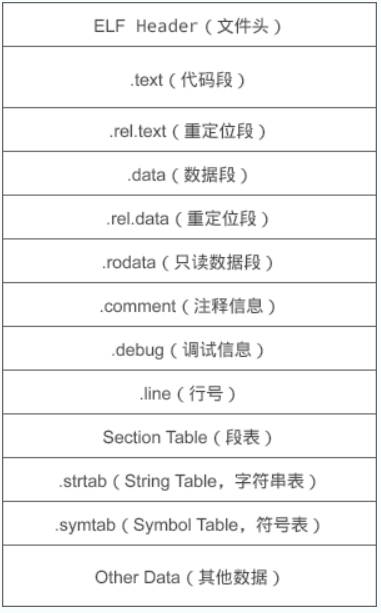

- [基础](#基础)
  - [int 几字节？不同 CPU 架构下大小会变吗？长整型呢？](#int-几字节不同-cpu-架构下大小会变吗长整型呢)
  - [从 cpp 源代码到 exe 经过了哪些过程？](#从-cpp-源代码到-exe-经过了哪些过程)
  - [c 和 c++ 差异？c++ 执行更快吗？](#c-和-c-差异c-执行更快吗)
  - [有了函数要它们何用？为什么不能用宏来替代函数？](#有了函数要它们何用为什么不能用宏来替代函数)
  - [inline 与宏区别?](#inline-与宏区别)
  - [final 和 override](#final-和-override)
  - [谈谈 static 关键字怎么用，有何效果？](#谈谈-static-关键字怎么用有何效果)
  - [class 与 struct 的区别](#class-与-struct-的区别)
  - [介绍一下 extern C关键字，为什么会有这个关键字？](#介绍一下-extern-c关键字为什么会有这个关键字)
  - [什么是尾递归？](#什么是尾递归)
  - [为什么会有栈溢出，为什么栈会设置容量？](#为什么会有栈溢出为什么栈会设置容量)
  - [什么是this指针，为什么存在this指针？](#什么是this指针为什么存在this指针)
  - [函数调用进行的操作：](#函数调用进行的操作)
- [内存管理](#内存管理)
    - [野指针的产生原因，解决方法](#野指针的产生原因解决方法)
    - [为什么要内存对齐？](#为什么要内存对齐)
      - [增加运行效率](#增加运行效率)
      - [增加可移植性](#增加可移植性)
    - [malloc的内存分配的方式，有什么缺点？](#malloc的内存分配的方式有什么缺点)
      - [什么是 mmap 提到的私有匿名映射](#什么是-mmap-提到的私有匿名映射)
      - [为什么不全部使用mmap来分配内存？](#为什么不全部使用mmap来分配内存)
      - [为什么不全部都用brk](#为什么不全部都用brk)
    - [传入一个指针，它如何确定具体要清理多少空间呢？](#传入一个指针它如何确定具体要清理多少空间呢)
    - [malloc和new的区别是什么？](#malloc和new的区别是什么)
- [面向对象](#面向对象)
  - [多继承的实现？可能出现什么问题](#多继承的实现可能出现什么问题)
  - [菱形继承下的类大小](#菱形继承下的类大小)
  - [类实例的内存存储形式是什么样子的](#类实例的内存存储形式是什么样子的)
  - [类中静态变量的初始化是什么时候？](#类中静态变量的初始化是什么时候)
  - [复制构造函数不能值传递](#复制构造函数不能值传递)
  - [所有数组类型的参数都会退化为指针类型](#所有数组类型的参数都会退化为指针类型)
- [多态](#多态)
  - [怎么理解 c++ 的虚函数？什么是纯虚函数？](#怎么理解-c-的虚函数什么是纯虚函数)
  - [虚表指针、虚函数表什么时候产生，存在哪里](#虚表指针虚函数表什么时候产生存在哪里)
  - [构造函数里面可以调用虚函数吗](#构造函数里面可以调用虚函数吗)
  - [为什么不允许派生类的构造函数调用派生类的虚函数重写](#为什么不允许派生类的构造函数调用派生类的虚函数重写)
  - [析构函数里面可以调用虚函数吗](#析构函数里面可以调用虚函数吗)
  - [为什么不允许基类的析构函数调用派生类的虚函数重写](#为什么不允许基类的析构函数调用派生类的虚函数重写)
  - [为何析构函数可以为虚？子类不实现析构函数会怎样？](#为何析构函数可以为虚子类不实现析构函数会怎样)
  - [重载重写覆盖的区别，子类重写了虚函数会对虚函数表有什么影响](#重载重写覆盖的区别子类重写了虚函数会对虚函数表有什么影响)
  - [构造函数和析构函数能不能是虚函数](#构造函数和析构函数能不能是虚函数)
  - [类的友元函数和 static 静态函数不能用 virtual 关键字修饰](#类的友元函数和-static-静态函数不能用-virtual-关键字修饰)
- [模板](#模板)
  - [为什么模板函数的声明和定义要在同一个头文件里面](#为什么模板函数的声明和定义要在同一个头文件里面)
  - [为什么不允许模板成员函数？](#为什么不允许模板成员函数)
- [异常安全](#异常安全)
  - [C++在构造函数和析构函数中的异常](#c在构造函数和析构函数中的异常)
- [并发与并行](#并发与并行)
  - [进程之间的通信方式有哪些？](#进程之间的通信方式有哪些)
  - [线程之间的通信方式有哪些](#线程之间的通信方式有哪些)
  - [锁的底层原理是什么？](#锁的底层原理是什么)
  - [原子操作是什么？](#原子操作是什么)
- [STL](#stl)
  - [左值 右值](#左值-右值)
    - [右值传参时退化为左值原因](#右值传参时退化为左值原因)
  - [STL 中 vector 不断 push，内存上会有何变化？用指针指向 vector 元素应该注意什么？](#stl-中-vector-不断-push内存上会有何变化用指针指向-vector-元素应该注意什么)
  - [map底层是什么，说一下红黑树](#map底层是什么说一下红黑树)
  - [哪些stl底层是哈希表？](#哪些stl底层是哈希表)
  - [C++ vector底层、扩容机制、insert方法的几种情况](#c-vector底层扩容机制insert方法的几种情况)
  - [既然有了 std::vector，那 std::array 的意义在哪里？](#既然有了-stdvector那-stdarray-的意义在哪里)
  - [C++ deque数据结构](#c-deque数据结构)
- [C++11 C++17 C++20](#c11-c17-c20)
  - [C++11中的auto是怎么实现自动识别类型的？模板是怎样实现转化成不同类型的？](#c11中的auto是怎么实现自动识别类型的模板是怎样实现转化成不同类型的)
  - [std::string\_view](#stdstring_view)
  - [std::function 之间为什么不可以比较的](#stdfunction-之间为什么不可以比较的)
  - [智能指针](#智能指针)
    - [make shared](#make-shared)
      - [持有的对象内存和控制块内存连续](#持有的对象内存和控制块内存连续)
      - [异常安全](#异常安全-1)
      - [持有的对象内存不能独立于控制块内存释放](#持有的对象内存不能独立于控制块内存释放)

## 基础

### int 几字节？不同 CPU 架构下大小会变吗？长整型呢？

4B、在 32 位下 long 也是 4B，而 64 位下 long 变为 8B

### 从 cpp 源代码到 exe 经过了哪些过程？

1.预处理阶段：对源代码文件中文件包含关系（头文件）、预编译语句（宏定义）进行分析和替换，生成预编译文件。产生.i文件。

1.1 对所有的“#define”进行宏展开

1.2 处理所有的条件编译指令，比如“#if”,“#ifdef”，“#elif”，“#else”,“#endif”

1.3 处理“#include”指令，这个过程是递归的，也就是说被包含的文件可能还包含其他文件

1.4 删除所有的注释“//”和“/**/”

1.5 添加行号和文件标识

1.6 保留所有的“#pragma”编译器指令

2.编译阶段 将预处理完的文件进行一系列词法分析，语法分析，语义分析及优化后生成相应的汇编代码文件(.s文件)

3.汇编阶段 汇编指令->机器指令

只编译生成目标文件，不链接，链接动作是在链接阶段完成的

目标文件由段组成



代码段：该段中所包含的主要是程序的指令。该段一般是可读和可执行的，但一般却不可写。

数据段：主要存放程序中要用到的各种全局变量或静态的数据。一般数据段都是可读，可写，可执行的。

这个目标文件也分为很多种。在 Windows 和 Linux 下分别被称为不同的格式

可重定位文件：其中包含有适合于其它目标文件链接来创建一个可执行的或者共享的目标文件的代码和数据。

Linux: .o .a

Windows: .obj .lib

共享的目标文件：这种文件存放了适合于在两种上下文里链接的代码和数据。

第一种是链接程序 可把它与其它可重定位文件及共享的目标文件一起处理来创建另一个目标文件；

第二种是动态链接程序 将它与另一个可执行文件及其它的共享目标文件结合到一起，创建一个进程映象。

Linux: .so

Windows: .dll

可执行文件

Linux: 一般不写后缀 

Windows: .exe

4.链接阶段

包括地址和空间分配(Address and Storage Allocation)、符号决议(Symbol Resolution)和重定位(Relocation)

就是把每个目标文件组合起来

链接方式：

4.1 静态链接/库

在链接阶段，会将汇编生成的目标文件.o与引用到的库一起链接打包到可执行文件中，因此对应的链接方式称为静态链接。

静态库可以简单看成是一组目标文件（.o/.obj文件）的集合，即很多目标文件经过压缩打包后形成的一个文件。

静态库的缺点在于：浪费空间和资源，因为所有相关的目标文件与牵涉到的函数库被链接合成一个可执行文件。

4.2 动态链接/库

动态库在程序编译时并不会被连接到目标代码中，而是在程序运行是才被载入。不同的应用程序如果调用相同的库，那么在内存里只需要有一份该共享库的实例，规避了空间浪费问题。动态库在程序运行是才被载入，也解决了静态库对程序的更新、部署和发布页会带来麻烦。用户只需要更新动态库即可，增量更新。

### c 和 c++ 差异？c++ 执行更快吗？

参考：[](https://www.zhihu.com/question/19779887)

我感觉是，不能一概而论

C++ 一般会提供一些便利的特性和容器，来帮助实现目的

你纯粹用 C 来手写也不是不行，但是自己实现可能不如 stl 

一般人说 C++ 有虚函数，所以 C++ 更慢，但是如果你用了虚函数，那就说明你需要这个特性，那你也要在 C 中实现一遍虚函数，要实现虚指针，虚表，自己填表，查表，最后虚指针的运行跟 C++ 也一样

### 有了函数要它们何用？为什么不能用宏来替代函数？

宏的优势，我个人认为是可以方便赋予函数块以意义

其他的用法，都可以用枚举或者常数变量来代替，更安全

但是比如在做反射机制的时候，把 get_type, get_type_name，get_size 这些函数都封装成一个宏定义，放在需要反射机制的类里面，

这样，你就把一堆函数捆绑起来，完成了反射的功能，同时还便于合作者理解你的代码

宏如果想去代替单个函数，其实没有太大优势

宏去代替单个函数，主要是节省一层函数调用的堆栈，但是也会增多展开出来的代码量

如果这个函数被使用了很多次，那么代码量会激增

宏不能替换递归函数，因为他不知道递归的终止条件

**函数可以取指针**，因为编译出来的文件，函数放在代码区，但是宏的话不能取指针，他只是方便替换，在预处理的时候就替换掉了

函数可以完成对参数的类型检查，宏不可以。因为函数可以被声明，编译器会检查函数声明，但是宏没有声明的机制，虽然宏可以知道自己被传递的参数的数量

调试也会很困难，比如程序在宏定义段里面报错，某些调试器可能没办法定位到宏定义段里面。还有就是如果要统计每个函数的运行时间的话，在宏定义展开的程序段里面的运行时间可能只是被记为 main 的时间，而没有更详细的信息

### inline 与宏区别? 

区别在于，宏是由预处理器对宏进行替代，而内联函数是通过编译器控制来实现的。 

而且内联函数是真正的函数，只是在需要用到的时候，内联函数像宏一样的展开，所以取消了函数的参数压栈，减少了调用的开销。

宏是预编译器的输入，然后宏展开之后的结果会送去编译器做语法分析。

宏与函数等处于不同的级别，操作不同的实体。

宏操作的是 token, 可以进行 token的替换和连接等操作，在语法分析之前起作用。而函数是语言中的概念，会在语法树中创建对应的实体，内联只是函数的一个属性。 

### final 和 override

override 关键字告诉编译器，这个函数一定会重写父类的虚函数，如果父类没有这个虚函数，则无法通过编译。此关键字可省略，但不建议省略。

finial 关键字告诉编译器，这个函数到此为止，如果后续有类继承当前类，也不能再重写此函数。

### 谈谈 static 关键字怎么用，有何效果？

修饰变量：只能在同一文件中被访问的静态变量

修饰函数：可以不实例化某个类，就调用该类的 static 函数

### class 与 struct 的区别

默认继承权限不同：class 默认继承的是 private 继承，struct 默认是 public 继承。

Class 还可用于定义模板参数，但是关键字 struct 不能用于定义模板参数，C++ 保留 struct 关键字，原因是保证与 C 语言的向下兼容性，为了保证百分百的与 C 语言中的 struct 向下兼容，C++ 把最基本的对象单元规定为 class 而不是 struct，就是为了避免各种兼容性的限制。

### 介绍一下 extern C关键字，为什么会有这个关键字？

是用来实现在C++代码段中用C语言的方式来编译代码，是C++为了兼容C语言所加入的关键字

### 什么是尾递归？

尾递归时递归的一种特殊情形，尾递归时一种特殊的尾调用，即在尾部直接调用自身的递归函数。核心思想是边调用便产生结果。

原理：当编译器检测到一个函数调用是尾递归的时候，它会覆盖当前的活动记录而不是在栈中创建一个新的。编译器可以做到这一点，因为递归调用是当前活跃期内最后一条待执行的语句，于是当这个调用返回时栈帧中并没有其他事情可以做，因此也就没有保存栈帧的必要了，通过覆盖当前的栈帧而不是在其之上重新添加一个，这样所使用的栈空间就大大缩减了，这使得实际的运行效率会变得更高。

特点：在尾部调用的是函数自身，可通过优化使得计算仅占用常量栈空间

### 为什么会有栈溢出，为什么栈会设置容量？

栈空间是预设的，它通常用于存放临时变量，如果你在函数内部定义一个局部变量，空间超出了设置的栈空间大小，就会溢出。不仅如此，如果函数嵌套太多，也会发生栈溢出，因为函数没有结束前，函数占用的变量也不被释放，占用了栈空间。

原因：是栈的地址空间必须连续，如果任其任意成长，会给内存管理带来困难。对于多线程程序来说，每个线程都必须分配一个栈，因此没办法让默认值太大。

### 什么是this指针，为什么存在this指针？

类和对象中的成员函数存储在公共的代码段，不同的对象调用成员函数时编译器为了知道具体操作的是哪一个对象给每个“非静态的成员函数”增加了一个隐藏的指针参数，让该指针指向当前对象，在函数体中所有成员变量的操作，都是通过这个指针来完成的由编译器自动完成。

### 函数调用进行的操作：

1.将参数压栈：按照参数顺序的逆序进行，如果参数中有对象则先进行拷贝构造

2.保存返回地址：即函数调用结束返回后接着执行的语句的地址

3.保护维护函数栈帧信息的寄存器内容如，SP（堆栈指针），FP（栈帧指针）等。

4.保存一些通用寄存器的内容：应为有些通用寄存器会被所有函数用到，所以在函数调用之前，这些寄存器就可能已经放置了对函数有用的信息。

5.调用函数，函数执行完毕

6.恢复通用寄存器的值

7.恢复保存函数栈帧信息的那些寄存器的值

8.通过移动栈指针，销毁函数的栈帧

9.将保存的返回地址出栈，并赋给寄存器。

10.通过移动栈指针，回收传给函数的参数所占用的空间

**传入参数，传入下一个语句，维护现场，调用函数，恢复线程，跳到下一个语句，取出参数**

## 内存管理

#### 野指针的产生原因，解决方法

指针变量声明时没有被初始化。

指针 p 被 free 或者 delete 之后，没有置为 NULL。

指针操作超越了变量的作用范围。

#### 为什么要内存对齐？ 

##### 增加运行效率

因为计算机读取内存的时候，每一次读取都是从某一个单位长度的整数倍出发，读取单位长度的内存

比如以字长为单位读取，32 位系统的字长是 4 字节，64 位的字长是 8 字节

当然这个对齐的长度也不一定是这个，也可能受到其他影响

比如缓存行的长度可能影响对齐。缓存行的长度是 16 字节，那么比较大的数据可能需要按照 16 字节对齐

[https://stackoverflow.com/questions/28898277/why-do-some-types-e-g-float80-have-a-memory-alignment-bigger-than-word-size](https://stackoverflow.com/questions/28898277/why-do-some-types-e-g-float80-have-a-memory-alignment-bigger-than-word-size)

##### 增加可移植性

有些 CPU 可以访问任意地址上的任意数据，而有些 CPU 只能在特定的地址访问数据，因此不同硬件平台具有差异性，这样的代码就不具有移植性

如果在编译时将进行对齐，这就具有平台的移植性。

#### malloc的内存分配的方式，有什么缺点？

malloc并不是系统调用，而是C库中的函数，用于动态内存分配，在使用malloc分配内存的时候会有两种方式向操作系统申请堆内存

方式1：当用户分配的内存小于128KB时通过brk()系统调用从堆分配内存，实现方式：将堆顶指针向高地址移动，获取内存空间，如果使用free释放空间，并不会将内存归还给操作系统，而是会缓存在malloc的内存池中，待下次使用

方式2：当用户分配的内存大于128KB时通过mmap()系统调用在文件映射区域分配内存，实现方式为：使用私有匿名映射的方式，在文件映射区分配一块内存，也就是从文件映射区拿了一块内存，free释放内存的时候，会把内存归还给操作系统，内存得到真正释放

缺点：容易造成内存泄漏和过多的内存碎片，影响系统正常运行，还得注意判断内存是否分配成功，而且内存释放后（使用free函数之后指针变量p本身保存的地址并没有改变），需要将p的赋值为NULL拴住野指针。

##### 什么是 mmap 提到的私有匿名映射

1.匿名（Anonymous）

映射的内存不关联任何文件，因此不会与磁盘上的数据同步，也不会影响文件内容。

通过 MAP_ANONYMOUS（或旧版本的 MAP_ANON）标志指定。

2.私有（Private）

该映射是**写时复制（Copy-on-Write, COW）**的，不会在进程间共享写入的修改。

通过 MAP_PRIVATE 标志指定。

3.按需分配（Lazy Allocation）

申请时不会立即分配物理内存，只有在第一次访问时才触发缺页中断，操作系统才会真正分配物理内存。

##### 为什么不全部使用mmap来分配内存？

因为向操作系统申请内存的时候，是要通过系统调用的，执行系统调用要进入内核态，然后再回到用户态，状态的切换会耗费不少时间，所以申请内存的操作应该避免频繁的系统调用

如果都使用mmap来分配内存，等于每次都要执行系统调用。

另外，因为mmap分配的内存每次释放的时候都会归还给操作系统，于是每次mmap分配的虚拟地址都是缺页状态，然后在第一次访问该虚拟地址的时候就会触发缺页中断。

> 为啥释放内存会影响到分配的内存？他的意思应该是，因为 mmap 直接归还了，所以 mmap 不会像 brk 

##### 为什么不全部都用brk

如果全部使用brk申请内存那么随着程序频繁的调用malloc和free，尤其是小块内存，堆内将产生越来越多的不可用的内存碎片。

#### 传入一个指针，它如何确定具体要清理多少空间呢？

我们在申请内存的时候，会多分配 16 字节的内存，里面保存了内存块的详细信息

free 会对传入的内存地址向左偏移 16 字节，然后分析出当前内存块的大小，就知道要释放多大的内存空间了。

#### malloc和new的区别是什么？

malloc/free 是标准库函数，new/delete 是 C++ 运算符

malloc 分配内存失败返回空，new 失败抛异常

new/delete 会调用构造析构函数，malloc/free 不会，所以他们无法满足动态对象的要求。

new返回有类型的指针，malloc 返回无类型的指针

分配内存的位置：malloc 从堆上动态分配内存，new 是从自由存储区为对象动态分配内存（取决于 operator new 的实现，可以为堆还可以是静态存储区）

new 申请内存的步骤：调用 operator new 函数，分配一块足够大，且原始的，未命名的内存空间来存储特定类型的对象。运行相应的构造函数来构造对象，并为其传入初值，返回一个指向该对象的指针。

delete：先调用对象的析构函数，再调用 operator delete 函数释放内存空间

## 面向对象

### 多继承的实现？可能出现什么问题

1. 定义派生类对象时，构造函数执行顺序？

定义派生类对象时，构造函数的执行顺序和派生类定义时继承的顺序保持一致。

2. 基类中同名变量冲突

必须要在变量名前加上作用域 son.Mother::name. 

如果两个平行的基类中有相同的数据，把它们存放在更上一级类中，可以通过菱形继承或虚继承实现。

3. 派生类类对象内存布局（多个虚表指针 __vfptr）

比如子类 C 继承了 A 和 B，A 和 B 中都有虚函数，那么 C 中有两个虚表指针，分别从 A 和 B 继承来

### 菱形继承下的类大小

同上

### 类实例的内存存储形式是什么样子的

空类的大小为 1

对象必须要被分配内存空间才有意义，这里编译器默认分配了 1Byte 内存空间(不同的编译器可能不同)

静态成员变量是在编译阶段就在静态区分配好内存的，所以静态成员变量的内存大小不计入类空间

类存在内存对齐

成员函数和非成员函数都是存放在代码区的，故类中一般成员函数、友元函数，内联函数还是静态成员函数都不计入类的内存空间

如果有虚函数，那么对象需要一个虚表指针

### 类中静态变量的初始化是什么时候？ 

1.静态初始化 static initialization

指的是用常量来对静态变量进行初始化，包括zero initialization和const initialization

其中zero initialization的变量会保存在.bss段（未初始化静态变量，以及初始化为0的静态变量）

const initialization的变量保存在.data段(已经初始化为非0的静态变量)。对于静态初始化的变量（请注意：包括在函数中采用静态初始化的静态变量），是在程序加载时完成的初始化。

2.动态初始化 dynamic initialization

指的是需要调用函数才能完成的初始化，比如类的构造函数。

```cpp
static int my_int = CreateMyInt();
```

对于全局或者类的静态成员变量，是在main()函数执行前由运行时调用相应的代码进行初始化的。

而对于局部静态变量，是在函数执行至此初始化语句时才开始执行的初始化。


### 复制构造函数不能值传递

因为值传递一个类，相当于要用复制构造来构造实参，所以相当于复制构造调用了复制构造自身，这样不断递归下去

所以编译器不允许复制构造函数的参数是值传递

[value para in copy ctor](./testing/value_para_in_copy_ctor.cpp)

### 所有数组类型的参数都会退化为指针类型

[array para decay to pointer](./testing/array_para_decay_to_pointer.cpp)

传入数组类型的参数的时候，带长度的话就不会退化成指针，不带长度就会退化

## 多态

### 怎么理解 c++ 的虚函数？什么是纯虚函数？

能够允许通过基类指针调用派生类函数

纯虚函数必须由子类实现

### 虚表指针、虚函数表什么时候产生，存在哪里

虚函数表指针随对象走，它发生在对象运行期，当对象创建的时候，虚函数表表指针位于该对象所在内存的最前面。

虚函数表是在编译期间就已经确定，且虚函数表存放虚函数的地址也是在创建时被确定。

虚函数表属于类，类的所有对象共享这个类的虚函数表。

虚函数表由编译器在编译时生成，保存在exe的(常量区).rdata只读数据段。

>~~在构造函数和析构函数中，虚函数表指针的值可能还没有被完全设置或者已经被销毁，这是因为在构造函数和析构函数的执行期间，对象可能只是部分构造或部分销毁。因此，在构造函数和析构函数中调用虚函数可能不会得到期望的结果，并且应该避免这样的调用~~
>
> 这是记的什么玩意

### 构造函数里面可以调用虚函数吗

语法上没有问题。

构造顺序是先基类后派生类，派生类在构造函数内部还是基类类型而不是派生类类型，所以调用的是基类的虚函数，而不是派生类的重写的虚函数，可能无法达到预期的效果

### 为什么不允许派生类的构造函数调用派生类的虚函数重写

问：在设计语法的时候，如果我人为改掉构造时的类型，认为派生类在构造的时候也是派生类类型，使得其可以调用派生类的重写的虚函数，可以吗？

不可以，因为派生类的构造时，派生类的一些成员可能还是未初始化的，这是不安全的

### 析构函数里面可以调用虚函数吗

语法上也没有问题。

析构是先派生类再基类，基类在析构的时候，派生类的析构已经执行完了，这个时候派生类的数据成员都应该是被销毁了，这是是基类类型，调用的是基类的虚函数，并没有多态，于是失去了用虚函数的意义。

### 为什么不允许基类的析构函数调用派生类的虚函数重写

问：在设计语法的时候，如果我人为改掉构造时的类型，使得基类以一种方式知道了自己是从哪个派生类析构而来的，使得其可以调用派生类的重写的虚函数，可以吗？

不可以，因为基类析构时，派生类已经被析构，那么派生类的成员应该是已经被销毁的，若要访问可能会出错

### 为何析构函数可以为虚？子类不实现析构函数会怎样？

鼓励子类实现，以在析构函数中释放资源。

背景是有一个将子类对象转型为父类的对象

不实现的话，会调用父类的析构函数，可能造成子类资源未释放导致内存泄漏

### 重载重写覆盖的区别，子类重写了虚函数会对虚函数表有什么影响

重载：函数名相同、函数参数不同、位于同一个域（类）中

重写（覆盖）：函数名相同、函数参数相同、位于同一个域（类）中、并且是虚函数

隐藏：函数名相同、函数参数相同、位于同一个域（类）中、并且不是虚函数

当子类继承父类时，会继承虚表；

当子类有新的虚函数时，会在虚表后面新增新的项；

当子类重写父类的虚函数时，会把虚表中原有的某一项覆盖。

### 构造函数和析构函数能不能是虚函数

当使用了多态的特性时，我们用基类指针指向子类对象

构造函数是通过创建对象时自动调用的，不可能通过父类的指针或者引用去调用，所以规定构造函数不能是虚函数

编译器不会通过

析构函数需要是虚函数

因为基类指针指向子类对象，这个指针被删除之后，如果基类析构函数没有 virtual，就只会调用基类析构函数，无法调用子类析构函数

这样，如果在子类的析构函数中释放资源，或者有其他逻辑，这些逻辑没有被调用，就会造成内存泄漏或业务逻辑错误等

声明基类析构函数为 virtual，才能调用到子类析构函数

### 类的友元函数和 static 静态函数不能用 virtual 关键字修饰

友元函数不是对象的成员函数，无法通过 this 来调用，所以不能实现多态

static 静态函数不与类的实例关联，也就是没有一个指向类的实例自身的 this 指针，所以也不能实现多态

调用 virtual 函数时，实际上是需要一个指向类的实例自身的 this 指针，通过这个指针找到自己的虚函数指针 vptr

vptr 是每一个派生自虚类的对象都有一份的，在构造函数中被初始化，指向派生类的 vtable

vtable 是这个派生类的所有对象共有的

## 模板

### 为什么模板函数的声明和定义要在同一个头文件里面

因为模板函数是在编译的时候实例化的

编译的时候，还没有到链接，所以某个单元是不知道其他单元的实现的，只知道 include 的头文件的内容

这个时候，如果你实例化某个模板函数，你是需要知道它的实现才能实例化的

所以模板函数的声明和定义要在同一个头文件里面

### 为什么不允许模板成员函数？

```cpp
class C
{
    public:
    template<int N>
    virtual void foo() // 模板函数 'void C::foo<N>()'不能为 virtual
    {
        std::cout << "C: " << N << std::endl;
    }

    template<int N>
    virtual static void foo2() // static 函数 'void C::foo2<N>()' 不能为 virtual
    {
        std::cout << "C: " << N << std::endl;
    }
};
```

如果允许存在虚函数模板的话，则每次以不同的模板类型调用虚函数模板都进行了一个新的虚函数的实例化，则要在虚函数表中加入这个虚函数

这意味着只有在程序链接的时候才可以构造虚函数表，无法在编译的阶段确定虚函数表的内容

## 异常安全

### C++在构造函数和析构函数中的异常

构造函数：

在构造函数中抛出异常，当前对象的析构函数不会被调用，如果在构造函数中分配了内存，那么就会造成内存泄露，所以要格外注意

析构函数：

1. 如果析构函数抛出异常，则异常点之后的程序不会执行，如果析构函数在异常点之后执行了某些必要的动作比如释放某些资源，则这些动作不会执行，会造成诸如资源泄漏的问题

2. 通常异常发生时，c++的异常处理机制在异常的传播过程中会进行栈展开（stack-unwinding），因发生异常而逐步退出复合语句和函数定义的过程，被称为栈展开。在栈展开的过程中就会调用已经在栈构造好的对象的析构函数来释放资源，此时若其他析构函数本身也抛出异常，则前一个异常尚未处理，又有新的异常，会造成程序崩溃

解决方法就是完全在析构函数内部处理异常，不要抛出

## 并发与并行

### 进程之间的通信方式有哪些？

管道：管道分为匿名管道和命名管道，管道本质上是一个内核中的一个缓存，当进程创建管道后会返回两个文件描述符，一个写入端一个输出端。缺点：半双工通信，一个管道只能一个进程写，一个进程读。不适合进程间频繁的交换数据

消息队列：可以边发边收，但是每个消息体都有最大长度限制，队列所包含的消息体的总数量也有上限并且在通信过程中存在用户态和内核态之间的数据拷贝问题

共享内存：解决了消息队列存在的内核态和用户态之间的数据拷贝问题。

信号量：本质上是一个计数器，当使用共享内存的通信方式时，如果有多个进程同时往共享内存中写入数据，有可能先写的进程的内容被其他进程覆盖了，信号量就用于实现进程间的互斥和同步PV操作不限于信号量+-1，而且可以任意加减正整数

信号

套接字

### 线程之间的通信方式有哪些

信号量

条件变量

互斥量

### 锁的底层原理是什么？

锁的底层是通过CAS，atomic 机制实现。

CAS机制：全称为Compare And Swap（比较相同再交换）可以将比较和交换操作转换为原子操作，CAS操作依赖于三个值：内存中的值V，旧的预估值X，要修改的新值B，如果旧的预估值X等于内存中的值V，就将新的值B保存在内存之中。（就是每一个线程从主内存复制一个变量副本后，进行操作，然后对其进行修改，修改完后，再刷新回主内存前。再取一次主内存的值，看拿到的主内存的新值与当初保存的快照值，是否一样，如果不一样，说明有其他线程修改，本次修改放弃，重试。）

atomic机制：如16问。

### 原子操作是什么？

原子操作是指不会被线程调度机制打断的操作，这种操作一旦开始，就一直运行到结束，中间不会有任何切换到另一个线程。

原理是：在 X86 的平台下，CPU 提供了在指令执行期间对总线加锁的手段，CPU 中有一根引线 #HLOCK pin 连接到北桥

如果汇编语言的程序在程序中的一条指令前面加上了前缀“LOCK”，经过汇编之后的机器码就使 CPU 在执行这条指令的时候把 #HLOCKpin 的电平拉低持续到这条指令结束的时候放开，从而把总线锁住，这样别的 CPU 就暂时不能够通过总线访问内存了，保证了多处理器环境中的原子性。

## STL

### 左值 右值

#### 右值传参时退化为左值原因

右值在传参的时候被保存到了特定的位置，所以就可以取地址了，失去了右值属性

改进方法，使用std::forward<>来保证右值属性的传递（完美转发）

### STL 中 vector 不断 push，内存上会有何变化？用指针指向 vector 元素应该注意什么？

达到阈值内存就扩容两倍（扩容倍数和编译器版本有关）

注意扩容后数据搬离，指针指空，变为野指针

### map底层是什么，说一下红黑树

1、红黑树

红黑树是一种二叉查找树，但在每个节点增加一个存储位表示节点的颜色，可以是红或黑（非红即黑）。

通过对任何一条从根到叶子的路径上各个节点着色的方式的限制，红黑树确保没有一条路径会比其它路径长出两倍，因此，红黑树是一种弱平衡二叉树，相对于要求严格的AVL树来说，它的旋转次数少，所以对于搜索，插入，删除操作较多的情况下，通常使用红黑树。

性质：

每个节点非红即黑

根节点是黑的;

每个叶节点（叶节点即树尾端NULL指针或NULL节点）都是黑的;

如果一个节点是红色的，则它的子节点必须是黑色的。

对于任意节点而言，其到叶子点树NULL指针的每条路径都包含相同数目的黑节点;

2、平衡二叉树（AVL树）

红黑树是在AVL树的基础上提出来的。

平衡二叉树又称为AVL树，是一种特殊的二叉排序树。其左右子树都是平衡二叉树，且左右子树高度之差的绝对值不超过1。

AVL树中所有结点为根的树的左右子树高度之差的绝对值不超过1。

将二叉树上结点的左子树深度减去右子树深度的值称为平衡因子BF，那么平衡二叉树上的所有结点的平衡因子只可能是-1、0和1。只要二叉树上有一个结点的平衡因子的绝对值大于1，则该二叉树就是不平衡的。

3、红黑树较AVL树的优点

AVL 树是高度平衡的，频繁的插入和删除，会引起频繁的rebalance，导致效率下降；红黑树不是高度平衡的，算是一种折中，插入最多两次旋转，删除最多三次旋转。

所以红黑树在查找，插入删除的性能都是O(logn)，且性能稳定，所以STL里面很多结构包括map底层实现都是使用的红黑树。

4、HashMap和TreeMap底层实现的不同

C++中unordered_map的底层是用哈希表来实现的，通过key的哈希路由到每一个桶（即数组）用来存放内容。通过key来获取value的时间复杂度就是O（1）。因为key的哈希容易碰撞，所以需要对碰撞做处理。unordered_map里的每一个数组（桶）里面存的其实是一个链表，key的哈希冲突以后会加到链表的尾部，这是再通过key获取value的时间复杂度就变成O(n），当碰撞很多的时候查询就会变慢。为了优化这个时间复杂度，map的底层就把这个链表转换成了红黑树，这样虽然插入增加了复杂度，但提高了频繁哈希碰撞时的查询效率，使查询效率变成O(log n)。

5、为什么使用红黑树而不是二叉搜索树

map，set底层都提供了排序功能，红黑树形式存储的键值是有序的。同时红黑树可以在O(log n)时间内做插入，查找和删除。
二叉搜索树并不一定是一颗平衡树，二叉搜索树（BST）只是左子树的值一定小于根节点，而右子树的值一定大于根节点。如果插入的值是有序的，那么构造出来的二叉树将是一个链表，它的时间复杂度将达到O(n)。而使用红黑树，可以通过对每个节点标色的方式，每次更新数据后进行平衡，保证查找效率。

### 哪些stl底层是哈希表？ 

无序容器 

unordered_map unordered_multimap unordered_set unordered_multiset

### C++ vector底层、扩容机制、insert方法的几种情况 

底层就是一块连续空间

扩容机制：增加元素时，如果超过自身最大的容量，vector则将自身的容量扩充为原来的两倍

扩充空间需要经过的步骤：重新配置空间，元素移动，释放旧的内存空间。

一旦vector空间重新配置，则指向原来vector的所有迭代器都失效了，因为vector的地址改变了。

插入元素时需要移动后面所有的元素

### 既然有了 std::vector，那 std::array 的意义在哪里？

std::array和std::vector相比：

在栈上，并且效率差并不是可以忽略不记。如果你有1的资源，0.01和0.001的区别在你看来当然可以忽略不计，但是它们之间确确实实有着10倍差距。

长度确定，这意味着当你用std::array作为函数形参时不用检查长度。

因其在栈上、长度确定、非常简单的特性，constexpr std::array更好实现，对于模板狂人和追求编译期计算的人来说，明显更友好。

std::array和内置数组相比：

可以整个数组赋值、拷贝

作为形参不会退化成指针

作为形参可以按值传递

作为形参能够限定长度

>3.反对部分答主的一个观点，就是vector使用堆区内存，array使用栈区内存，这个有个前提，就是使用stl内置的allocator的情况下，这个allocator还是很有文章的，在特殊情况下可以使用自定义的allocator将stl容器的内存管理映射到共享内存，mmapfile或者其他结构上去。
作者：Aunsmile
链接：https://www.zhihu.com/question/580334007/answer/3114809104
来源：知乎
著作权归作者所有。商业转载请联系作者获得授权，非商业转载请注明出处。

### C++ deque数据结构 

deque 容器存储数据的空间是由一段一段等长的连续空间构成，各段空间之间并不一定是连续的，可以位于在内存的不同区域

为了管理这些连续空间，deque 容器用数组（数组名假设为 map）存储着各个连续空间的首地址。

通过建立 map 数组，deque 容器申请的这些分段的连续空间就能实现“整体连续”的效果。

换句话说，当 deque 容器需要在头部或尾部增加存储空间时，它会申请一段新的连续空间，同时在 map 数组的开头或结尾添加指向该空间的指针，由此该空间就串接到了 deque 容器的头部或尾部。

有读者可能会问，如果 map 数组满了怎么办？很简单，再申请一块更大的连续空间供 map 数组使用，将原有数据（很多指针）拷贝到新的 map 数组中，然后释放旧的空间。

deque 容器的分段存储结构，提高了在序列两端添加或删除元素的效率，但也使该容器迭代器的底层实现变得更复杂。

## C++11 C++17 C++20

### C++11中的auto是怎么实现自动识别类型的？模板是怎样实现转化成不同类型的？

auto仅仅只是一个占位符，在编译期间它会被真正的类型替代，或者说C++中变量必须要有明确类型的，只是这个类型是由编译器自己推导出来的。函数模板是一个蓝图，它本身并不是函数，是编译器用使用方式具体类型函数的模具，所以模板其实就是将原本应该我们做重复的事情交给了编译器。

### std::string_view

### std::function 之间为什么不可以比较的

做一个删除 `vector` 中的 `std::function` 时出错

```cpp
#pragma once

#include <algorithm>
#include <functional>
#include <vector>

template<typename... Args>
class Signal
{
public:
    using SlotType = std::function<void(Args...)>;

    SlotType& connect(const SlotType& slot)
    {
        slots.push_back(slot);
        return *(slots.end() - 1);
    }

    bool disconnect(const SlotType& slot)
    {
        auto it = std::find(slots.begin(), slots.end(), slot);
        if (it != slots.end())
        {
            slots.erase(it);
            return true;
        }
        return false;
    }

    void operator()(Args... args) const
    {
        for (const auto& slot : slots)
        {
            slot(args...);
        }
    }

private:
    std::vector<SlotType> slots;
};
```

用 `std::remove` 也是类似的

于是发现是 `std::function` 没有定义 `==` 运算符

[https://stackoverflow.com/questions/3629835/why-is-stdfunction-not-equality-comparable](https://stackoverflow.com/questions/3629835/why-is-stdfunction-not-equality-comparable)

原因应该是因为同一个函数的包装可能不同，但是语义相同，要根据包装来猜语义是不是相同会比较艰难

### 智能指针

shared ptr 里面是一个原始指针和一个指向计数块的指针

如果只考虑 shared ptr 的话，那么就是当 shared ptr 被构造，被复制的时候计数+1，被析构的时候计数-1，计数为0是释放保存的原始指针

但是考虑到 weak ptr 也有方法获得 shared ptr

如果 weak ptr 单方面获得了 shared ptr 的指针，这合理吗，这不合理，因为 shared ptr 可以同时存在多个，会析构，weak ptr 如果仅仅是指向其中一个 shared ptr 的话，就好像指向了一个临时量一样，是完全不可靠的

所以 weak ptr 也是跟 shared ptr 类似的结构，他的计数块指针也是跟 shared ptr 内存的是相同的指针，只是 weak ptr 构造和析构的时候不会影响计数块

计数块这边对 weak ptr 一无所知的话，那么计数块的构造和析构要是完全由 shared ptr 控制，weak ptr 就不知道计数块是什么时候析构掉的

看上去好像是，你可以查看计数块来查看保存的原始指针是否有效哦，但是计数块析构之后，weak ptr 就不能访问计数块了，因为计数块析构不影响 weak ptr，所以 weak ptr 里面存的指向计数块的指针的值不会变，那他就是指向一个被释放的内存了，那他就是野指针了

所以说计数块也一定要有一个方法和 weak ptr 产生联系

之前面试的时候我被问到了这个问题，怎么产生联系的，我当时都没有想到这个问题，纯粹是被引导到思考这个问题，于是我就说，通过事件的方式来实现，当计数块销毁的时候，通过事件来通知所有指向这个计数块的 weak ptr

实际上只需要在计数块里面也加上与 weak ptr 相关的部分就好了

于是现在计数块的结构是有两个计数，一个是相关的 shared ptr 的数量，一个是相关的 weak ptr 的数量，只有当两者都为 0 的时候才析构计数块内存

#### make shared

make shared 有两个优势，一个劣势

##### 持有的对象内存和控制块内存连续

如果传入构造参数，那么 make shared 可以控制内存分配，让分配的内存多一点，把对象内存和计数块内存放在一起，避免分配两次内存，也使得内存连续

如果传入一个已经分配好的了内存，那么控制块内存只新分配一个地方，毕竟已经确定好了的内存是不能改的了

所以你一定需要一个新的函数，在创建对象的阶段就介入

##### 异常安全

```cpp
void F(const std::shared_ptr<Lhs>& lhs, const std::shared_ptr<Rhs>& rhs) { /* ... */ }

F(std::shared_ptr<Lhs>(new Lhs("foo")), std::shared_ptr<Rhs>(new Rhs("bar")));
```

求值顺序不定，如果两次 new 都在 shared ptr 的构造函数之前，那么仅在这两次 new 的时候，new 出来的内存还是没有 shared ptr 管理的

于是如果两次 new 都在 shared ptr 的构造函数之前，并且第二次 new 出现了异常，程序退出当前块，那么第一次 new 出来的内存就无人释放

make shared 可以在 new 之后立即获得指针，立即纳入 shared ptr 管理，这个时候即使异常了，也一定会触发 shared ptr 析构，就不会出现“两次 new 都在 shared ptr 的构造函数之前，new 出来的内存还是没有 shared ptr 管理”的情况

##### 持有的对象内存不能独立于控制块内存释放

因为 make shared 申请了一块内存来同时放对象和控制块，所以释放内存的时候这两者也是一起释放的

一般来说，在控制块的 shared 计数为 0 的时候就可以释放对象内存的，但是现在 make shared 的话，那么一旦释放内存就意味着对象和控制块都被释放了

所以在 shared ptr 清空，但是仍然存在 weak ptr 的时候，make shared 创建出来的对象无法被释放，因为还需要留着控制块方便 weak ptr 找