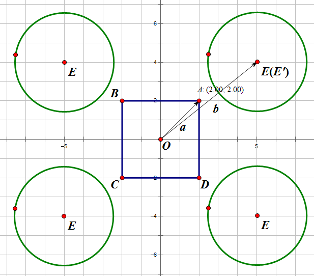
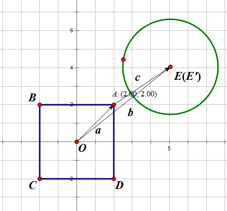
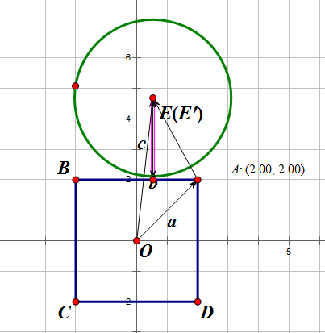
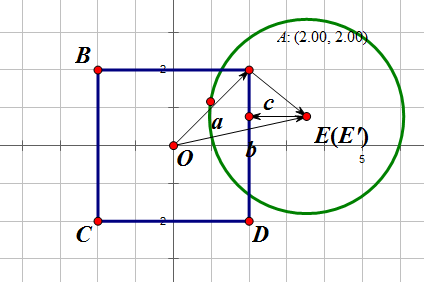
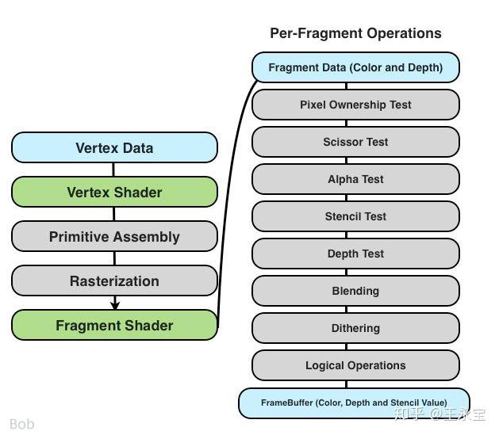
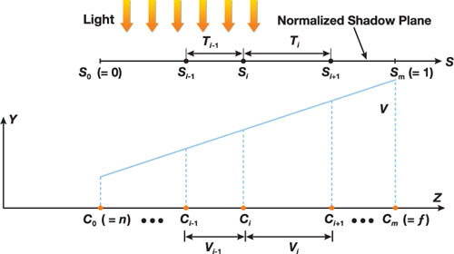

- [几何](#几何)
  - [如何判断一个多边形是凸多边形](#如何判断一个多边形是凸多边形)
  - [检测圆与矩形相交的快速判定算法](#检测圆与矩形相交的快速判定算法)
    - [化归到第一象限](#化归到第一象限)
  - [为什么使用齐次坐标，它有什么好处？](#为什么使用齐次坐标它有什么好处)
  - [如何判断射线与球体相交？ 如何优化](#如何判断射线与球体相交-如何优化)
- [渲染管线](#渲染管线)
  - [GPU 渲染管线有哪些流程？](#gpu-渲染管线有哪些流程)
  - [除了 fs、vs 还有哪些着色器？它们的作用？写代码时用过哪些着色器？](#除了-fsvs-还有哪些着色器它们的作用写代码时用过哪些着色器)
  - [知道哪些常见渲染路径？它们有什么差异？](#知道哪些常见渲染路径它们有什么差异)
  - [延迟渲染的优缺点是什么？在移动端实现需要注意什么？](#延迟渲染的优缺点是什么在移动端实现需要注意什么)
  - [如何改进前向渲染？具体怎么实现？](#如何改进前向渲染具体怎么实现)
  - [你会选用 forward+ 还是 deferred 管线？为什么？](#你会选用-forward-还是-deferred-管线为什么)
  - [为什么延迟渲染没有办法处理透明物体](#为什么延迟渲染没有办法处理透明物体)
  - [知道伽马矫正吗？说说何时切换到伽马空间？](#知道伽马矫正吗说说何时切换到伽马空间)
  - [顶点属性太多，槽位不够怎么办？](#顶点属性太多槽位不够怎么办)
  - [渲染顶点数量大的模型](#渲染顶点数量大的模型)
  - [vs 开销很大怎么办？fs 开销很大呢？](#vs-开销很大怎么办fs-开销很大呢)
    - [顶点着色器的优化方法](#顶点着色器的优化方法)
    - [片元着色器的优化方法](#片元着色器的优化方法)
      - [over draw](#over-draw)
      - [优化程序](#优化程序)
  - [法线贴图时为什么要使用切线空间而不是模型空间？](#法线贴图时为什么要使用切线空间而不是模型空间)
  - [视锥体如何定义](#视锥体如何定义)
  - [MIPMAP原理、作用，如何确定使用哪一层](#mipmap原理作用如何确定使用哪一层)
  - [什么是色调映射？了解哪些色调映射算法？写一下伪代码](#什么是色调映射了解哪些色调映射算法写一下伪代码)
  - [什么是模板测试？有哪些作用 除了用模板测试做阴影，还有什么方法](#什么是模板测试有哪些作用-除了用模板测试做阴影还有什么方法)
  - [什么情况下fs的执行次数会小于vs的执行次数](#什么情况下fs的执行次数会小于vs的执行次数)
- [光照](#光照)
  - [BlinnPhong和Phong的区别是什么](#blinnphong和phong的区别是什么)
  - [介绍一下渲染方程](#介绍一下渲染方程)
  - [PBR](#pbr)
    - [分别谈一谈 PBR 里面的 D、F、G 项？菲涅尔项会带来怎样的视觉效果？](#分别谈一谈-pbr-里面的-dfg-项菲涅尔项会带来怎样的视觉效果)
    - [PBR 材质贴图很多，纹理槽位不够应该怎么处理？](#pbr-材质贴图很多纹理槽位不够应该怎么处理)
    - [PBR 贴图格式需要注意什么？](#pbr-贴图格式需要注意什么)
- [抗锯齿](#抗锯齿)
  - [MSAA 和 SSAA 的区别](#msaa-和-ssaa-的区别)
  - [TAA、MSAA、FXAA](#taamsaafxaa)
  - [FXAA](#fxaa)
  - [为什么MSAA不能用于延迟渲染？](#为什么msaa不能用于延迟渲染)
    - [显存要求](#显存要求)
    - [算法实现](#算法实现)
- [阴影](#阴影)
  - [知道 CSM 吗？CSM 存在什么问题？如何优化 CSM 的性能？](#知道-csm-吗csm-存在什么问题如何优化-csm-的性能)
  - [知道哪些纹理贴图的压缩算法？](#知道哪些纹理贴图的压缩算法)
  - [一面中有提到虚拟纹理，下去有深入了解吗？说说看](#一面中有提到虚拟纹理下去有深入了解吗说说看)
  - [知道 Single Pass 吗？](#知道-single-pass-吗)
  - [移动端、PC 端 GPU 在显存、架构上有何不同？为什么移动端采用这种解决方案？](#移动端pc-端-gpu-在显存架构上有何不同为什么移动端采用这种解决方案)
  - [说一说 GPU Driven 能实现哪些功能？具体怎么实现的？](#说一说-gpu-driven-能实现哪些功能具体怎么实现的)
  - [compute shader 剔除结果需要回读到 cpu 吗？能直接绘制吗？](#compute-shader-剔除结果需要回读到-cpu-吗能直接绘制吗)
  - [compute shader 使用时会有什么问题，需要注意什么？](#compute-shader-使用时会有什么问题需要注意什么)
  - [有用 compute shader 实现过什么功能？](#有用-compute-shader-实现过什么功能)
  - [自己项目做了哪些优化？](#自己项目做了哪些优化)
  - [降分辨率会有什么问题？你怎么解决？](#降分辨率会有什么问题你怎么解决)
  - [你自己也实现过 Cluster Lighting，说说这个策略有什么缺点，存在什么问题？](#你自己也实现过-cluster-lighting说说这个策略有什么缺点存在什么问题)
  - [怎么理解光线追踪中的重要性采样？](#怎么理解光线追踪中的重要性采样)
  - [知道 HDR 吗？谈谈 HDR 和 Bloom 的关系](#知道-hdr-吗谈谈-hdr-和-bloom-的关系)
  - [实现过 Bloom 吗？是怎么实现的？为何在 Bloom 时候要采样多级 mipmap？不这么做会有什么结果？](#实现过-bloom-吗是怎么实现的为何在-bloom-时候要采样多级-mipmap不这么做会有什么结果)
- [全局光照](#全局光照)
  - [RayMarch 和 RayTracing 有何区别？有哪些加速 RayMarch 的策略？](#raymarch-和-raytracing-有何区别有哪些加速-raymarch-的策略)
  - [屏幕空间反射的原理是什么？步进过程能优化吗？在移动设备如何实现镜面反射？](#屏幕空间反射的原理是什么步进过程能优化吗在移动设备如何实现镜面反射)
  - [GPU Skin](#gpu-skin)
  - [现代 API 相对于 OpenGL 的优势](#现代-api-相对于-opengl-的优势)
- [开放型问题](#开放型问题)
  - [有详细了解原神的各个渲染 pass 吗？](#有详细了解原神的各个渲染-pass-吗)
  - [谈谈开放世界游戏中的天气变化，比如下雨天在渲染上需要如何处理？](#谈谈开放世界游戏中的天气变化比如下雨天在渲染上需要如何处理)

## 几何

### 如何判断一个多边形是凸多边形

把一个多边形任意一边向两方无限延长成为一条直线,如果多边形的其他各边均在此直线的同旁,那么这个多边形就叫做凸多边形

### 检测圆与矩形相交的快速判定算法

#### 化归到第一象限

首先，对于矩形来说，将坐标系原点移到矩形的中心，并且将从原点到第一象限的顶点的向量a求出来。


其次，无论圆心E在哪一个象限，都将其通过轴对称转换到第一象限，并且求出原点到转换后的圆心E′的向量b。



接下来是最关键的一步：算出A到E′的向量c，并且把向量c中的负值全部置为0，得到最终的向量c。

为什么这么做呢？这个做法的隐含的意义是，当 c 中的分量都是正值的时候，就和矩形的这个顶点来比较

当 c 中的分量有一个是负值的时候，就和矩形的某一个边比较。

1) 两个分量都大于 0



2) x 分量小于 0



相当于与横边比较

3) y 分量小于 0



相当于与竖边比较

4) 两个分量都小于 0

那就说明圆心一定在正方形内了

> 这个相交检测，或许是称为重叠检测更合适？因为假设一个正方形很大，圆在它的内部，也会被判断为 c 的两个分量都小于 0，都被赋 0

最终只要比较半径r与向量c的模长的大小即可，如果需要在代码中实现，则无需开方。

若c<r，则圆与矩形相交。

若c=r，则圆与矩形相切。

否则二者相离。

```cpp
bool Intersection(float2 c, float2 h, float2 p, float r) 
{
    float2 v = abs(p - c); 
    float2 u = max(v - h, 0); 
    return dot(u, u) < r * r; 
} 
```

### 为什么使用齐次坐标，它有什么好处？

统一了旋转和平移

方便进行透视除法

### 如何判断射线与球体相交？ 如何优化 

相交：直接联立参数方程求解，求出交点

那么可以知道射线起点到交点的长度 a

## 渲染管线


### GPU 渲染管线有哪些流程？

应用程序、几何处理、投影、裁剪、光栅化、像素着色、各种 test

### 除了 fs、vs 还有哪些着色器？它们的作用？写代码时用过哪些着色器？

几何、细分、计算着色器

用 compute shader 写过 cluster lighting，每个 cluster 分配一个 GPU 线程去做光源剔除

### 知道哪些常见渲染路径？它们有什么差异？

前向、延迟

前向渲染逐物体计算光照，可能有 over draw；延迟渲染逐屏幕像素计算，开销和场景复杂度无关

前向渲染不同物体可以使用不同的光照；而延迟渲染不区分物体，所有的像素都用同一套光照

前向渲染多光源需要重复多次绘制（多个 pass）渲染；延迟渲染一次性遍历所有光源并在一个 pass 中计算

---

上面的是它的回答

> 其实他说的这个优势……严格上来说不是主要优势？
>
> 因为 forward renderering，计算光照也可以只需要一个 light

前向渲染：泛指传统上的只有两个通道的渲染技术。

Opaque Pass（不透明，从前往后按顺序渲染）

Transparent Pass（透明，从后往前按顺序渲染）

以前 Unity 的 built-in 的前向渲染是一个灯光一个 pass

[https://forum.unity.com/threads/in-forward-rendering-why-unity-use-multipass-instead-of-looping-lights-in-shader.471131/](https://forum.unity.com/threads/in-forward-rendering-why-unity-use-multipass-instead-of-looping-lights-in-shader.471131/)

因为 Unity 的 built-in 渲染管线是在 2010 年写的，而且要支持低端设备

但是 URP 实现了单通道的前向渲染，就是片元着色器接受一个灯光序列，在一个 pass 里面，对每一个像素计算所有灯光的贡献之和

Forward+ 对相机视锥进行划分，划分成了 tile 之后，对每一个 tile 查看能影响到自己的光源，保存光源列表

光源范围和 tile 求交，或者说光源剔除，用 compute shader 来做

[https://www.lfzxb.top/forwardplus-bringing-deferred-lighting-to-the-next-level/](https://www.lfzxb.top/forwardplus-bringing-deferred-lighting-to-the-next-level/)

### 延迟渲染的优缺点是什么？在移动端实现需要注意什么？

优点：计算多光源光照时只用一个 pass，和场景复杂度无关

缺点：gbuffer 显存带宽，不支持 MSAA，透明物体渲染难以处理

在移动端可以将多个 gbuffer 压缩成一张纹理（参考 CryEngine 的 MicroGBuffer 技术）

追问：还有呢？

没答出来，面试官提示苹果的 metal 有实现移动端 gbuffer 的优化，通过 Lossy compression 压缩 Render Target 的大小以节省显存带宽

### 如何改进前向渲染？具体怎么实现？

forward 改 forward+，对屏幕 XY 方向分 tile，对每个 tile 进行光源剔除，保留影响当前 tile 的光源，然后计算光照

### 你会选用 forward+ 还是 deferred 管线？为什么？

开放问题，我答了 forward+，这种题理由充分答哪边都行

原因：对多光源场景有明显优化、支持 MSAA、透明物体绘制方便

### 为什么延迟渲染没有办法处理透明物体

1.光照与颜色混合：

延迟渲染的一个关键问题是它在第一阶段就已经将场景的所有几何信息（如颜色、法线、深度等）存储到G-buffer中，因此无法直接进行实时的光照计算。对于透明物体，颜色混合和光照计算通常需要实时访问场景的像素数据，这就无法直接在延迟渲染中进行。透明物体的像素需要根据其透明度与背景图像进行混合，这需要从G-buffer中提取颜色和其他信息，执行正确的混合操作。

2.排序问题：

透明物体的渲染顺序非常重要，因为透明物体的颜色需要与后面的背景物体混合。如果渲染顺序不对，可能会导致错误的混合效果。传统的前向渲染通常是逐像素的，渲染透明物体时可以按照深度排序进行正确的混合。而在延迟渲染中，由于所有物体都在同一个阶段进行光照计算，透明物体的顺序问题变得更加复杂。

3.无深度信息：

在延迟渲染的第一阶段，所有的几何信息都会被存储在G-buffer中，但透明物体的深度信息在这个阶段并不会直接影响渲染结果。对于透明物体，深度信息通常很重要，因为透明物体可能出现在其他物体之前或之后，需要正确的深度排序才能得到正确的视觉效果。

解决方法

1.前向渲染和延迟渲染混合：

对于透明物体，可以使用传统的前向渲染方式。将透明物体单独提取出来，在光照计算后进行渲染。这种方式能确保透明物体能够按正确的顺序进行渲染和混合。

2.改进的G-buffer设计：

有些方法尝试将透明度信息和其他相关信息（如反射率、折射率等）也存储在G-buffer中，结合不同的混合算法处理透明物体，但这需要更复杂的渲染管线设计和优化。

### 知道伽马矫正吗？说说何时切换到伽马空间？

显示器电压和亮度的变换不是线性的，而是 gamma 2.2

在线性空间计算光照、颜色，输出的时候要做一次 gamma 0.454 抵消显示器的变换

### 顶点属性太多，槽位不够怎么办？

使用一个大 buffer 存 struct 然后顶点属性只用存 buffer 的索引

### 渲染顶点数量大的模型

降模、LOD、使用顶点索引

程序化生成。比如地形，存地形网格的开销很大

剔除不可见的顶点，例如背面簇剔除

将顶点按照相近法线方向分为簇，渲染开始的时候，剔除掉那些和法线方向和视线方向相反的簇

[https://www.reddit.com/r/vulkan/comments/8ies4r/working_with_large_sets_of_vertex_data/](https://www.reddit.com/r/vulkan/comments/8ies4r/working_with_large_sets_of_vertex_data/)

### vs 开销很大怎么办？fs 开销很大呢？

#### 顶点着色器的优化方法

感觉做优化之前还是要通过性能分析来看，瓶颈在哪里

如果是在运算上，

避免连续矩阵乘法，可以在 cpu 上预先算好

参考：[Vertex Shader Performance - NVIDIA Docs](https://docs.nvidia.com/gameworks/index.html#technologies/mobile/gles2_perf_vertex_shader.htm)

如果是在 IO 上，

使用顶点索引

压缩顶点属性，比如使用字节来存储法线、切线、颜色，用半精度浮点来存储 UV

如果是缓存一致性，

使用 AOS 而不是 SOA，避免内存抖动

对顶点数组做预先排列，同时对应地重新映射索引数组

#### 片元着色器的优化方法

瓶颈在哪？

最简单的就是降低分辨率

##### over draw

检查 over draw 现象是否严重

over draw 就是是否重复绘制同一个像素

减小 over draw，需要知道引起 over draw 的原因

不透明物体、技能粒子特效、UI

透明物体实际上也可能造成 over draw

参考：[Unity Overdraw: Improving the GPU Performance of Your Game](https://thegamedev.guru/unity-gpu-performance/overdraw-optimization/)

虽然一般都会对物体排序，然后不透明物体从前往后渲染

但是这个排序是根据物体的自身的原点来排序的

对于一些看上去处于远处的大的物体，它的原点实际上可能比一些看上去小的，近的物体，还要更近

也就是说，你可能需要将大的对象拆分为更小的子对象

还有就是与自身相交的几何体，这个也可以拆分

但是拆分这个行为就是，用更多的 draw call 换更少的 over draw

很难说最终性能怎么样吧，还是要测试

Unity 的批处理可能导致没有对这些合并的物体在渲染的时候排序

> 我感觉自己实现的话应该是可以排序的呀？

半透明 UI 的优化思路可以是，为 UI 制作一个紧密的 Mesh

或者是以不透明模式渲染 UI 的一部分

因为不透明模式和半透明模式的区别之一是是否写入 z buffer

有一个优化 over draw 的方法是创建一个低分辨率的 RT，把透明物体都渲染到这个低分辨率 RT 上，然后渲染主屏幕的时候再从这个 RT 采样回来

[优化 Overdraw 和 GrabPass](https://chengkehan.github.io/OverdrawAndGrabPassOptimization.html)

看到有人自己做工具的

[Overdraw概念、指标和分析工具](https://zhuanlan.zhihu.com/p/323421079)

还有镜头后处理、地形之类的也会导致 over draw

[Unity性能优化 - Overdraw篇](https://blog.csdn.net/qq_33808037/article/details/129427267)

over draw 这里也涉及到 GPU 架构

[浅谈移动端GPU架构](https://www.zhihu.com/column/c_1657343719325155328)

但是看这个之前或许要先了解大概结构

[深入GPU硬件架构及运行机制](https://www.cnblogs.com/timlly/p/11471507.html)

##### 优化程序

参考：[Fragment Performance - NVIDIA Docs](https://docs.nvidia.com/gameworks/index.html#technologies/mobile/gles2_perf_fragment.htm%3FTocPath%3DTechnologies%7CMobile%2520Technologies%7CMobile%2520How%2520Tos%7COptimize%2520OpenGL%2520ES%25202.0%2520Performance%2520for%2520Tegra%7C_____3)

纹理过滤

使用 mipmap。不使用 mipmap 可能导致不可预测的内存访问模式，从而破坏纹理缓存、降低内存效率并增加内存带宽消耗，从而导致性能下降。

这个就是看硬件具体情况了吧

减少寄存器的使用

压缩精度。输出到 16 位 (RGB 565) 而不是 32 位 (RGBA8888) 帧缓冲区

使用一些周期更少的指令去做等效替代

避免条件判断。具有离散模式的着色器都可以分为多个单一模式的着色器

或者是利用阶梯函数的思维来代替条件判断

或者使用三目运算

避免 discard

因为 discard 导致 early z 失效

因为如果这个时候还用 early z，那么你通过了深度测试的像素之后被丢弃的话，那么这个像素的深度也应该被丢弃，但是你在 early z 里面却已经写入了这个像素的深度值，所以就已经错了

参考：[Alpha Test 一定会打断 early Z 么？ - 王淼淼的回答 - 知乎](https://www.zhihu.com/question/526193551/answer/2429606136)

如果要用 discard 也要用 early z 那么就可以分为两个 pass

pass1:只做discard相关的计算，完成后进行深度测试写入或不写深度

pass2:关闭深度写入，进行颜色相关的计算，不包含discard指令

> 现代 API 里面，alpha test 和 early z 这种环节，是怎么设置的
>
> 似乎没搜到
>
> alpha test 本质上是不是，自己写在片元着色器的包含 discard 的条件判断语句
>
> 应该是的。我看某些图里面，也会把 alpha test 写在管线里面，但是这不代表 alpha test 是写在硬件上的不可修改的东西

### 法线贴图时为什么要使用切线空间而不是模型空间？

如果你把法线存储到模型空间中

那么当模型转动的时候，旧的存储的法线就不对了

当然可以用更多操作来处理，比如记录一下，你烘培法线的时候的旋转姿态是什么，然后记录当前旋转姿态是什么，然后求出旋转角，对每一个存储在模型空间的法线都做旋转

但是这样不够标准吧我觉得

人人都可以在任何姿态烘培法线，不够统一

现在我们约定，法线只在切线空间烘培

切线空间就是某点的法向量和两个互相垂直的切向量组成的坐标系

那么现在我们都知道要把法线转换到模型空间，需要做什么变换

### 视锥体如何定义

宽高比

FOV

近平面远平面

### MIPMAP原理、作用，如何确定使用哪一层

相邻像素的UV差值越大，说明采样的纹理在屏幕上占比越小，对应的就需要使用mipmap level更大的mipmap等级进行纹理采样

### 什么是色调映射？了解哪些色调映射算法？写一下伪代码 

我只知道查表……

3d lut，rgb 对应三个轴

### 什么是模板测试？有哪些作用 除了用模板测试做阴影，还有什么方法

模板测试就相当于划分了一个区域，可以让绘制只写入通过与模板值比较的区域

### 什么情况下fs的执行次数会小于vs的执行次数

进行了模板测试的情况下



测试是在片元之后的，居然也算是 fs 执行次数？

模板测试就是测试像素是否在特定的图形的内部

## 光照

### BlinnPhong和Phong的区别是什么

BlinnPhong 半程向量与normal的夹角

Phong 视线与入射光线反射向量的夹角

### 介绍一下渲染方程

发出的光的辐射度 = 自发光

（1）辐射能(Radiant Energy)，符号Q，表示光穿过一个平面的光能。

（2）辐射通量(Radiant Flux(Power))，符号Φ，表示单位时间内光穿过一个截面的光能。

（3）辐射强度(Radiant Intensity)，又叫光强度，符号I，表示单位立体角上的辐射通量。

（4）辐射率(Radiance)，又叫光亮度，符号L，表示单位立体角、单位投影面积上的辐射通量。

（5）辐照度(Irradiance )，符号E，表示单位面积上的辐射通量。

（6）辐射率和辐照度的区别：想象一个微小的平面，往每一个方向方向吸收光能，那么radiance就表示该平面沿着某一个方向上吸收到的光能，这个微小发光面吸收到的所有能量之和就是Irradiance，等于所有radiance的积分。

**Radiance是带有方向性的光亮度，Irradiance是不带有方向性的，各个方向上Radiance的积分之和：**

### PBR

#### 分别谈一谈 PBR 里面的 D、F、G 项？菲涅尔项会带来怎样的视觉效果？

$$
f(\mathbf{i},\mathbf{o}) = \dfrac{F(\mathbf{i},\mathbf{h})G(\mathbf{i},\mathbf{o},\mathbf{h})D(\mathbf{h})}{4(\mathbf{n}, \mathbf{i})(\mathbf{n}, \mathbf{o})}
$$

F 表示菲涅尔项，表示多少光线被反射

入射光线与物体表面夹角小于一定程度时，出现明显的反射

体验上就是边缘上更亮一点，因为反射光线更多

D 表示法线分布

h 表示半程向量，因为反射的时候入射光线和反射光线是以法向量为对称的，所以如果发生的反射，那么入射光线和反射光线的半程向量应该是靠近法向量的，所以我们可以使用半程向量去与法向量之间作比较，越接近则越反射

D(h) 表示查询，也就是查询在所有的微表面中，有多少微表面是法向量接近半程向量的，这个占比就表明了物体表面材质在宏观上对这个半程向量所表示的情况的反射行为

G 表示几何项，考虑微表面之间的互相遮挡

当光线几乎与物体表面平行入射的时候，容易发生微表面之间的互相遮挡

#### PBR 材质贴图很多，纹理槽位不够应该怎么处理？

合并多个属性到一个通道，比如 roughness 和 metallic 可以存在 8 bit 纹理的高低 4 bit 上

追问：还有别的方法？

虚拟纹理，将小贴图合并成大贴图，按需调入

#### PBR 贴图格式需要注意什么？

albedo 可以 sRGB 格式，而 roughness 和 metallic 需要保存在线性空间

也就是颜色需要单独处理，因为颜色是有和电平有 gamma 0.45 的关系的

其他量都是与显示器电压无关的物理量，所以不需要特别处理，所以直接就是线性

## 抗锯齿

### MSAA 和 SSAA 的区别

SSAA 是直接渲染 4x 的帧缓冲然后插值到 1x 的帧缓冲，理论结果最好，但是成本太高

MSAA 的帧缓冲还是 1x，但是颜色、深度、模板缓冲是 4x，在三角形片元的时候还是 1x，但是片元算出颜色之后，对 4x 的子采样点做测试，查看这个子采样点是否在三角形内，如果在的话，并且通过测试的话，就把算出来的颜色，还有深度信息，赋给子采样点

最后根据 4x 的颜色缓冲 resolve 出 1x 帧缓冲上的最终颜色

**MSAA 和 SSAA 的区别就是，MSAA 只算 1x 的片元着色，那个 4x 的颜色缓冲是被赋值来的，不是算出来的**

### TAA、MSAA、FXAA

基于图像后处理的 AA 算法：简单的图像后处理，根据像素邻域信息进行融合，性能开销小，对于边缘平滑明显，常见于 FXAA。

增加像素采样数 AA 算法：他们对于单个像素颜色，使用了多个样本点平均，得出的结果更精确。算法开销中等，效果明显优于 FXAA，且消耗更多的 GPU 内存资源，MSAA、Temporal AA 属于该类算法。

基于深度学习的 AA 算法：前两种算法的组合，利用神经网络的重建能力进行图像处理。效果较好，算法开销最高，同时利用时域信息增加单个像素的采样点，常见算法 DLSS（需要特殊硬件 Tensor Core 的支持，当前，仅 RTX 20 系列的少量游戏能开启）。

[游戏反走样算法调研 | 英伟达最新 DLSS, TAA, FXAA, MSAA 原理及比较](https://zhuanlan.zhihu.com/p/57503957)

### FXAA

[fxaa](./fxaa.md)

### 为什么MSAA不能用于延迟渲染？

#### 显存要求

MSAA对显存和显存带宽的消耗过大，在性能上无法实现

GBuffer里面的RT（Albedo、深度、法线等）容量和带宽消耗全都会翻倍

#### 算法实现

1.不知道每个子Sample属于哪个三角形，因此不知道应该把光照结果复制到哪个子Sample

2.
延迟渲染在计算光照时已经无法获取像素的几何信息，因此无法使用MSAA

## 阴影

### 知道 CSM 吗？CSM 存在什么问题？如何优化 CSM 的性能？

通过渲染多张深度图实现

draw call 开销大，显存带宽开销大

阴影相机做视锥剔除。或者 csm 不开太远，远处阴影靠 SDF 或干脆不绘制阴影

[Chapter 10. Parallel-Split Shadow Maps on Programmable GPUs](https://developer.nvidia.com/gpugems/gpugems3/part-ii-light-and-shadows/chapter-10-parallel-split-shadow-maps-programmable-gpus)



1. 使用 { C i } 处的分割平面将视锥体V分割为m个部分 { Vi }。

2. 计算每个分割部分Vi的光的视图投影变换矩阵

3. 为所有分割部分 { Vi }生成具有分辨率res的PSSM { Ti }

4. 为场景合成阴影

### 知道哪些纹理贴图的压缩算法？

DXTC、ETC、ASTC

他们的基础原理都是通过块压缩来实现的

对于某个块，取两个端点的颜色，然后各个块的颜色就是在这两个端点之间插值

### 一面中有提到虚拟纹理，下去有深入了解吗？说说看

类似虚拟内存，将大纹理（比如地形纹理）分成一块一块的页（page），按需调入

### 知道 Single Pass 吗？

应该指的是在一次遍历里面就完成所有的渲染操作，它应该是一个笼统的概念

1.光照计算

在光照模型中，Single Pass 渲染可以指在一次渲染操作中计算所有光照信息，例如环境光、点光源、聚光灯等，而不需要为每种光源或光照计算分别渲染场景。这在多光源的场景中非常重要，能够有效减少渲染的复杂度。

2.着色器的应用

在着色器编程中，Single Pass 意味着通过一个着色器程序处理所有必要的计算。这通常涉及到将多种渲染操作（如颜色计算、法线映射、阴影、反射等）都集中在一个着色器执行，而不需要多次切换不同的渲染阶段。

3.阴影贴图

通过 Single Pass 渲染技术，可以一次性计算整个场景的阴影贴图，而不是为每个光源都进行一次渲染。这样可以大大提高渲染效率，尤其是在动态光源的情况下。

4.多重渲染目标（MRT）

在多重渲染目标中，单遍渲染技术可以通过单次渲染将多个输出同时写入不同的渲染目标。例如，可以在同一次渲染中计算并存储颜色、法线、深度等多个信息，避免了重复计算和多次渲染的需求。

5.环境映射和反射

许多环境映射和反射的技术，比如立方体映射（Cube Mapping），也可以通过 Single Pass 渲染优化。通过一个单一的渲染路径计算出所有反射和环境的影响，而不需要多次渲染。

6.透明物体渲染

在渲染透明物体时，如果能够通过 Single Pass 渲染计算出物体的透明度效果和混合效果，则能够减少渲染开销，避免了传统的透明物体需要两次渲染的过程。

>这个好像是 Unity VR 的选项？一般 VR 是渲染左右眼共两次，而 Single Pass 一次性将画面渲染到两倍宽度的 RT 上面
>
> 这是原帖的回答，这应该只是 Single Pass 的应用

### 移动端、PC 端 GPU 在显存、架构上有何不同？为什么移动端采用这种解决方案？

PC 端的显卡，在主板上有供电，有显存，有 GPU

而移动端的显卡只有一个 GPU，也没有显存，它是统一内存架构，gpu 和 cpu 共用一个内存

移动端 cpu 和 gpu 无法交叉访存。

渲染方面使用 tile base，每次渲染一小块屏幕区域。依次将每个 tile 的数据调入小容量、低功耗的高速存储器（Tile Memory）进行光栅化、着色等计算

> 啥是 cpu 和 gpu 交叉访存

### 说一说 GPU Driven 能实现哪些功能？具体怎么实现的？

遮挡剔除，先生成低分辨率深度图，然后将物体 bounding box 和深度图做对比，如果被挡住则不用绘制。

这里当时回答的时候没有说清楚，低分辨率深度图的获取主要分为两个流派，一种是 cpu 做软光栅化，另一种是回读上一帧的深度图

---

> GPU Driven 指的就是把 CPU 的东西放到 GPU 来做

[现代渲染引擎开发-GPU Driven Render Pipeline](https://zhuanlan.zhihu.com/p/409244895)

真看不懂了

### compute shader 剔除结果需要回读到 cpu 吗？能直接绘制吗？

可以不直接回读，在 GPU 直接执行绘制命令

需要图形 API 达到一定版本才支持，比如 DX12 的 ExecuteIndirect

### compute shader 使用时会有什么问题，需要注意什么？

执行某些算法时 cpu 需要向 gpu 提交大量数据，内存 -显存的数据迁移造成开销

注：这里没答好，感觉面试官想问线程同步、硬件特性、wrap 优化性能这方面的。因为每个 GPU SIMD 的特性，每个 wrap 内所有线程执行一样的指令，所以难以处理分支指令。一般是两边都走然后各取结果所以效率低

### 有用 compute shader 实现过什么功能？

写过 Cluster Lighting，每个 cluster 分配一个线程去做光源剔除

### 自己项目做了哪些优化？

Bloom 高斯模糊分横竖两个 pass，dowm sample + up sample 用硬件 Bilinear 做快速滤波

体积云用降分辨率 tracing 然后 up sample 到屏幕上

### 降分辨率会有什么问题？你怎么解决？

体积云，低分辨率的 RT 直接 up sample 回去，会模糊，在深度变化较大的边缘会有 Artifact

实际上应该把 RT 的深度一起存了，up sample 的时候顺便看看屏幕深度和 RT 深度是否相差过大，如果是的话就舍弃

### 你自己也实现过 Cluster Lighting，说说这个策略有什么缺点，存在什么问题？

需要 cpu 提交大量数据到 gpu，造成开销

这里只答了一个点，当时蒙了。因为一般是说优点，突然问个缺点没反应过来。仔细想了想面试官可能想问移动端 compute shader 的兼容性、跳跃存取 compute buffer 数据带来的 cache 缺失开销、warp 内走的分支不同导致开销等问题

### 怎么理解光线追踪中的重要性采样？

对亮度贡献大的方向（比如环境贴图中的亮处、BRDF 大的方向）多分配光线，使用少量采样就可以达到不错的效果

### 知道 HDR 吗？谈谈 HDR 和 Bloom 的关系

普通像素的范围在 0~255，而 HDR 能够模拟物理世界中正确的光照，比如环境贴图中亮度上万的像素。使用 HDR 在物理上能够得出正确的颜色，但是屏幕显示不了那么亮，需要做一个色调映射再输出。

如果对 HDR 的 RT 做 Bloom，单个超亮的像素也能扩出大范围的光晕，比如《无主之地3》中高亮的天线：

---

不单单是 bloom，其实 hdr 也可以提升其他后处理的效果

[Does HDR rendering have any benefits if bloom won't be applied?](https://gamedev.stackexchange.com/questions/62836/does-hdr-rendering-have-any-benefits-if-bloom-wont-be-applied)

### 实现过 Bloom 吗？是怎么实现的？为何在 Bloom 时候要采样多级 mipmap？不这么做会有什么结果？

两种方法：用横竖两次高斯模糊、或者 down sample 出一串 mip 然后再 up sample 回屏幕

如果采样单级 mip，因为硬件 Bilinear 滤波是 2x2 的盒子，最终扩出的 bloom 结果会是方块形状的，很丑。叠加多级 mip 的结果，方块感没那么强

注：这里又没答好，用低分辨率的 mip 还有一个好处就是 bloom 扩散的范围会非常大。而高斯模糊的效果要想做到与前者同样大的扩散范围，需要更大的 filter size 也带来了更高的开销

## 全局光照

### RayMarch 和 RayTracing 有何区别？有哪些加速 RayMarch 的策略？

从某一个像素出发，RayCasting 是投射多个光线，RayTracing 是投射一个光线

RayMarch 需要老老实实一步一步步进，收集沿途的信息，而 RayTracing 只关心射线和场景的交点，不关心步进的过程，因此可以用一些策略加速步进

常规：降分辨率 + 随机步长 + temporal

Hiz：在深度图的 mipmap 串上面进行步进

有符号距离场（SDF）

### 屏幕空间反射的原理是什么？步进过程能优化吗？在移动设备如何实现镜面反射？

单次反弹的光线追踪。利用深度图，通过比较采样深度和测试深度的大小来判断射线与场景求交。返回交点颜色作为反射的颜色

步进过程可以通过降分辨率、Hi-Z、SDF 等策略优化

在移动设备 tracing 开销过大，可以使用反射探针（静态场景）或者加一个 camera 渲染到 RT 的策略（比如镜子）

### GPU Skin

[https://blog.csdn.net/vincent_game/article/details/97641611](https://blog.csdn.net/vincent_game/article/details/97641611)

[https://blog.csdn.net/yinfourever/article/details/108368799](https://blog.csdn.net/yinfourever/article/details/108368799)

把动画信息烘培成贴图，通过读取贴图的方式来获得网格上各个顶点的信息

通过 GPU instancing 绘制大量重复物体

传入一个偏移数组，来控制每个重复物体不同的动画时间起点

适用于动画信息没有那么复杂的，但是需要大量绘制的角色动画

动画的复杂可以是使用了动作融合，骨骼部位分离动画，IK，重定向，骨骼蒙版等

这张复杂的动画一般就是主角才用

### 现代 API 相对于 OpenGL 的优势

我看网上的文章，主要是现代 API 天然支持并行性

因为 opengl 有状态的，所以做什么事情都要切换成特定的上下文

但是现代 api 都是可以直接并行，就是你可以在绘制的同时上传资源之类的

## 开放型问题

### 有详细了解原神的各个渲染 pass 吗？

感觉这里面虽然讲了各个技术，但是完整的 pass 没有讲

[《原神》主机版渲染技术要点和解决方案](https://zhuanlan.zhihu.com/p/356435019)

### 谈谈开放世界游戏中的天气变化，比如下雨天在渲染上需要如何处理？

光照：来自太阳的平行光（场景主光）减弱或者消失，依赖场景光源（比如路灯）进行照明

云：云层应该变得稠密，通过修改采样噪声图的参数实现

植被：植被的晃动程度应该增加

雾：雾的浓度增加，如果是 cluster lighting 管线下，frustum voxel 中有光源信息的话也可以做光源体积雾