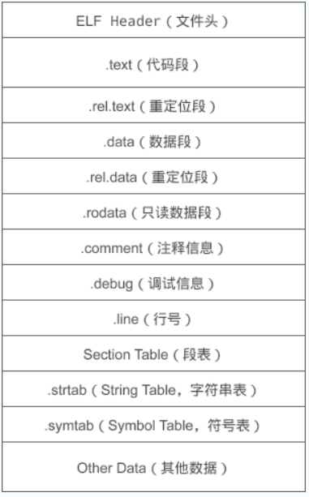

## 基础

### int 几字节？不同 CPU 架构下大小会变吗？长整型呢？

4B、在 32 位下 long 也是 4B，而 64 位下 long 变为 8B

### 从 cpp 源代码到 exe 经过了哪些过程？

1.预处理阶段：对源代码文件中文件包含关系（头文件）、预编译语句（宏定义）进行分析和替换，生成预编译文件。产生.i文件。

1.1 对所有的“#define”进行宏展开

1.2 处理所有的条件编译指令，比如“#if”,“#ifdef”，“#elif”，“#else”,“#endif”

1.3 处理“#include”指令，这个过程是递归的，也就是说被包含的文件可能还包含其他文件

1.4 删除所有的注释“//”和“/**/”

1.5 添加行号和文件标识

1.6 保留所有的“#pragma”编译器指令

2.编译阶段 将预处理完的文件进行一系列词法分析，语法分析，语义分析及优化后生成相应的汇编代码文件(.s文件)

3.汇编阶段 汇编指令->机器指令

只编译生成目标文件，不链接，链接动作是在链接阶段完成的

目标文件由段组成



代码段：该段中所包含的主要是程序的指令。该段一般是可读和可执行的，但一般却不可写。

数据段：主要存放程序中要用到的各种全局变量或静态的数据。一般数据段都是可读，可写，可执行的。

这个目标文件也分为很多种。在 Windows 和 Linux 下分别被称为不同的格式

可重定位文件：其中包含有适合于其它目标文件链接来创建一个可执行的或者共享的目标文件的代码和数据。

Linux: .o .a

Windows: .obj .lib

共享的目标文件：这种文件存放了适合于在两种上下文里链接的代码和数据。

第一种是链接程序 可把它与其它可重定位文件及共享的目标文件一起处理来创建另一个目标文件；

第二种是动态链接程序 将它与另一个可执行文件及其它的共享目标文件结合到一起，创建一个进程映象。

Linux: .so

Windows: .dll

可执行文件

Linux: 一般不写后缀 

Windows: .exe

4.链接阶段

包括地址和空间分配(Address and Storage Allocation)、符号决议(Symbol Resolution)和重定位(Relocation)

就是把每个目标文件组合起来

链接方式：

4.1 静态链接/库

在链接阶段，会将汇编生成的目标文件.o与引用到的库一起链接打包到可执行文件中，因此对应的链接方式称为静态链接。

静态库可以简单看成是一组目标文件（.o/.obj文件）的集合，即很多目标文件经过压缩打包后形成的一个文件。

静态库的缺点在于：浪费空间和资源，因为所有相关的目标文件与牵涉到的函数库被链接合成一个可执行文件。

4.2 动态链接/库

动态库在程序编译时并不会被连接到目标代码中，而是在程序运行是才被载入。不同的应用程序如果调用相同的库，那么在内存里只需要有一份该共享库的实例，规避了空间浪费问题。动态库在程序运行是才被载入，也解决了静态库对程序的更新、部署和发布页会带来麻烦。用户只需要更新动态库即可，增量更新。

### c 和 c++ 差异？c++ 执行更快吗？

参考：[](https://www.zhihu.com/question/19779887)

我感觉是，不能一概而论

C++ 一般会提供一些便利的特性和容器，来帮助实现目的

你纯粹用 C 来手写也不是不行，但是自己实现可能不如 stl 

一般人说 C++ 有虚函数，所以 C++ 更慢，但是如果你用了虚函数，那就说明你需要这个特性，那你也要在 C 中实现一遍虚函数，要实现虚指针，虚表，自己填表，查表，最后虚指针的运行跟 C++ 也一样

### 野指针的产生原因，解决方法

指针变量声明时没有被初始化。

指针 p 被 free 或者 delete 之后，没有置为 NULL。

指针操作超越了变量的作用范围。

### 为什么要内存对齐？ 

因为计算机读取内存的时候，每一次读取都是从某一个单位长度的整数倍出发，读取单位长度的内存

比如以字长为单位读取，32 位系统的字长是 4 字节，64 位的字长是 8 字节

当然这个对齐的长度也不一定是这个，也可能受到其他影响

比如缓存行的长度可能影响对齐。缓存行的长度是 16 字节，那么比较大的数据可能需要按照 16 字节对齐

[https://stackoverflow.com/questions/28898277/why-do-some-types-e-g-float80-have-a-memory-alignment-bigger-than-word-size](https://stackoverflow.com/questions/28898277/why-do-some-types-e-g-float80-have-a-memory-alignment-bigger-than-word-size)

### 有了函数要它们何用？为什么不能用宏来替代函数？

宏的优势，我个人认为是可以方便赋予函数块以意义

其他的用法，都可以用枚举或者常数变量来代替，更安全

但是比如在做反射机制的时候，把 get_type, get_type_name，get_size 这些函数都封装成一个宏定义，放在需要反射机制的类里面，

这样，你就把一堆函数捆绑起来，完成了反射的功能，同时还便于合作者理解你的代码

宏如果想去代替单个函数，其实没有太大优势

宏去代替单个函数，主要是节省一层函数调用的堆栈，但是也会增多展开出来的代码量

如果这个函数被使用了很多次，那么代码量会激增

宏不能替换递归函数，因为他不知道递归的终止条件

**函数可以取指针**，因为编译出来的文件，函数放在代码区，但是宏的话不能取指针，他只是方便替换，在预处理的时候就替换掉了

函数可以完成对参数的类型检查，宏不可以。因为函数可以被声明，编译器会检查函数声明，但是宏没有声明的机制，虽然宏可以知道自己被传递的参数的数量

调试也会很困难，比如程序在宏定义段里面报错，某些调试器可能没办法定位到宏定义段里面。还有就是如果要统计每个函数的运行时间的话，在宏定义展开的程序段里面的运行时间可能只是被记为 main 的时间，而没有更详细的信息

### inline与宏区别? 

区别在于，宏是由预处理器对宏进行替代，而内联函数是通过编译器控制来实现的。 

而且内联函数是真正的函数，只是在需要用到的时候，内联函数像宏一样的展开，所以取消了函数的参数压栈，减少了调用的开销。

宏是预编译器的输入，然后宏展开之后的结果会送去编译器做语法分析。

宏与函数等处于不同的级别，操作不同的实体。

宏操作的是 token, 可以进行 token的替换和连接等操作，在语法分析之前起作用。而函数是语言中的概念，会在语法树中创建对应的实体，内联只是函数的一个属性。 

### 左值 右值

#### 右值传参时退化为左值原因

右值在传参的时候被保存到了特定的位置，所以就可以取地址了，失去了右值属性

改进方法，使用std::forward<>来保证右值属性的传递（完美转发）

### STL 中 vector 不断 push，内存上会有何变化？用指针指向 vector 元素应该注意什么？

达到阈值内存就扩容两倍（扩容倍数和编译器版本有关）

注意扩容后数据搬离，指针指空，变为野指针

### 多继承的实现？可能出现什么问题

1. 定义派生类对象时，构造函数执行顺序？

定义派生类对象时，构造函数的执行顺序和派生类定义时继承的顺序保持一致。

2. 基类中同名变量冲突

必须要在变量名前加上作用域 son.Mother::name. 

如果两个平行的基类中有相同的数据，把它们存放在更上一级类中，可以通过菱形继承或虚继承实现。

3. 派生类类对象内存布局（多个虚表指针 __vfptr）

比如子类 C 继承了 A 和 B，A 和 B 中都有虚函数，那么 C 中有两个虚表指针，分别从 A 和 B 继承来

### 菱形继承下的类大小

同上

### 类实例的内存存储形式是什么样子的

空类的大小为 1

对象必须要被分配内存空间才有意义，这里编译器默认分配了 1Byte 内存空间(不同的编译器可能不同)

静态成员变量是在编译阶段就在静态区分配好内存的，所以静态成员变量的内存大小不计入类空间

类存在内存对齐

成员函数和非成员函数都是存放在代码区的，故类中一般成员函数、友元函数，内联函数还是静态成员函数都不计入类的内存空间

如果有虚函数，那么对象需要一个虚表指针

### final 和 override

override 关键字告诉编译器，这个函数一定会重写父类的虚函数，如果父类没有这个虚函数，则无法通过编译。此关键字可省略，但不建议省略。

finial 关键字告诉编译器，这个函数到此为止，如果后续有类继承当前类，也不能再重写此函数。

### 谈谈 static 关键字怎么用，有何效果？

修饰变量：只能在同一文件中被访问的静态变量

修饰函数：可以不实例化某个类，就调用该类的 static 函数

### 类中静态变量的初始化是什么时候？ 

1.静态初始化 static initialization

指的是用常量来对静态变量进行初始化，包括zero initialization和const initialization

其中zero initialization的变量会保存在.bss段（未初始化静态变量，以及初始化为0的静态变量）

const initialization的变量保存在.data段(已经初始化为非0的静态变量)。对于静态初始化的变量（请注意：包括在函数中采用静态初始化的静态变量），是在程序加载时完成的初始化。

2.动态初始化 dynamic initialization

指的是需要调用函数才能完成的初始化，比如类的构造函数。

```cpp
static int my_int = CreateMyInt();
```

对于全局或者类的静态成员变量，是在main()函数执行前由运行时调用相应的代码进行初始化的。

而对于局部静态变量，是在函数执行至此初始化语句时才开始执行的初始化。


### 复制构造函数不能值传递

因为值传递一个类，相当于要用复制构造来构造实参，所以相当于复制构造调用了复制构造自身，这样不断递归下去

所以编译器不允许复制构造函数的参数是值传递

[value para in copy ctor](./testing/value_para_in_copy_ctor.cpp)

### 所有数组类型的参数都会退化为指针类型

[array para decay to pointer](./testing/array_para_decay_to_pointer.cpp)

传入数组类型的参数的时候，带长度的话就不会退化成指针，不带长度就会退化

## 多态

### 怎么理解 c++ 的虚函数？什么是纯虚函数？

能够允许通过基类指针调用派生类函数

纯虚函数必须由子类实现

### 虚表指针、虚函数表什么时候产生

虚函数表指针随对象走，它发生在对象运行期，当对象创建的时候，虚函数表表指针位于该对象所在内存的最前面。

虚函数表是在编译期间就已经确定，且虚函数表存放虚函数的地址也是在创建时被确定。

虚函数表属于类，类的所有对象共享这个类的虚函数表。

虚函数表由编译器在编译时生成，保存在exe的(常量区).rdata只读数据段。

>~~在构造函数和析构函数中，虚函数表指针的值可能还没有被完全设置或者已经被销毁，这是因为在构造函数和析构函数的执行期间，对象可能只是部分构造或部分销毁。因此，在构造函数和析构函数中调用虚函数可能不会得到期望的结果，并且应该避免这样的调用~~
>
> 这是记的什么玩意

### 构造函数里面可以调用虚函数吗

语法上没有问题。

构造顺序是先基类后派生类，派生类在构造函数内部还是基类类型而不是派生类类型，所以调用的是基类的虚函数，而不是派生类的重写的虚函数，可能无法达到预期的效果

### 为什么不允许派生类的构造函数调用派生类的虚函数重写

问：在设计语法的时候，如果我人为改掉构造时的类型，认为派生类在构造的时候也是派生类类型，使得其可以调用派生类的重写的虚函数，可以吗？

不可以，因为派生类的构造时，派生类的一些成员可能还是未初始化的，这是不安全的

### 析构函数里面可以调用虚函数吗

语法上也没有问题。

析构是先派生类再基类，基类在析构的时候，派生类的析构已经执行完了，这个时候派生类的数据成员都应该是被销毁了，这是是基类类型，调用的是基类的虚函数，并没有多态，于是失去了用虚函数的意义。

### 为什么不允许基类的析构函数调用派生类的虚函数重写

问：在设计语法的时候，如果我人为改掉构造时的类型，使得基类以一种方式知道了自己是从哪个派生类析构而来的，使得其可以调用派生类的重写的虚函数，可以吗？

不可以，因为基类析构时，派生类已经被析构，那么派生类的成员应该是已经被销毁的，若要访问可能会出错

### 为何析构函数可以为虚？子类不实现析构函数会怎样？

鼓励子类实现，以在析构函数中释放资源。

背景是有一个将子类对象转型为父类的对象

不实现的话，会调用父类的析构函数，可能造成子类资源未释放导致内存泄漏

### 重载重写覆盖的区别，子类重写了虚函数会对虚函数表有什么影响

重载：函数名相同、函数参数不同、位于同一个域（类）中

重写（覆盖）：函数名相同、函数参数相同、位于同一个域（类）中、并且是虚函数

隐藏：函数名相同、函数参数相同、位于同一个域（类）中、并且不是虚函数

当子类继承父类时，会继承虚表；

当子类有新的虚函数时，会在虚表后面新增新的项；

当子类重写父类的虚函数时，会把虚表中原有的某一项覆盖。

### 构造函数和析构函数能不能是虚函数

当使用了多态的特性时，我们用基类指针指向子类对象

构造函数是通过创建对象时自动调用的，不可能通过父类的指针或者引用去调用，所以规定构造函数不能是虚函数

编译器不会通过

析构函数需要是虚函数

因为基类指针指向子类对象，这个指针被删除之后，如果基类析构函数没有 virtual，就只会调用基类析构函数，无法调用子类析构函数

这样，如果在子类的析构函数中释放资源，或者有其他逻辑，这些逻辑没有被调用，就会造成内存泄漏或业务逻辑错误等

声明基类析构函数为 virtual，才能调用到子类析构函数

### 类的友元函数和 static 静态函数不能用 virtual 关键字修饰

友元函数不是对象的成员函数，无法通过 this 来调用，所以不能实现多态

static 静态函数不与类的实例关联，也就是没有一个指向类的实例自身的 this 指针，所以也不能实现多态

调用 virtual 函数时，实际上是需要一个指向类的实例自身的 this 指针，通过这个指针找到自己的虚函数指针 vptr

vptr 是每一个派生自虚类的对象都有一份的，在构造函数中被初始化，指向派生类的 vtable

vtable 是这个派生类的所有对象共有的

## 模板

### 为什么模板函数的声明和定义要在同一个头文件里面

因为模板函数是在编译的时候实例化的

编译的时候，还没有到链接，所以某个单元是不知道其他单元的实现的，只知道 include 的头文件的内容

这个时候，如果你实例化某个模板函数，你是需要知道它的实现才能实例化的

所以模板函数的声明和定义要在同一个头文件里面

## 异常安全

### C++在构造函数和析构函数中的异常

构造函数：

在构造函数中抛出异常，当前对象的析构函数不会被调用，如果在构造函数中分配了内存，那么就会造成内存泄露，所以要格外注意

析构函数：

1. 如果析构函数抛出异常，则异常点之后的程序不会执行，如果析构函数在异常点之后执行了某些必要的动作比如释放某些资源，则这些动作不会执行，会造成诸如资源泄漏的问题

2. 通常异常发生时，c++的异常处理机制在异常的传播过程中会进行栈展开（stack-unwinding），因发生异常而逐步退出复合语句和函数定义的过程，被称为栈展开。在栈展开的过程中就会调用已经在栈构造好的对象的析构函数来释放资源，此时若其他析构函数本身也抛出异常，则前一个异常尚未处理，又有新的异常，会造成程序崩溃

解决方法就是完全在析构函数内部处理异常，不要抛出

## STL

### map底层是什么，说一下红黑树

1、红黑树

红黑树是一种二叉查找树，但在每个节点增加一个存储位表示节点的颜色，可以是红或黑（非红即黑）。

通过对任何一条从根到叶子的路径上各个节点着色的方式的限制，红黑树确保没有一条路径会比其它路径长出两倍，因此，红黑树是一种弱平衡二叉树，相对于要求严格的AVL树来说，它的旋转次数少，所以对于搜索，插入，删除操作较多的情况下，通常使用红黑树。

性质：

每个节点非红即黑

根节点是黑的;

每个叶节点（叶节点即树尾端NULL指针或NULL节点）都是黑的;

如果一个节点是红色的，则它的子节点必须是黑色的。

对于任意节点而言，其到叶子点树NULL指针的每条路径都包含相同数目的黑节点;

2、平衡二叉树（AVL树）

红黑树是在AVL树的基础上提出来的。

平衡二叉树又称为AVL树，是一种特殊的二叉排序树。其左右子树都是平衡二叉树，且左右子树高度之差的绝对值不超过1。

AVL树中所有结点为根的树的左右子树高度之差的绝对值不超过1。

将二叉树上结点的左子树深度减去右子树深度的值称为平衡因子BF，那么平衡二叉树上的所有结点的平衡因子只可能是-1、0和1。只要二叉树上有一个结点的平衡因子的绝对值大于1，则该二叉树就是不平衡的。

3、红黑树较AVL树的优点

AVL 树是高度平衡的，频繁的插入和删除，会引起频繁的rebalance，导致效率下降；红黑树不是高度平衡的，算是一种折中，插入最多两次旋转，删除最多三次旋转。

所以红黑树在查找，插入删除的性能都是O(logn)，且性能稳定，所以STL里面很多结构包括map底层实现都是使用的红黑树。

4、HashMap和TreeMap底层实现的不同

C++中unordered_map的底层是用哈希表来实现的，通过key的哈希路由到每一个桶（即数组）用来存放内容。通过key来获取value的时间复杂度就是O（1）。因为key的哈希容易碰撞，所以需要对碰撞做处理。unordered_map里的每一个数组（桶）里面存的其实是一个链表，key的哈希冲突以后会加到链表的尾部，这是再通过key获取value的时间复杂度就变成O(n），当碰撞很多的时候查询就会变慢。为了优化这个时间复杂度，map的底层就把这个链表转换成了红黑树，这样虽然插入增加了复杂度，但提高了频繁哈希碰撞时的查询效率，使查询效率变成O(log n)。

5、为什么使用红黑树而不是二叉搜索树

map，set底层都提供了排序功能，红黑树形式存储的键值是有序的。同时红黑树可以在O(log n)时间内做插入，查找和删除。
二叉搜索树并不一定是一颗平衡树，二叉搜索树（BST）只是左子树的值一定小于根节点，而右子树的值一定大于根节点。如果插入的值是有序的，那么构造出来的二叉树将是一个链表，它的时间复杂度将达到O(n)。而使用红黑树，可以通过对每个节点标色的方式，每次更新数据后进行平衡，保证查找效率。

### 哪些stl底层是哈希表？ 

无序容器 

unordered_map unordered_multimap unordered_set unordered_multiset

### C++ vector底层、扩容机制、insert方法的几种情况 

底层就是一块连续空间

扩容机制：增加元素时，如果超过自身最大的容量，vector则将自身的容量扩充为原来的两倍

扩充空间需要经过的步骤：重新配置空间，元素移动，释放旧的内存空间。

一旦vector空间重新配置，则指向原来vector的所有迭代器都失效了，因为vector的地址改变了。

插入元素时需要移动后面所有的元素

### 既然有了 std::vector，那 std::array 的意义在哪里？

std::array和std::vector相比：

在栈上，并且效率差并不是可以忽略不记。如果你有1的资源，0.01和0.001的区别在你看来当然可以忽略不计，但是它们之间确确实实有着10倍差距。

长度确定，这意味着当你用std::array作为函数形参时不用检查长度。

因其在栈上、长度确定、非常简单的特性，constexpr std::array更好实现，对于模板狂人和追求编译期计算的人来说，明显更友好。

std::array和内置数组相比：

可以整个数组赋值、拷贝

作为形参不会退化成指针

作为形参可以按值传递

作为形参能够限定长度

>3.反对部分答主的一个观点，就是vector使用堆区内存，array使用栈区内存，这个有个前提，就是使用stl内置的allocator的情况下，这个allocator还是很有文章的，在特殊情况下可以使用自定义的allocator将stl容器的内存管理映射到共享内存，mmapfile或者其他结构上去。
作者：Aunsmile
链接：https://www.zhihu.com/question/580334007/answer/3114809104
来源：知乎
著作权归作者所有。商业转载请联系作者获得授权，非商业转载请注明出处。

### C++ deque数据结构 

deque 容器存储数据的空间是由一段一段等长的连续空间构成，各段空间之间并不一定是连续的，可以位于在内存的不同区域

为了管理这些连续空间，deque 容器用数组（数组名假设为 map）存储着各个连续空间的首地址。

通过建立 map 数组，deque 容器申请的这些分段的连续空间就能实现“整体连续”的效果。

换句话说，当 deque 容器需要在头部或尾部增加存储空间时，它会申请一段新的连续空间，同时在 map 数组的开头或结尾添加指向该空间的指针，由此该空间就串接到了 deque 容器的头部或尾部。

有读者可能会问，如果 map 数组满了怎么办？很简单，再申请一块更大的连续空间供 map 数组使用，将原有数据（很多指针）拷贝到新的 map 数组中，然后释放旧的空间。

deque 容器的分段存储结构，提高了在序列两端添加或删除元素的效率，但也使该容器迭代器的底层实现变得更复杂。

## C++11 C++17 C++20

### std::string_view

### std::function 之间为什么不可以比较的

做一个删除 `vector` 中的 `std::function` 时出错

```cpp
#pragma once

#include <algorithm>
#include <functional>
#include <vector>

template<typename... Args>
class Signal
{
public:
    using SlotType = std::function<void(Args...)>;

    SlotType& connect(const SlotType& slot)
    {
        slots.push_back(slot);
        return *(slots.end() - 1);
    }

    bool disconnect(const SlotType& slot)
    {
        auto it = std::find(slots.begin(), slots.end(), slot);
        if (it != slots.end())
        {
            slots.erase(it);
            return true;
        }
        return false;
    }

    void operator()(Args... args) const
    {
        for (const auto& slot : slots)
        {
            slot(args...);
        }
    }

private:
    std::vector<SlotType> slots;
};
```

用 `std::remove` 也是类似的

于是发现是 `std::function` 没有定义 `==` 运算符

[https://stackoverflow.com/questions/3629835/why-is-stdfunction-not-equality-comparable](https://stackoverflow.com/questions/3629835/why-is-stdfunction-not-equality-comparable)

原因应该是因为同一个函数的包装可能不同，但是语义相同，要根据包装来猜语义是不是相同会比较艰难
