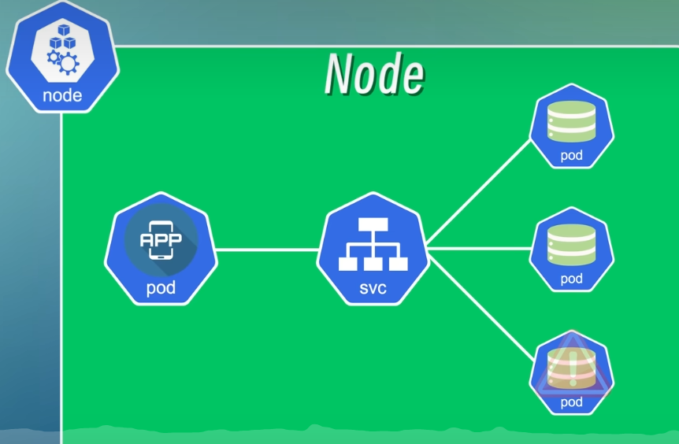
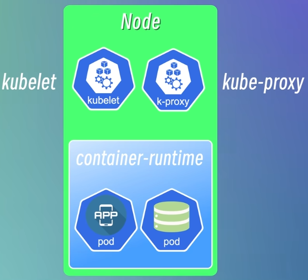

# Kubernetes

# 基本概念

用 Docker 进行容器化管理之后方便了很多，容器少的话，可以使用 Shell 脚本来管理。但随着容器越来越多，容器也越来越难以管理，项目架构也越来越复杂，如何管理和维护这些容器，就是 Kubernetes 要解决的问题。

## Kubernetes 组件

### Node

Node：节点，一个物理机或者一台虚拟机。

### Pod

Pod 是 Kubernetes 的最小调度单元，可以理解为容器的抽象。一个 Pod 就是一个或者多个应用容器的组合。它创建了一个容器的运行环境，在这个环境中容器可以共享一些资源，比如网络、存储和运行时的一些配置等等。

假设我们系统包括一个应用程序和一个数据库，就可以将应用程序和数据库分别放到两个不同的 Pod 中，一般情况下一个 Pod 中只运行一个容器，这样可以更好地实现应用程序的解耦和扩展。

一个 Pod 中也是可以运行多个容器的，一般仅限于这些容器是高度耦合的情况，它们之间为了共享一些配置或者资源，不得不将它们放到一个容器中

应用程序要访问数据库的话，只需要知道数据库的 IP 地址，这里的 IP 地址是 Pod 在创建的时候自动创建的，是一个集群内部的 IP 地址（也就是无法从集群外部访问），Pod 之间通过这些 IP 地址进行通信。

#### Pod IP 不稳定问题

Pod 并不是稳定的实体，它们非常容易被创建或者销毁，比如发生故障的时候，Kubernetes会自动将发生故障的 Pod 销毁掉然后创建一个新的 Pod 替代它，这时候 IP 也会重新分配，如果应用程序还用原来的 IP 来访问的话就找不到。

### Service

为了解决这个问题，Kubernetes 提供了一个名为 Service 的资源对象，它可以将一组 Pod 封装成一个服务，这个服务通过一个统一的入口来访问。

就比如上面的场景，我们分别将应用程序和数据库两组 Pod 封装成两个 Service，这样应用程序就可以通过 Service 的 IP 地址访问数据库（有点像路由器和反向代理），即使 Pod 的 IP 地址发生了变化，Service 的 IP 地址也不会发生变化，Service 会自动将请求转发到其它健康的 Pod 上。



正向代理：代理的是 C 端（客户端），S 端不知道 C 端的 IP。C 端发送请求给代理服务器，再由代理服务器向 S 端（服务端）发送请求，S 端就会将数据响应给代理服务器，再由代理服务器将数据传输给 C 端。（科学上网使用的就是正向代理）

反向代理：代理的是 S 端，，C 端不知道 S 端的 IP。S 端可能有多台服务器，C 端向代理服务器发送请求，代理服务器向 S 端的其中一台服务器发送请求，服务器将数据响应给代理服务器，再由代理服务器将数据传输给 C 端。（比如 Nginx 的负载均衡）

使用代理模式的好处：

1. 隐藏真实 IP，隐私
2. 在代理服务器上设置缓存可以加快访问
3. 突破网络限制，有些网站会限制某些地区的 IP 访问，使用化茧成蝶可以突破限制。（还是科学上网）

坏处：

1. C 端和 S 端的 IP 对彼此隐藏了，但会将 IP 暴露给代理服务器
2. 网络链路多了代理服务器的节点，降低访问速度

#### 内部服务和外部服务

内部服务：不能暴露或者不需要暴露给外部的服务，比如数据库、缓存、消息队列等，这些服务只需要在集群内部访问就可以了。

外部服务：后端的 API 接口或者前端界面等等，这些就是需要暴露给用户的服务。

外部服务常见的类型有 ExternalName、LoadBalancer、NodePort、ClusterIP，其中 NodePort 是我们常用的类型，它会在节点上开放一个端口，然后将这个端口映射到 Service 的 IP 地址和端口上，这样就可以通过节点的 IP 地址和端口来访问 Service 了。是不是感觉有点熟悉？http://localhost:8080，想起来了吗？

在开发和测试阶段使用 IP 和端口号的方式是没有问题的，但在生产环境中通常是用域名来访问服务的，这时就用到了另一个资源对象 Ingress。

### Ingress

Ingress 是用于管理从集群外部访问集群内部服务的入口和方式，可以通过 Ingress 配置不同的转发规则，从而根据不同的规则来访问不同的 Service 以及 Service 所对应的 Pod。还可以通过 Ingress 来配置域名，这样就可以从集群外部使用域名和访问 Service。

Ingress 也可以用来配置 SSL 证书或者负载均衡。


### ConfigMap

原来我们的应用程序需要访问数据库的话，一般的做法是将数据库的地址和端口等连接信息写到配置文件或者环境变量中，然后在应用程序中读取这些配置信息，这样配置信息就和应用程序耦合在一起了，当数据库的地址或者端口发生变化，我们就得修改应用程序的配置信息然后重新编译部署，这样不仅麻烦，而且对于一些需要不间断运行的服务来说是不能接受的（比如你深夜肚子饿了想点外卖而服务器却在重新编译部署）。

为了解决这个问题，Kubernetes 提供了一个 ConfigMap 组件，它可以将配置信息封装起来，然后就可以在应用程序中读取和使用。将配置信息和应用程序的镜像内容分离开，当数据库的地址和端口发生变化的时候，只需要修改 ConfigMap对象中的配置信息，**然后重新加载 Pod**，不需要重新编译和部署应用程序。

可以理解为给数据库加了个反向代理

### Secret

但 ConfigMap 有个问题，就是它的配置信息是明文的，如果用户名和密码存在 ConfigMap 中是有风险的，于是 Kubernetes 提供了 Secret 组件，用于封装敏感信息，会将配置信息 Base64 编码，但 Base64 编码很容易解码，浏览器随便搜个解码器就能得到原文，所以还需要配合其它手段来确保安全性。

真是一层套一层

### Volume

Pod 被销毁或重启时数据也跟着消失，这对于需要持久化存储的应用程序比如数据库肯定是不行的，Kubernetes 提供了 Volume 组件，它可以将一些持久化存储的资源挂载到集群中的本地磁盘上，或者挂载到集群外部的远程存储上（比如 OSS）。

### Deployment

如果服务端只有一个节点的话，这个节点发生故障就会导致服务宕机（即单点故障），无法实现高可用性。这个好解决，既然一个不够，那就多复制几个，当一个节点发生故障的时候，Service 就会自动将请求转发到另一个节点。（这里的 Service 指的是上面的 [Service](https://www.yuque.com/xiaoguai-pbjfj/cxxcrs/ocefqltbmbgl5eqg#T9uOD) 组件）

Deployment 就是用来定义和管理应用程序的副本数量以及应用程序的更新策略，将一个或者多个 Pod 组合在一起，简化应用程序的部署和更新操作，还可以副本控制、滚动更新、自动扩缩容等。

副本控制：定义和管理应用程序的副本数量，比如定义一个应用程序副本数量为 3，当其中一个发生故障时，就会生成一个新的副本来替换坏副本，始终保持有 3 个副本在集群中运行。

滚动更新：定义和管理应用程序的更新策略，使用新版本替换旧版本，确保应用程序的平滑升级。

平滑升级：不对用户的使用造成中断或不便的升级

### StatefulSet

除了应用程序，数据库也有故障、升级和更新维护的时候，数据库停了服务也停了，所以数据库也需要采取多副本的方式来保证高可用性，但一般不使用 Deployment 来实现数据库的多副本，因为**数据库的多副本之间是有状态的**，就是每个副本的数据存在差异（状态不同），需要确保数据的一致性，可以把数据写到一个共享的存储中歌者同步不同副本之间的数据。

对于这一类有状态的应用程序，Kubernetes 提供了 StatefulSet 组件来管理，StatefulSet 跟 Deployment 非常类似，也提供了定义和管理应用程序副本数量和动态扩缩容等功能，**此外它还保证了每个副本都有自己稳定的网络标识符和持久化存储**，数据库、缓存、消息队列等这些**有状态的应用**以及**保留了会话状态的应用**一般都需要使用 StatefulSet 而不是 Deployment。

但 StatefulSet 部署的过程比较复杂和繁琐，而且并不是所有的有状态应用都适合用 StatefulSet 来部署，比如Redis，当 Redis 实例需要使用内存进行数据存储，并且数据存储在**实例的内存**中而不是持久性存储中时，如果这时候实例重启，Redis 数据丢失，这时候 StatefulSet 就无法保证数据的持久性（还是有点不理解）。更加通用和简单的方式是把有状态的应用程序从 Kubernetes 中剥离出来，在集群外单独部署。（ToLearn：集群外单独部署有状态应用的方法）

##  Kubernetes 架构

Kubernetes 是典型的 Master-Worker 架构， Master Node 负责管理整个集群，Worker Node 负责运行应用程序和服务。

官方定义：Kubernetes 通过将容器放入在节点上运行的 Pod 中来执行工作负载。

### Worker Node

下面这个 Node 就运行了两个 Pod，这里的 Node 就是集群中实际完成工作的节点，也就是 Worker-Node。



为了对外提供服务，每个 Node 上都会包含三个组件，kubelet、kube-proxy 和 container runtime。

#### container runtime

翻译为“运行环境”，可以理解为一个运行容器的实例，负责拉取容器镜像、创建容器、启动或者停止容器等等，所有的容器都需要通过 container runtime 来运行，所以每个节点上都需要安装 container runtime。

#### kubelet

负责管理和维护每个节点上的 Pod 并确保它们按照预期运行，它也会定期从 apiserver 组件接收新的或者修改后的 Pod 规范，同时会监控工作节点的运行情况，然后将信息汇报给 apiserver。

#### kube-proxy

负责为 Pod 对象提供网络代理和负载均衡服务。


一般 Kubernetes 集群包含多个节点，节点之间通过 Service 通信，这就需要一个负载均衡器来接收请求，然后再将请求发送到不同节点上。kube-proxy 就是负责这个功能的组件，它在每个 Node 上启动一个网络代理，使发往 Service 的流量**路由**到正确的后端 Pod，比如 Node A 的应用程序要访问数据库，应用程序对数据库的访问请求并不会被随机路由到别的节点的数据库中，kube-proxy 会把请求路由到与应用程序同一个节点（也就是 Node A）的数据库 Pod 中。

“路由”也是一个动词

### Master Node


#### kube-apiserver

负责提供 Kubernetes 集群的 API 接口服务，所有的组件通过 apiserver 通信，用户在集群中部署应用时也需要使用客户端与 apiserver 进行交互。apiserver 就像一个集群的网关，是整个系统的入口，所有的请求都会先经过它，再由它分发给不同的组件进行处理。

除了提供 API 接口之外，apiserver 还负责对所有对象的增删改查等操作进行认证、授权和访问控制。apiserver 接收到请求时会先验证请求的合法性，验证通过之后才会将请求转发给 **Scheduler** 处理。

#### Scheduler 调度器

负责监控集群中所有节点的资源使用情况，然后根据调度策略将 Pod 调度到合适的节点上运行。

调度策略：比如新增一个新 Pod 时，将 Pod 调度到空闲资源最多的节点上

#### Controller Manager 控制器管理器

负责管理集群中各种资源对象（比如 Node、Pod、Service）的状态，然后根据状态做出相应的响应。比如集群中有一个节点发生故障时，得有一个机制来监控和检测这个故障然后处理故障，比如重启 Pod 或者使用新 Pod 替代，这就是 Controller Manager 要做的事。 

#### etcd

高可用**键-值存储系统**，类似 Redis，用于存储集群中所有资源对象的状态信息，每新增或者崩掉一个 Pod，这些信息都会被记录到 etcd 中，使用命令行查询集群状态时就是通过 etcd 来获取的。

etcd 一般只存储集群中应用程序的状态信息，不存储应用程序的数据

#### Cloud Controller Manager

一个云平台相关的控制器，负责与云平台（例如 Google GKE、Microsoft AKS、Amazon EKS）的 API 进行交互，并且对不同平台都提供一致的管理接口。

# minikube 搭建环境

minikube 是一个轻量级的 Kubernetes 发行版可以在本地运行单节点的 Kubernetes 集群。

kubectl 是一个命令行工具，可以通过在命令行输入各种命令与 Master Node 的 apiserver 交互，从而与 Kubernetes 集群进行交互。

1. 命令行输入`choco install minkube`安装 minikube
2. `minikube version`查看版本信息验证是否安装成功

如果出现类似下面的警告，那就自己到相应目录下新建一个文件

Unable to resolve the current Docker CLI context "default": context "default": context not found: open C:\Users\LittleGuai\.docker\contexts\meta\37a8eec1ce19687d132fe29051dca629d164e2c4958ba141d5f4133a33f0688f\meta.json: The system cannot find the path specified.

1. `minikube start`创建一个集群

下面这条命令先不加参数，直接启动如果很慢的话，试试指定镜像源为 cn，还是慢的话加上后面的版本参数，初步学习就不用追求最新版了。

```
minikube start --image-mirror-country='cn'  --kubernetes-version=v1.23.9
```

成功 start 之后就可以`sudo kubectl get nodes`查看集群中的节点信息了。

## K3s 和 Multipass

Win 安装 Multipass 之后要启动软件再重启命令行 再执行`multipass version`才能看到版本信息

```powershell
# 查看帮助
multipass help
multipass help <command>
# 创建⼀个名字叫做k3s的虚拟机
multipass launch --name k3s
# 在虚拟机中执⾏命令
multipass exec k3s -- ls -l
# 进⼊虚拟机并执⾏shell
multipass shell k3s
# 查看虚拟机的信息
multipass info k3s
# 停⽌虚拟机
multipass stop k3s
# 启动虚拟机
multipass start k3s
# 删除虚拟机
multipass delete k3s
# 清理虚拟机
multipass purge
# 查看虚拟机列表
multipass list
# 创建一台虚拟机
multipass launch --name k3s --cpus 2 --memory 4G --disk 10G
```

创建新的虚拟机之后由于不知道管理员密码无法进入管理员模式，就用 `sudo paswd root`重置密码再进入。

### 一个提升效率的准备工作

我们每次登录虚拟机时都得用`multipass shell hostname`命令，然后再输入密码，有点麻烦。

做点工作省略这些步骤。

先用`multipass shell hostname`登录到虚拟机中。

然后为 ubuntu 用户添加一个密码`sudo passwd ubuntu`（123456 就好）

对，没错，为了免密登录我们得先配置密码，出于安全考虑

然后修改 SSH 配置`sudo vi /etc/ssh/sshd_config`，把下面这三个都改为 yes

```powershell
PubkeyAuthentication yes
PasswordAuthentication yes
KbdInteractiveAuthentication yes
```

vi 编辑器技巧

1. 按 / 键进入搜索模式，输入待匹配字符串之后按回车，光标会跳到第一个匹配处，然后按 n 跳到下一个，N 跳到上上一个
2. 把光标移动到一个单词的开头，按 dw 可以删除整个单词
3. 按 i 进行编辑模式，编辑完按 Esc 退出编辑模式
4. 在普通模式下按 : 进入命令模式，输入 wq 保存退出

编辑好 SSH 配置文件之后要重启 SSH 服务`sudo service ssh restart`

做完上面这些工作之后就可以用 SSH 来登录虚拟机了，执行`ssh ubuntu@ip`命令后输入密码登录

说好的免密登录呢？别急，往下看

#### 配置免密登录

先了解一下原理——非对称加密，我们用自己的电脑生成一对公钥和私钥，私钥保存好，公钥发给各个虚拟机，这样就能通过匹配公钥和私钥进行登录而不用输入密码


先用 ssh 生成一对公钥和私钥`ssh-keygen -t rsa -b 4096`，回车之后会提示为文件设置密码，建议直接回车不设密码

gen：generate，-t：type 密钥类型，-b：bit 位数

生成密钥后到当前用户下的 .ssh 目录下 `ls` 查看公钥和私钥的文件。


我们需要把公钥复制到虚拟机中，Linux 和 Mac直接执行`ssh-copy-id username@remote_host`就可以自动把本地的公钥复制到虚拟机中，然鹅，Windows 系统不支持这个命令，有两个办法可以解决。

ssh-copy-id 命令用于将本地计算机上的公钥添加到远程主机的 ~/.ssh/authorized_keys 文件中

1. 既然 Windows 不行那我们就找个 Linux，想想有Windows 上有什么是 轻量级 Linux 系统？GitBash，用 GitBash 进入到  **.ssh** 文件夹下，然后执行命令。需要你输入前面设置的密码。
2. ssh-copy-id 命令的本质是把本地的公钥添加到远程虚拟机的`~/.ssh/authorized_keys`文件里，PowerShell 行不通那就自己复制，把 `.ssh/id_rsa.pub` 的内容复制出来，到虚拟机中写入就好了。

#### 配置命令别名

每次都要输入`ssh hostname@ip`也是有点麻烦，我们给这个命令起个别名更方便一些

- Linux 和 MacOS 可以直接用 alias 直接给命令起别名，但 Windows 又没这个命令，得另外想办法。
  注意如果只是用命令`alias master='ssh ubuntu@ip'`起别名的话只是临时有效，想永久生效的话得把命令保存到`.bash_profile`文件中。（原理是保存到文件后每次打开终端都会加载这个别名）

Linux 优势之一

- Windows 先在命令行中输入`echo $PROFILE`，查看 PowerShell 配置文件的位置

```powershell
PS C:\Users\LittleGuai> echo $PROFILE
D:\文档\WindowsPowerShell\Microsoft.PowerShell_profile.ps1
```

进入到 `D:\文档\WindowsPowerShell`文件夹下，新建一个文件命名为`Microsoft.PowerShell_profile.ps1`，用记事本打开输入命令别名，**保存关闭文件后重新开一个命令行**。

注意 multipass 创建的虚拟机重启之后会重新分配 IP，所以如果重启了虚拟机这里的 IP 也要跟着改。


如果遇到报错看看下面的[报错合集](https://www.yuque.com/xiaoguai-pbjfj/cxxcrs/ocefqltbmbgl5eqg#hfZe1)里有没有，没有就继续。

master 操作完之后 worker 也一样的操作，耐点心，后面会方便很多。

千辛万苦终于到了这里，现在终于可以轻松登录虚拟机了。

如果你输入别名后久久连不上，那就检查一下 IP 吧。

### K3s 创建集群

- 登录虚拟机后执行命令创建，这里用的是国内的镜像

```powershell
ubuntu@k3s:~$ curl -sfL https://rancher-mirror.rancher.cn/k3s/k3s-install.sh | INSTALL_K3S_MIRROR=cn sh -
```

安装好之后`sudo kubectl get nodes`查看已有节点，这个是 **Master** 节点

```powershell
ubuntu@k3s:~$ sudo kubectl get nodes
NAME   STATUS   ROLES                  AGE   VERSION
k3s    Ready    control-plane,master   15m   v1.29.3+k3s1
```

- 在 Master 节点上获取 token，这个 token 是其它节点加入集群的凭证

```powershell
ubuntu@k3s:~$ sudo cat /var/lib/rancher/k3s/server/node-token
# 你自己的token
```

- 接下来添加环境变量 TOKEN 和 MASTER_IP

 Linux 和 Mac 用户执行这条命令

```
TOKEN=$(multipass exec k3s sudo cat /var/lib/rancher/k3s/server/node-token)
```

`TOKEN=`：这是声明一个名为 TOKEN 的变量。

`$(...)`：命令替换的语法，它会执行括号中的命令，并将其输出作为整个表达式的结果。

`exec` 是 multipass 命令的一个子命令，用于在指定的虚拟机实例中执行命令。

multipass exec k3s sudo cat /var/lib/rancher/k3s/server/node-token：指定 k3s 虚拟机执行`sudo cat /var/lib/rancher/k3s/server/node-token`

整个命令最终的结果就是把 node-token 文件里的值赋值给环境变量 TOKEN

然后执行`echo $TOKEN`查看变量值

Windows 用户执行这一条，这条命令的效果跟自己到系统变量里添加一个 TOKEN 变量是一样的，不想输命令就常规操作

```
[Environment]::SetEnvironmentVariable("TOKEN", $(Invoke-Expression "multipass exec k3s sudo cat /var/lib/rancher/k3s/server/node-token"), [System.EnvironmentVariableTarget]::Machine)
```

下面这条命令只会在当前会话中保持有效，关闭会话就消失了，了解即可

```
$env:TOKEN = Invoke-Expression "multipass exec k3s sudo cat /var/lib/rancher/k3s/server/node-token"
```

`$env:TOKEN`查看变量值

- 然后获取 Master 节点的 IP
  Linux/Mac：`MASTER_IP=$(multipass info k3s | grep IPv4 | awk '{print $2}')` 
  Windows：`[Environment]::SetEnvironmentVariable("MASTER_IP", $(Invoke-Expression 'multipass info k3s | Select-String "IPv4" | ForEach-Object { $_.ToString().Split(" ")[-1] }'), [System.EnvironmentVariableTarget]::Machine)`

这里注意 Invoke-Expression 后面用单引号，用双引号的话会与子命令的双引号匹配而提前结束命令

下面这条命令也只是设置临时变量，了解即可

```
$env:MASTER_IP = Invoke-Expression 'multipass info k3s | Select-String "IPv4" | ForEach-Object { $_.ToString().Split(" ")[-1] }'
```

获取后`$env:MASTER_IP`查看变量值

Windows 一般在设置完系统变量之后要**重新打开会话**载入变量

- 接下来就可以创建 Worker 节点了，我们创建两个 worker1 和 worker2

```
multipass launch --name worker1 --cpus 2 --memory 2G --disk 10G
```

如果在这里遇到报错`launch failed: Start-VM`，去下面找找，没有就跳过

创建完把两台工作机都[配置免密登录](https://www.yuque.com/xiaoguai-pbjfj/cxxcrs/ocefqltbmbgl5eqg#YSDPA)

- 给两台 Worker 安装 k3s 并设置环境变量

```bash
 for f in 1 2; do
     multipass exec worker$f -- bash -c "curl -sfL https://rancher-mirror.rancher.cn/k3s/k3s-install.sh | INSTALL_K3S_MIRROR=cn K3S_URL=\"https://$MASTER_IP:6443\" K3S_TOKEN=\"$TOKEN\" sh -"
 done
```

Linux/Mac 用户直接执行，Windows 用户用 GitBash 执行，复制后在 GitBash 中 Shift+Insert 粘贴。

ToLearnL：这里我还没搞懂怎么在 PowerShell 上实现，有兴趣的同学可以试试下面这段，我用 GitBash 装好之后再执行这段就没反应了

```powershell
foreach ($f in 1, 2) {
  Invoke-Expression "multipass exec worker$f -- bash -c `"curl -sfL https://rancher-mirror.rancher.cn/k3s/k3s-install.sh | INSTALL_K3S_MIRROR=cn K3S_URL=`"https://$MASTER_IP:6443`" K3S_TOKEN=`"$TOKEN`" sh -`""
}
```

PowerShell 中会解析双引号里的变量但不解析单引号里的，这里面带了 $f，所以得用双引号包裹，其他引号就得用反单引号 ` 转义

完成上面的工作之后登录 Master，执行`sudo kubectl get nodes`，就能看到集群信息了

```powershell
ubuntu@k3s:~$ sudo kubectl get nodes
NAME      STATUS   ROLES                  AGE   VERSION
k3s       Ready    control-plane,master   20h   v1.29.3+k3s1
worker1   Ready    <none>                 62m   v1.29.3+k3s1
worker2   Ready    <none>                 62m   v1.29.3+k3s1
ubuntu@k3s:~$
```

### kubectl 常用命令

#### 创建一个 Pod

```
sudo kubectl run podName --image=imageName
```

用这个命令创建一个 Pod 已经被弃用，并在较新版本的 Kubernetes 中不再建议使用，ToLearn：规范的操作方法

```powershell
ubuntu@k3s:~$ sudo kubectl run nginx --image=nginx
pod/nginx created
ubuntu@k3s:~$ sudo kubectl get pod
NAME    READY   STATUS              RESTARTS   AGE
nginx   0/1     ContainerCreating   0          5s
# 上面这个是正在创建的状态，创建完之后会变成 Running 
ubuntu@k3s:~$ sudo kubectl get pod
NAME    READY   STATUS    RESTARTS   AGE
nginx   1/1     Running   0          5m4s
```

也可以使用 creat 命令来创建想要的资源对象

`ubuntu@k3s:~$ sudo kubectl create -h`可以查看 create 命令相关的帮助文档

翻一翻可以看到，create 命令的资源对象里并没有 Pod，因为 Pod 是 Kubernetes 中最基本的资源对象，通常情况下我们并不会直接创建一个 Pod，而是创建一个 Pod 的上层资源对象


现在我们来创建一个 Deployment，`ubuntu@k3s:~$ sudo kubectl create deployment nginx-deployment --image=nginx`

电脑性能不是很好的话 `sudo kubectl get pod`查看 Pod 可能新建的 Pod 会一直是 ContainerCreating 状态，不着急，耐心等一下，只要没报错，它会 Running 的。

```powershell
ubuntu@k3s:~$ sudo kubectl get pod
NAME                                READY   STATUS              RESTARTS   AGE
nginx                               1/1     Running             0          137m
nginx-deployment-6d6565499c-xrkv9   0/1     ContainerCreating   0          2m31s
```

在 Deployment 和 Pod 之间还有一个中间层 ReplicaSet，用来管理 Pod 的副本数量，什么？副本？听着有点耳熟，看看前面对 [Deployment](https://www.yuque.com/xiaoguai-pbjfj/cxxcrs/ocefqltbmbgl5eqg#qnI4N) 的介绍，好像明白了什么。

`sudo kubectl get replicaset`查看 replicaset 列表，注意看，这里有个字符串有点眼熟，这个 replicaset 的 ID 在前面查看的 Pod 里出现过。Pod Name 分为三个部分，自己起的名字、replica ID、Pod ID，所以 Deployment、ReplicaSet 和 Pod 三者的关系就是 Pod Ⅽ ReplicaSet Ⅽ Deployment，通过 Pod Name 中的 ReplicaSet ID 就可以知道这个 Pod 属于哪个 ReplicaSet，ReplicaSet Name 里也包含所属 Deployment 的 Name。

```powershell
ubuntu@k3s:~$ sudo kubectl get replicaset
NAME                          DESIRED   CURRENT   READY   AGE
nginx-deployment-6d6565499c   1         1         0       3m20s
```

replica 就是副本的意思

ReplicaSet 并不用我们手动创建，而是通过 Deployment 来完成各种配置和管理。

#### 通过 Deployment 指定副本数量

`sudo kubectl edit deployment nginx-deployment`打开 Deployment 的配置文件，找到 replicas，把值改为 3。


退出后查看一下 Pod，可以发现多了两个副本


这个方式不是很稳妥的方式，了解即可

# Kubernetes 调试命令和技巧

- 查看日志：`sudo kubectl logs podName`
- `exec`命令：以交互式的方式进入 Pod 中的一个容器，并启动一个 Bash shell。
  `sudo kubectl exec -it podName -- /bin/bash`

```powershell
ubuntu@k3s:~$ sudo kubectl exec -it nginx-deployment-6d6565499c-xrkv9 -- /bin/bash
root@nginx-deployment-6d6565499c-xrkv9:/#
```

kubectl exec：进入一个正在运行的 Pod 中执行命令。

-it：是下面两个选项的组合：

-i：允许你与Pod中的容器交互式地通信。

-t：为命令分配一个伪终端，使你能够使用命令行界面。

--：这个是一个分隔符，表示接下来的内容是要在容器内部执行的命令。

/bin/bash：这是要在容器内部执行的命令。在这个例子中，它启动了一个Bash shell。

## YAML 配置文件的使用

我们创建资源对象时可以通过指定各种参数来配置生成的资源对象的状态，比如`kubectl create deployment nginx-dep --image=nginx --replicaset=3`，这尊就指定了镜像是 nginx，副本数量是 3，但只在命令行中声明不方便我们日后查看，所以写到配置文件中更实用。

- 通过配置文件创建资源对象

先创建一个 yaml 文件`vi nginx-deployment.yaml`

```yaml
apiVersion: apps/v1  # 定义使用的API版本，这里是apps/v1，表示使用应用的v1版本API。
kind: Deployment  # 定义资源类型为Deployment，表示部署一个应用。
metadata:  # 元数据部分，用于描述Deployment的基本信息。
  name: nginx-deployment  # Deployment的名称为nginx-deployment。
spec:  # 规格部分，定义Deployment的规格。
  selector:  # 选择器部分，用于选择要管理的Pod。
    matchLabels:  # 匹配标签部分。
      app: nginx  # 匹配标签为app=nginx的Pod。
  replicas: 3  # 指定副本数为3，意味着会运行3个相同的Pod实例。
  template:  # 模板部分，定义创建新Pod时使用的模板。
    metadata:  # 模板的元数据部分。
      labels:  # 标签部分，为新创建的Pod定义标签。
        app: nginx  # 新创建的Pod的标签为app=nginx。
    spec:  # 新创建的Pod的规格。
      containers:  # 容器列表，定义在Pod中运行的容器。
        - name: nginx  # 容器的名称为nginx。
          image: nginx:1.25  # 使用的容器镜像是nginx:1.25。
          ports:  # 容器的端口配置。
            - containerPort: 80  # 容器监听的端口号为80。
```

然后`sudo kubectl create -f nginx-deployment.yaml`根据配置文件创建一个 Deployment

```yaml
ubuntu@k3s:~$ sudo kubectl create -f nginx-deployment.yaml
deployment.apps/nginx-deployment created
```

创建完查看一下效果，可以看到多出一个 Deployment 且副本数量为 3


也可以加上`-o wide`参数查看每个 Pod 的 IP


上面的 IP 是集群内部的 IP，无法从集群外部访问

也可以通过配置文件删除资源对象`sudo kubectl delete -f nginx-deployment.yaml`，通过这个文件创建的**所有**资源对象都会被删除。

- 根据配置文件应用资源对象

```
sudo kubectl apply -f nginx-deployment.yaml
```

如果该文件对应的资源对象还没创建，则创建并启用资源对象，如果已经存在则更新后启用。

试试把上面的配置文件副本数量改为 2，然后再查看变化。

这就量使用配置文件来管理 Pod 的优势所在，遇到流量高峰的时候，修改一下副本数量就可以快速扩容，高峰过后也可以主很方便地释放资源。

甚至可以通过配置实现自动扩缩容，原理就是定时检查资源对象的状态，比较状态和配置是否一致，如果不一致就自动修改资源的状态，使其和配置保持一致

create 和 apply 的区别：类比创建虚拟机，create 只是创建但没有启用资源对象，apply 会创建/更新资源对象后启用。

## 使用 Service 提供外部服务

Pod 使用的是一个集群内部的 IP 地址，如果用 Pod 来运行 nginx 是无法从集群外部访问到页面的。比如上面创建的 Pod，在 Master 节点上执行`curl ip`就可以访问到 nginx 页面。


但 `exit 退出到 PowerShell 后就无法访问了。`


另一个问题就是 Pod 并不是一个稳定的实体，经常会被创建或销毁，这里它的 IP 地址也会发生变化。

解决方案就是**使用 Service 来提供外部服务**。

- 创建一个 Service `sudo kubectl service nginx-service`
- 也可以直接将已存在的 Deployment 对外公开为一个服务
  `sudo kubectl expose deployment nginx-deployment`


- 查看资源详细信息`sudo kubectl describe [资源类型] [资源名称]`


- 通过配置文件创建 Service

新建一个配置文件 nginx-service.yaml

```yaml
apiVersion: v1  # 使用的Kubernetes API版本，这里是v1。
kind: Service  # 定义资源类型为Service，表示创建一个服务。
metadata:  # 元数据部分，用于描述Service的基本信息。
  name: nginx-service  # Service的名称为nginx-service。
spec:  # 规格部分，定义Service的规格。
  selector:  # 选择器部分，用于指定服务应该选择哪些Pod作为后端。
    app: nginx  # 选择具有标签app=nginx的Pod作为后端。
  ports:  # 端口配置，定义Service暴露的端口。
    - protocol: TCP  # 使用TCP协议。
      port: 80  # Service暴露的端口号为80。
      targetPort: 80  # 转发到后端Pod的端口号也为80。
```

这里需要先了解一下选择器 selector  的作用：选择特定的资源，一般和 label 标签一起使用，类似 CSS 的选择器，我们前面在创建 Deployment 时已经给 Deployment 绑定了一个选择器，回头看看[配置文件](https://www.yuque.com/xiaoguai-pbjfj/cxxcrs/ocefqltbmbgl5eqg#svFr9)里的 matchLabels，也可以`sudo kubectl describe deployment nginx-deployment`看一下 Deployment 信息，可以看到 Deployment 信息下有个 Selector


然后再看看 Pod 信息，创建的三个 Pod 都有 Labels 标签


总结一下就是，在 Deployment 声明一个选择器，在 Pod 里贴上一个标签，选择器与标签匹配的 Deployment 就可以管理 Pod。


保存配置文件后应用一下这个文件`sudo kubectl apply -f nginx-service.yaml`

但是这个服务还是一个集群内部的服务，无法从集群外部访问，这时我们就得用到 NodePort 类型的服务。


NodePort 可以将服务公开到集群的节点上，然后我们通过 IP 和端口就可以访问到服务了。

我们创建 Service 时没有指定服务的类型，那这个 Service 默认就是一个 ClusterIP 类型的服务，也就是集群内部的服务，现在我们来将 Service 的服务类型改为 NodePort，只要在配置文件里加上 type 和 nodePort 就好了。注意端口的范围在 30000~32767 之间（这个范围是由 Kubernetes 团队选择的，因为它们通常不会被其他应用或服务占用）

```yaml
apiVersion: v1  # 使用的Kubernetes API版本，这里是v1。
kind: Service  # 定义资源类型为Service，表示创建一个服务。
metadata:  # 元数据部分，用于描述Service的基本信息。
  name: nginx-service  # Service的名称为nginx-service。
spec:  # 规格部分，定义Service的规格。
  type: NodePort	# 指定服务类型
  selector:  # 选择器部分，用于指定服务应该选择哪些Pod作为后端。
    app: nginx  # 选择具有标签app=nginx的Pod作为后端。
  ports:  # 端口配置，定义Service暴露的端口。
    - protocol: TCP  # 使用TCP协议。
      port: 80  # Service暴露的端口号为80。
      targetPort: 80  # 转发到后端Pod的端口号也为80。
      nodePort: 30080
```

保存后 apply 一下，`sudo kubectl apply -f nginx-service.yaml`

然后查看 Service 信息，可以看到服务类型变成了 NodePort，且端口号为 30080


查看一下 IP 地址`sudo kubectl get nodes -o wide`


然后打开浏览器，输入 `nodeIP:port`，可以访问了！


关于 Service 的类型还有其它各类和应用，LoadBalcancer、ExternalName、Headless，感兴趣上官网了解一下

# 可视化 Kubernetes  管理工具

工具叫 Portainer，只需要在官网上下载一个配置文件，然后 apply 这个文件就好了。

那么问题来了，我们用 Windows 下载的文件怎么上传到虚拟机？

使用`scp`命令`scp \path\of\your\file username@ip:/dir`

如果是直接复制到根目录可以`scp \path\of\your\file ubuntu@172.22.94.170:`注意冒号不能省

有了配置文件后执行`sudo kubectl apply -n portainer -f portainer.yaml`

注意这里有个`-n portainer`参数，-n 用来指定命名空间

n 代表 Namespace，命名空间，一种将 Kubernetes 资源进行分组的机制，相当于把一个 Kubernetes 集群划分成多个空间，不同的项目或团队可以在各自的空间上独立工作互不干扰，不同命名空间中的资源也可以同名。

适用于多租户环境（又学一个高级词），突然反应过来云服务器是怎么运行的了，把一个节点划分多个 Namespace，然后就可以租给多个用户了

如果看教程看入迷了，启动了 portainer 之后过了五分钟没登录的话，再去浏览器访问 portainer 会收到提示 Your Portainer instance timed out for security purposes. To re-enable your Portainer instance, you will need to restart Portainer. 这时候要重启服务，直接重新 apply 一下就好了`sudo kubectl apply -n portainer -f portainer.yaml`，但这样还是得每五分钟去弄一下它。找到一个一劳永逸的方法。改一下 portainer.yaml 文件的检查周期`livenessProbe.periodSeconds`，改完记得重新 apply 一下。

```yaml
livenessProbe:
  httpGet:
    path: /
  periodSeconds: 3600  # 修改这里的值，单位为秒，比如修改为600表示每10分钟检查一次
```

这样改完就是每一小时检查一次活跃了。界面如下。


##  报错合集

#### launch failed: Remote "" is unknown or unreachable.

我没猜错的话你的电脑里有梯子，而且你科学上网了，出现这个报错就说明连不上远程，你开梯子的时候会修改 host 文件，导致 multipass 连接 Remote 的时候无法正确 IP，用火绒的网络诊断工具诊断并修理一下就好了。

#### ubuntu@ip: Permission denied (publickey)

确保 sshd 配置文件里以下三个选项都是 yes

```powershell
PubkeyAuthentication yes

# To disable tunneled clear text passwords, change to no here!
PasswordAuthentication yes

# Change to yes to enable challenge-response passwords (beware issues with
# some PAM modules and threads)
KbdInteractiveAuthentication yes
```

#### Bad permissions. Try removing permissions for user: \\Everyone (S-1-1-0) on file C:/Users/LittleGuai/.ssh/id_rsa.

我不是配置了免密登录了吗？怎么还要输入密码？别急，读一下报错信息。


这个报错是因为本地私钥的文件权限放得太开了（too open）， 要求私钥文件只能由当前用户访问。

先用 `$env:username`查看当前用户名，记住这个用户名，后面有用

```powershell
PS C:\Users\LittleGuai> $env:username
姚小怪
```

进入`C:\Users\LittleGuai\.ssh`按下面操作，这里的所有者（Owner）就是文件的创建人，主体（Principal）就是可以访问私钥文件的用户，就是因为可访问的用户太多所以系统认定这个文件不安全，所以要把主体全部删掉（或者可以尝试禁用他们的权限），这样被删掉的主体就访问不了文件了。

再把所有者改为当前用户（如果跟前面查到的一样可以不用改），主体中添加当前用户就可以了。


6 不见了，别在意，下面是更改所有者的操作，添加主体点左下角的“添加”，一样的操作。


最终结果就是所有者和主体都只有你自己


然后就可以快乐地去用别名登录虚拟机了。

#### launch failed: Start-VM

报错信息如下

```powershell
+ CategoryInfo          : NotSpecified: (:) [Start-VM], VirtualizationException
+ FullyQualifiedErrorId : Unspecified,Microsoft.HyperV.PowerShell.Commands.StartVM
```

打开任务管理器看看内存占多少了


再看看你新建虚拟机的时候指定多大的内存，这时候应该都不够了，因为 Master 的内存就占了 8G，所以得先关掉 Master 释放内存再新建 Worker。

内存不够的话我们就将就一下不要创建那么大内存的虚拟机了，改成 4G 好了。

可以直接在 PowerShell 用命令改，先关掉虚拟机`multipass stop k3s`，再改内存`multipass set local.k3s.memory=4G`，再启动虚拟机`multipass start k3s`，最后查看虚拟机信息`multipass info k3s`，没意外的话 Memory usage 应该改好了。

Windows 也可以用 Hyper-V 改，win+s 搜索 Hyper-V，不用关机就能直接改（咱 Windows 用户也扬眉吐气一回）


# Windows PowerShell 下常用命令

注意：PowerShell 和普通的 cmd 不一样，命令也不一样

列出环境变量：`Get-ChildItem Env:`

查看某个环境变量值：`$env:变量名`