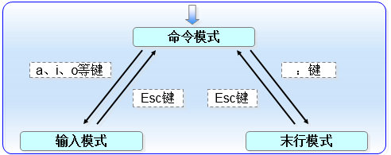

# Vi编辑&Bash 脚本学习

## 1.1 **Vim文本编辑器**

Vim编辑器中设置了3种模式—命令模式、末行模式和编辑模式，每种模式分别又支持多种不同的命令快捷键，这大大提高了工作效率，而且用户在习惯之后也会觉得相当顺手。要想高效地操作文本，就必须先搞清这3种模式的操作区别以及模式之间的切换方法

**命令模式**：控制光标移动，可对文本进行复制、粘贴、删除和查找等工作。

**输入模式**：正常的文本录入。

**末行模式**：保存或退出文档，以及设置编辑环境。



​                              命令模式中最常用的一些命令

| 命令 | 作用                                               |
| ---- | -------------------------------------------------- |
| dd   | 删除（剪切）光标所在整行                           |
| 5dd  | 删除（剪切）从光标处开始的5行                      |
| yy   | 复制光标所在整行                                   |
| 5yy  | 复制从光标处开始的5行                              |
| n    | 显示搜索命令定位到的下一个字符串                   |
| N    | 显示搜索命令定位到的上一个字符串                   |
| u    | 撤销上一步的操作                                   |
| p    | 将之前删除（dd）或复制（yy）过的数据粘贴到光标后面 |

​                              末行模式中最常用的一些命令

| 命令          | 作用                                 |
| ------------- | ------------------------------------ |
| :w            | 保存                                 |
| :q            | 退出                                 |
| :q!           | 强制退出（放弃对文档的修改内容）     |
| :wq!          | 强制保存退出                         |
| :set nu       | 显示行号                             |
| :set nonu     | 不显示行号                           |
| :命令         | 执行该命令                           |
| :整数         | 跳转到该行                           |
| :s/one/two    | 将当前光标所在行的第一个one替换成two |
| :s/one/two/g  | 将当前光标所在行的所有one替换成two   |
| :%s/one/two/g | 将全文中的所有one替换成two           |
| ?字符串       | 在文本中从下至上搜索该字符串         |
| /字符串       | 在文本中从上至下搜索该字符串         |


## **2.1 编写简单的脚本**

Vim example.sh

```shell
#! /bin/bash
#welcome to linux program
echo $0
echo $1,$3,$5
echo $#, $*

```

结果：

```shell
# bash haha.sh a b c d e f g
haha.sh
a,c,e
7,a b c d e f g
```

## 2.2 **判断用户的参数**

按照测试对象来划分，条件测试语句可以分为4种：

> 文件测试语句；
>
> 逻辑测试语句；
>
> 整数值比较语句；
>
> 字符串比较语句。


###                         文件测试所用的参数

| 操作符 | 作用                       |
| ------ | -------------------------- |
| -d     | 测试文件是否为目录类型     |
| -e     | 测试文件是否存在           |
| -f     | 判断是否为一般文件         |
| -r     | 测试当前用户是否有权限读取 |
| -w     | 测试当前用户是否有权限写入 |
| -x     | 测试当前用户是否有权限执行 |

下面使用文件测试语句来判断/etc/fstab是否为一个目录类型的文件，然后通过Shell解释器的内设$?变量显示上一条命令执行后的返回值。如果返回值为0，则目录存在；如果返回值为非零的值，则意味着它不是目录，或这个目录不存在：

```shell
[root@linuxprobe ~]# [ -d /etc/fstab ]
[root@linuxprobe ~]# echo $?
1
```

再使用文件测试语句来判断/etc/fstab是否为一般文件，如果返回值为0，则代表文件存在，且为一般文件：

```shell
[root@linuxprobe ~]# [ -f /etc/fstab ]
[root@linuxprobe ~]# echo $?
0
```

判断与查询一定要敲两次命令吗？其实可以一次搞定。

逻辑语句用于对测试结果进行逻辑分析，根据测试结果可实现不同的效果。例如在Shell终端中逻辑“与”的运算符号是&&，它表示当前面的命令执行成功后才会执行它后面的命令，因此可以用来判断/dev/cdrom文件是否存在，若存在则输出Exist字样。

```shell
[root@linuxprobe ~]# [ -e /dev/cdrom ] && echo "Exist"
Exist
```

除了逻辑“与”外，还有逻辑“或”，它在Linux系统中的运算符号为||，表示当前面的命令执行失败后才会执行它后面的命令，因此可以用来结合系统环境变量USER来判断当前登录的用户是否为非管理员身份：

```shell
[root@linuxprobe ~]# echo $USER
root
[root@linuxprobe ~]# [ $USER = root ] || echo "user"
[root@linuxprobe ~]# su - linuxprobe 
[linuxprobe@linuxprobe ~]$ [ $USER = root ] || echo "user"
user
```

  

  整数比较运算符仅是对数字的操作，不能将数字与字符串、文件等内容一起操作，而且不能想当然地使用日常生活中的等号、大于号、小于号等来判断。因为等号与赋值命令符冲突，大于号和小于号分别与输出重定向命令符和输入重定向命令符冲突。因此一定要使用规范的整数比较运算符来进行操作。

###                    可用的整数比较运算符

| 操作符 | 作用           |
| ------ | -------------- |
| -eq    | 是否等于       |
| -ne    | 是否不等于     |
| -gt    | 是否大于       |
| -lt    | 是否小于       |
| -le    | 是否等于或小于 |
| -ge    | 是否大于或等于 |

接下来小试牛刀。先测试一下10是否大于10以及10是否等于10（通过输出的返回值内容来判断）：

```
[root@linuxprobe ~]# [ 10 -gt 10 ]
[root@linuxprobe ~]# echo $?
1
[root@linuxprobe ~]# [ 10 -eq 10 ]
[root@linuxprobe ~]# echo $?
0
```

在2.4节曾经讲过free命令，它能够用来获取当前系统正在使用及可用的内存量信息。接下来先使用free -m命令查看内存使用量情况（单位为MB），然后通过“grep Mem:”命令过滤出剩余内存量的行，再用awk '{print $4}'命令只保留第4列。这个演示确实有些难度，但看懂后会觉得很有意思，没准在运维工作中也会用得上。

```
[root@linuxprobe ~]# free -m
              total        used        free      shared  buff/cache   available
Mem:           1966        1374         128          16         463         397
Swap:          2047          66        1981
[root@linuxprobe ~]# free -m | grep Mem:
Mem:           1966        1374         128          16         463         397
[root@linuxprobe ~]# free -m | grep Mem: | awk '{print $4}'
128
```

如果想把这个命令写入到Shell脚本中，那么建议把输出结果赋值给一个变量，以方便其他命令进行调用：

```
[root@linuxprobe ~]# FreeMem=`free -m | grep Mem: | awk '{print $4}'`
[root@linuxprobe ~]# echo $FreeMem 
128
```

上面用于获取内存可用量的命令以及步骤可能有些“超纲”了，如果不能理解领会也不用担心，接下来才是重点。我们使用整数运算符来判断内存可用量的值是否小于1024，若小于则会提示“Insufficient Memory”（内存不足）的字样：

```
[root@linuxprobe ~]# [ $FreeMem -lt 1024 ] && echo "Insufficient Memory"
Insufficient Memory
```

字符串比较语句用于判断测试字符串是否为空值，或两个字符串是否相同。它经常用来判断某个变量是否未被定义（即内容为空值），理解起来也比较简单。

###                     常见的字符串比较运算符

| 操作符 | 作用                   |
| ------ | ---------------------- |
| =      | 比较字符串内容是否相同 |
| !=     | 比较字符串内容是否不同 |
| -z     | 判断字符串内容是否为空 |

接下来通过判断String变量是否为空值，进而判断是否定义了这个变量：

```
[root@linuxprobe ~]# [ -z $String ]
[root@linuxprobe ~]# echo $?
0
```

再次尝试引入逻辑运算符来试一下。当用于保存当前语系的环境变量值LANG不是英语（en.US）时，则会满足逻辑测试条件并输出“Not en.US”（非英语）的字样：

```
[root@linuxprobe ~]# echo $LANG
en_US.UTF-8
[root@linuxprobe ~]# [ ! $LANG = "en.US" ] && echo "Not en.US"
Not en.US
```