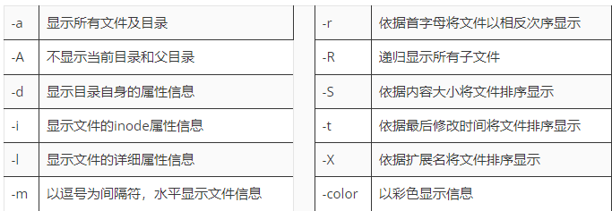

# Linux 命令


# 一、**常用系统工作命令**

## 1.1 Echo

用于在终端设备上输出字符串或变量提取后的值，语法格式为“echo [字符串] [$变量]”

其中$符号的意思是提取变量的实际值，以便后续的输出操作

eg：

```shell
#echo LinuxProbe.com
LinuxProbe.com//显示结果
echo $SHELL
/bin/bas
```

## 1.2 Date

### 如何显示

eg：

```shell
#date "+%Y-%m-&d" →2023-10-24
#date "+%H:%M:%S"→16：53：31
#date "+%Y-%m-%d %H:%M:%S" →2023-10-24 16：53：31
```

### 如何设置时间

```shell
//设置时区
#set-timezone Asia/Shanghai

//如果遇到这个问题则是系统同步时间
Automatic time synchronization is enable
//关闭操作流程
1、#set-ntp
2、#set-ntp false

```

## 1.3 Linux进程的类型

五大状态

R：Running 正常服务

S：stopped、Sleeping 停止服务

D：unstopped 不可中断

Z：zombie 僵尸进程 没有提供服务但是会消耗进程

T Stopped 停止

## 1.4 PS

ps -a（查看所有进程） -u（查看进程详细信息） -x（显示没有终端进行） 或者 ps -aux

pstree 层级关系显示（只能执行一次）

top（动态实时更新）

## 1.5 nice

nice命令用于调整进程的优先级，语法格式为“nice优先级数字 服务名称”

## 1.6 pidof

pidof命令用于查询某个指定服务进程的PID号码值，语法格式为“pidof [参数] 服务名称”

每次重启pid会更换，且pid值是唯一值

```shell
# pidof httpd
```

## 1.7 killall

对当前进程进行批量处理关闭

语法格式为“killall [参数] 服务名称”

eg:

```shell
#killall httpd
```


# 二、**系统状态检测命令**

## 2.1 ifconfig

用于获取网卡配置与网络状态等信息，英文全称为“interface config”。

语法格式为“ifconfig [参数] [网络设备]”

主要查看的就是网卡名称、inet参数后面的IP地址、ether参数后面的网卡物理地址（又称为MAC地址），以及RX、TX的接收数据包与发送数据包的个数及累计流量

eg：

```shell
[root@linuxprobe ~]# ifconfig
ens160: flags=4163<UP,BROADCAST,RUNNING,MULTICAST>  mtu 1500
        inet 192.168.10.10  netmask 255.255.255.0  broadcast 192.168.10.255
        inet6 fe80::c8f8:f5c5:8251:aeaa  prefixlen 64  scopeid 0x20
        ether 00:0c:29:7d:27:bf  txqueuelen 1000  (Ethernet)
        RX packets 304  bytes 33283 (32.5 KiB)
        RX errors 0  dropped 0  overruns 0  frame 0
        TX packets 91  bytes 11052 (10.7 KiB)
        TX errors 0  dropped 0 overruns 0  carrier 0  collisions 0

lo: flags=73<UP,LOOPBACK,RUNNING>  mtu 65536
        inet 127.0.0.1  netmask 255.0.0.0
        inet6 ::1  prefixlen 128  scopeid 0x10
        loop  txqueuelen 1000  (Local Loopback)
        RX packets 376  bytes 31784 (31.0 KiB)
        RX errors 0  dropped 0  overruns 0  frame 0
        TX packets 376  bytes 31784 (31.0 KiB)
        TX errors 0  dropped 0 overruns 0  carrier 0  collisions 0

virbr0: flags=4099<UP,BROADCAST,MULTICAST>  mtu 1500
        ether 52:54:00:a2:89:54  txqueuelen 1000  (Ethernet)
        RX packets 0  bytes 0 (0.0 B)
        RX errors 0  dropped 0  overruns 0  frame 0
        TX packets 0  bytes 0 (0.0 B)
        TX errors 0  dropped 0 overruns 0  carrier 0  collisions 0
```

## 2.2 uname

用于查看系统内核版本与系统架构等信息，英文全称为“unix name”，语法格式为“uname [-a]”

使用uname命令时，一般要固定搭配上-a参数来完整地查看当前系统的内核名称、主机名、内核发行版本、节点名、压制时间、硬件名称、硬件平台、处理器类型以及操作系统名称等信息

要查看当前系统版本的详细信息，则需要查看redhat-release文件

```shell
[root@linuxprobe ~]# uname -a
Linux linuxprobe.com 4.18.0-80.el8.x86_64 #1 SMP Wed Mar 13 12:02:46 UTC 2019 x86_64 x86_64 x86_64 GNU/Linux
[root@linuxprobe ~]# cat /etc/redhat-release
Red Hat Enterprise Linux release 8.0 (Ootpa)
```

## 2.3 **uptime**

用于查看系统的负载信息

平均负载值指的是系统在最近1分钟、5分钟、15分钟内的压力情况，负载值越低越好(时间从右到左依次减小即15-5-1)，建议负载值保持在1左右，在生产环境中不要超过5就好

```shell
[root@linuxprobe ~]# uptime
22:49:55 up 10 min, 1 users, load average: 0.01, 0.19, 0.18
```

## 2.4 **free**

用于显示当前系统中内存的使用量信息，语法格式为“free [-h]”

如果不使用-h（易读模式）查看内存使用量情况，则默认以KB为单位。这样一来，服务器如果有几百GB的内存，则换算下来就会是一大长串的数字，真不利于阅读

```shell
[root@linuxprobe ~]# free -h
```

## 2.5 last

用于调取主机的被访记录，输入该命令后按回车键执行即可

此命令调用文件lastlog

```shell
#cat /var/log/lastlog
```

## 2.6 ping

用于测试主机之间的网络连通性，语法格式为“ping [参数] 主机地址”

| 参数 | 作用               |
| ---- | ------------------ |
| -c   | 总共发送次数       |
| -l   | 指定网卡名称       |
| -i   | 每次间隔时间（秒） |
| -W   | 最长等待时间（秒） |

## 2.7 tracepath

用于显示数据包到达目的主机时途中经过的所有路由信息，语法格式为“tracepath [参数] 域名”

当两台主机之间无法正常ping通时，要考虑两台主机之间是否有错误的路由信息，导致数据被某一台设备错误地丢弃。这时便可以使用tracepath命令追踪数据包到达目的主机时途中的所有路由信息，以分析是哪台设备出了问题。

eg:

```shell
[root@linuxprobe ~]# tracepath www.linuxprobe.com
 1?: [LOCALHOST]                                          pmtu 1500
 1:  no reply
 2:  11.223.0.189                                          5.954ms asymm  1 
 3:  11.223.0.14                                           6.256ms asymm  2 
 4:  11.220.159.62                                         3.313ms asymm  3 
 5:  116.251.107.13                                        1.841ms 
 6:  140.205.50.237                                        2.416ms asymm  5 
 7:  101.95.211.117                                        2.772ms 
 8:  101.95.208.45                                        40.839ms 
 9:  101.95.218.217                                       13.898ms asymm  8 
10:  202.97.81.162                                         8.113ms asymm  9 
11:  221.229.193.238                                      15.693ms asymm 10 
12:  no reply
13:  no reply
14:  no reply
15:  no reply
16:  no reply
17:  no reply
18:  no reply
```

就可以从11这个ip查找相关原因。

## 2.8 netstat

用于显示如网络连接、路由表、接口状态等的网络相关信息，英文全称为“network status”，语法格式为“netstat [参数]”

netstat命令中的参数以及作用

| 参数 | 作用                     |
| ---- | ------------------------ |
| -a   | 显示所有连接中的Socket   |
| -p   | 显示正在使用的Socket信息 |
| -t   | 显示TCP协议的连接状态    |
| -u   | 显示UDP协议的连接状态    |
| -n   | 使用IP地址，不使用域名   |
| -l   | 仅列出正在监听的服务状态 |
| -i   | 显示网卡列表信息         |
| -r   | 显示路由表信息           |

eg：

```shell
[root@linuxprobe ~]# netstat -a
Active Internet connections (servers and established)
Proto Recv-Q Send-Q Local Address           Foreign Address         State      
tcp        0      0 0.0.0.0:ssh             0.0.0.0:*               LISTEN     
tcp        0      0 localhost:ipp           0.0.0.0:*               LISTEN     
tcp        0      0 0.0.0.0:sunrpc          0.0.0.0:*               LISTEN     
tcp6       0      0 [::]:ssh                [::]:*                  LISTEN     
tcp6       0      0 localhost:ipp           [::]:*                  LISTEN     
tcp6       0      0 [::]:sunrpc             [::]:*                  LISTEN     
udp        0      0 0.0.0.0:bootps          0.0.0.0:*                          
udp        0      0 0.0.0.0:sunrpc          0.0.0.0:*                          
udp        0      0 0.0.0.0:mdns            0.0.0.0:*                          
udp        0      0 0.0.0.0:37396           0.0.0.0:*                          
udp6       0      0 [::]:sunrpc             [::]:*                             
udp6       0      0 [::]:mdns               [::]:*                             
udp6       0      0 [::]:38541              [::]:*       
```

## 2.9 history

用于显示执行过的命令历史，语法格式为“history [-c]”

执行history命令能显示出当前用户在本地计算机中执行过的最近1000条命令记录。如果觉得1000不够用，可以自定义/etc/profile文件中的HISTSIZE变量值。在使用history命令时，可以使用-c参数清空所有的命令历史记录。还可以使用“!编码数字”的方式来重复执行某一次的命令

```shell
[root@linuxprobe ~]# history
1 ifconfig
2 uname -a
3 cat /etc/redhat-release
4 uptime
5 free -h
6 who
7 last
8 ping -c 192.168.10.10
9 ping -c 192.168.10.20
10 tracepath www.linuxprobe.com
11 netstat -a
12 netstat -i
13 history
[root@linuxprobe ~]# !3
cat /etc/redhat-release
Red Hat Enterprise Linux release 8.0 (Ootpa)
```

清空当前用户在本机上执行的Linux命令历史记录信息，可执行如下命令

```shell
# history -c
```

## 2.10 sosreport

用于收集系统配置及架构信息并输出诊断文档，输入该命令后按回车键执行即可。


# 三、**查找定位文件命令**

## 3.1 pwd

用于显示用户当前所处的工作目录，英文全称为“print working directory”

```shell
[root@linuxprobe etc]# pwd
/etc
```

## 3.2 cd

用于切换当前的工作路径，英文全称为“change directory”，语法格式为“cd [参数] [目录]”

用“cd -”命令返回到上一次所处的目录，使用“cd ..”命令进入上级目录，以及使用“cd ~”命令切换到当前用户的家目录，抑或使用“cd ~username”命令切换到其他用户的家目录

返回到上一次的目录（即/etc目录）

```
[root@linuxprobe bin]# cd -
/etc
[root@linuxprobe etc]#
```

可以通过下面的命令快速切换到用户的家目录：

```shell
[root@linuxprobe etc]# cd ~
[root@linuxprobe ~]#
```

## 3.3 ls

用于显示目录中的文件信息，英文全称为“list”，语法格式为“ls [参数] [文件名称]”

  

```shell
[root@linuxprobe ~]# ls -al
total 48
dr-xr-x---. 15 root root 4096 Jul 24 06:33 .
dr-xr-xr-x. 17 root root  224 Jul 21 05:04 ..
-rw-------.  1 root root 1407 Jul 21 05:09 anaconda-ks.cfg
-rw-------.  1 root root  335 Jul 24 06:33 .bash_history
-rw-r--r--.  1 root root   18 Aug 13  2018 .bash_logout
-rw-r--r--.  1 root root  176 Aug 13  2018 .bash_profile
-rw-r--r--.  1 root root  176 Aug 13  2018 .bashrc
drwx------. 10 root root  230 Jul 21 05:19 .cache
drwx------. 11 root root  215 Jul 24 06:27 .config
-rw-r--r--.  1 root root  100 Aug 13  2018 .cshrc
drwx------.  3 root root   25 Jul 21 05:16 .dbus
drwxr-xr-x.  2 root root    6 Jul 21 05:19 Desktop
drwxr-xr-x.  2 root root    6 Jul 21 05:19 Documents
drwxr-xr-x.  2 root root    6 Jul 21 05:19 Downloads
-rw-------.  1 root root   16 Jul 21 05:19 .esd_auth
-rw-------.  1 root root  620 Jul 24 06:26 .ICEauthority
-rw-r--r--.  1 root root 1562 Jul 21 05:18 initial-setup-ks.cfg
drwx------.  3 root root   19 Jul 21 05:19 .local
drwxr-xr-x.  2 root root    6 Jul 21 05:19 Music
drwxr-xr-x.  2 root root    6 Jul 21 05:19 Pictures
drwxr-----.  3 root root   19 Jul 21 05:19 .pki
drwxr-xr-x.  2 root root    6 Jul 21 05:19 Public
-rw-r--r--.  1 root root  129 Aug 13  2018 .tcshrc
drwxr-xr-x.  2 root root    6 Jul 21 05:19 Templates
drwxr-xr-x.  2 root root    6 Jul 21 05:19 Videos
-rw-------.  1 root root 3235 Jul 24 06:32 .viminfo
```

## 3.4 tree

tree命令用于以树状图的形式列出目录内容及结构，输入该命令后按回车键执行即可

tree命令则能够以树状图的形式列出目录内所有文件的结构

```shell
[root@linuxprobe ~]# tree
.
├── A
│   └── B
│       └── C
├── anaconda-ks.cfg
├── Desktop
├── Documents
├── Downloads
├── initial-setup-ks.cfg
├── Music
├── Pictures
├── Public
├── Templates
└── Videos
```

## 3.5 find 

find命令用于按照指定条件来查找文件所对应的位置，语法格式为“find [查找范围] 寻找条件”

 find命令中的参数以及作用

| 参数              | 作用                                                         |
| ----------------- | ------------------------------------------------------------ |
| -name             | 匹配名称                                                     |
| -perm             | 匹配权限（mode为完全匹配，-mode为包含即可）                  |
| -user             | 匹配所有者                                                   |
| -group            | 匹配所有组                                                   |
| -mtime -n +n      | 匹配修改内容的时间（-n指n天以内，+n指n天以前）               |
| -atime -n +n      | 匹配访问文件的时间（-n指n天以内，+n指n天以前）               |
| -ctime -n +n      | 匹配修改文件权限的时间（-n指n天以内，+n指n天以前）           |
| -nouser           | 匹配无所有者的文件                                           |
| -nogroup          | 匹配无所有组的文件                                           |
| -newer f1 !f2     | 匹配比文件f1新但比f2旧的文件                                 |
| -type b/d/c/p/l/f | 匹配文件类型（后面的字母依次表示块设备、目录、字符设备、管道、链接文件、文本文件） |
| -size             | 匹配文件的大小（+50KB为查找超过50KB的文件，而-50KB为查找小于50KB的文件） |
| -prune            | 忽略某个目录                                                 |
| -exec …… {}\;     | 后面可跟用于进一步处理搜索结果的命令                         |

根据文件系统层次标准（Filesystem Hierarchy Standard）协议，Linux系统中的配置文件会保存到/etc目录中。如果要想获取该目录中所有以host开头的文件列表，可以执行如下命令

```shell
[root@linuxprobe ~]# find /etc -name "host*" -print
```

## 3.6 locate

locate命令用于按照名称快速搜索文件所对应的位置，语法格式为“locate文件名称”

在使用locate命令时，先使用updatedb命令生成一个索引库文件，这个库文件的名字是/var/lib/mlocate/mlocate.db，后续在使用locate命令搜索文件时就是在该库中进行查找操作，速度会快很多。

```shell
[root@linuxprobe ~]# updatedb 
[root@linuxprobe ~]# ls -l /var/lib/mlocate/mlocate.db
-rw-r-----. 1 root slocate 2945917 Sep 13 17:54 /var/lib/mlocate/mlocate.db
```

使用locate命令搜索出所有包含“whereis”名称的文件所在的位置eg:

```shell
[root@linuxprobe ~]# locate whereis
/usr/bin/whereis
/usr/share/bash-completion/completions/whereis
/usr/share/man/man1/whereis.1.gz
```

## 3.7 whereis

用于按照名称快速搜索二进制程序（命令）、源代码以及帮助文件所对应的位置，语法格式为“whereis命令名称”

whereis命令也是基于updatedb命令所生成的索引库文件进行搜索，它与locate命令的区别是不关心那些相同名称的文件，仅仅是快速找到对应的命令文件及其帮助文件所在的位置

eg:

```shell
[root@linuxprobe ~]# whereis ls
ls: /usr/bin/ls /usr/share/man/man1/ls.1.gz /usr/share/man/man1p/ls.1p.gz
[root@linuxprobe ~]# whereis pwd
pwd: /usr/bin/pwd /usr/share/man/man1/pwd.1.gz /usr/share/man/man1p/pwd.1p.gz
```

## 3.8 which

用于按照指定名称快速搜索二进制程序（命令）所对应的位置，语法格式为“which命令名称”

which命令是在PATH变量所指定的路径中，按照指定条件搜索命令所在的路径。也就是说，如果我们既不关心同名文件（find与locate），也不关心命令所对应的源代码和帮助文件（whereis），仅仅是想找到命令本身所在的路径，那么这个which命令就合适了

```shell
[root@linuxprobe ~]# which locate
/usr/bin/locate
[root@linuxprobe ~]# which whereis
/usr/bin/whereis
```

# 四、**文本文件编辑命令**

## 4.1 cat

用于查看纯文本文件（内容较少的），英文全称为“concatenate”，语法格式为“cat [参数] 文件名称”

cat命令就是用于查看内容较少的纯文本文件

如果在查看文本内容时还想顺便显示行号的话，不妨在cat命令后面追加一个-n参数

```shell
[root@linuxprobe ~]# cat -n initial-setup-ks.cfg 
     1	#version=RHEL8
     2	# X Window System configuration information
     3	xconfig  --startxonboot
     4	# License agreement
     5	eula --agreed
     6	# Use graphical install
     7	graphical
     8	# Network information
     9	network  --bootproto=dhcp --device=ens160 --onboot=off --ipv6=auto --no-activate
    10	network  --bootproto=dhcp --hostname=localhost.localdomain
    11	repo --name="AppStream" --baseurl=file:///run/install/repo/AppStream
    12	ignoredisk --only-use=sda
    13	# Use CDROM installation media
    14	cdrom
    15	# Run the Setup Agent on first boot
    16	firstboot --enable
    17	# System services
………………省略部分输出信息………………
```

## 4.2 more

用于查看纯文本文件（内容较多的），语法格式为“more [参数] 文件名称”

因此对于长篇的文本内容，推荐使用more命令来查看。more命令会在最下面使用百分比的形式来提示您已经阅读了多少内容；还可以使用空格键或回车键向下翻页

eg:

```shell
[root@linuxprobe ~]# more initial-setup-ks.cfg 
#version=RHEL8
# X Window System configuration information
xconfig  --startxonboot
# License agreement
eula --agreed
# Use graphical install
graphical
# Network information
network  --bootproto=dhcp --device=ens160 --onboot=off --ipv6=auto --no-activate
network  --bootproto=dhcp --hostname=localhost.localdomain
repo --name="AppStream" --baseurl=file:///run/install/repo/AppStream
ignoredisk --only-use=sda
# Use CDROM installation media
cdrom
# Run the Setup Agent on first boot
firstboot --enable
# System services
services --disabled="chronyd"
# Keyboard layouts
keyboard --vckeymap=us --xlayouts='us'
# System language
lang en_US.UTF-8
--More--(41%)
```

## 4.3 head 

用于查看纯文本文件的前*N*行，语法格式为“head [参数] 文件名称”

如果只想查看文本中前10行的内容，该怎么办呢？head命令就能派上用场了

```shell
[root@linuxprobe ~]# head -n 10 initial-setup-ks.cfg 
#version=RHEL8
# X Window System configuration information
xconfig --startxonboot
# License agreement
eula --agreed
# Use graphical install
graphical
# Network information
network --bootproto=dhcp --device=ens160 --onboot=off --ipv6=auto --no-activate
network --bootproto=dhcp --hostname=localhost.localdomain
```

## 4.4 tail

用于查看纯文本文件的后*N*行或持续刷新文件的最新内容，语法格式为“tail [参数] 文件名称”

tail命令的操作方法与head命令非常相似，只需要执行“tail -n 10文件名称”命令就可以达到这样的效果

eg:

```
[root@linuxprobe ~]# tail -n 10 initial-setup-ks.cfg 
%addon com_redhat_subscription_manager 
%end
%addon ADDON_placeholder --disable --reserve-mb=auto
%end

%anaconda
pwpolicy root --minlen=6 --minquality=1 --notstrict --nochanges --notempty
pwpolicy user --minlen=6 --minquality=1 --notstrict --nochanges --emptyok
pwpolicy luks --minlen=6 --minquality=1 --notstrict --nochanges --notempty
%end
```

tail命令最强悍的功能是能够持续刷新一个文件的内容，当想要实时查看最新的日志文件时，这特别有用，此时的命令格式为“tail -f 文件名称”：

eg:

```
[root@linuxprobe ~]# tail -f /var/log/messages
Sep 15 00:14:01 localhost rsyslogd[1392]: imjournal: sd_journal_get_cursor() failed: Cannot assign requested address [v8.37.0-9.el8]
Sep 15 00:14:01 localhost rsyslogd[1392]: imjournal: journal reloaded... [v8.37.0-9.el8 try http://www.rsyslog.com/e/0 ]
Sep 15 00:14:01 localhost systemd[1]: Started update of the root trust anchor for DNSSEC validation in unbound.
Sep 15 00:14:01 localhost sssd[kcm][2764]: Shutting down
Sep 15 00:14:06 localhost systemd[1]: Starting SSSD Kerberos Cache Manager...
Sep 15 00:14:06 localhost systemd[1]: Started SSSD Kerberos Cache Manager.
Sep 15 00:14:06 localhost sssd[kcm][3989]: Starting up
Sep 15 00:14:26 localhost NetworkManager[1203]: <info> [1600100066.4675] audit: op="sleep-control" arg="off" pid=3990 uid=0 result="fail" reason="Already awake"
Sep 15 00:19:04 localhost org.gnome.Shell.desktop[2600]: Window manager warning: last_user_time (2361102) is greater than comparison timestamp (2361091). This most likely represents a buggy client sending inaccurate timestamps in messages such as _NET_ACTIVE_WINDOW. Trying to work around...
Sep 15 00:19:04 localhost org.gnome.Shell.desktop[2600]: Window manager warning: W14 (root@local) appears to be one of the offending windows with a timestamp of 2361102. Working around...
```

## 4.5  tr

用于替换文本内容中的字符，英文全称为“transform”，语法格式为“tr [原始字符] [目标字符]”

在很多时候，我们想要快速地替换文本中的一些词汇，又或者想把整个文本内容都进行替换。如果进行手工替换，难免工作量太大，尤其是需要处理大批量的内容时，进行手工替换更是不现实。这时，就可以先使用cat命令读取待处理的文本，然后通过管道符把这些文本内容传递给tr命令进行替换操作即可。例如，把某个文本内容中的英文全部替换为大写

eg:

```shell
[root@linuxprobe ~]# cat anaconda-ks.cfg | tr [a-z] [A-Z]
#VERSION=RHEL8
IGNOREDISK --ONLY-USE=SDA
AUTOPART --TYPE=LVM
# PARTITION CLEARING INFORMATION
CLEARPART --ALL --INITLABEL --DRIVES=SDA
# USE GRAPHICAL INSTALL
GRAPHICAL
REPO --NAME="APPSTREAM" --BASEURL=FILE:///RUN/INSTALL/REPO/APPSTREAM
# USE CDROM INSTALLATION MEDIA
CDROM
# KEYBOARD LAYOUTS
KEYBOARD --VCKEYMAP=US --XLAYOUTS='US'
# SYSTEM LANGUAGE
LANG EN_US.UTF-8
# NETWORK INFORMATION
NETWORK --BOOTPROTO=DHCP --DEVICE=ENS160 --ONBOOT=OFF --IPV6=AUTO --NO-ACTIVATE
NETWORK --HOSTNAME=LOCALHOST.LOCALDOMAIN
# ROOT PASSWORD
ROOTPW --ISCRYPTED $6$TTBUW5DKOPYQQ.VI$RMK9FCGHOJOQ2QAPRURTQM.QOK2NN3YFN/I4F/FALVGGGND9XOIYFBRXDN16WWIZIASJ0/CR06U66IPEOGLPJ.
# X WINDOW SYSTEM CONFIGURATION INFORMATION
XCONFIG --STARTXONBOOT
# RUN THE SETUP AGENT ON FIRST BOOT
FIRSTBOOT --ENABLE
# SYSTEM SERVICES
SERVICES --DISABLED="CHRONYD"
# SYSTEM TIMEZONE
TIMEZONE ASIA/SHANGHAI --ISUTC --NONTP
………………省略部分输出信息………………
```

## 4.6 wc

用于统计指定文本文件的行数、字数或字节数，英文全称为“word counts”，语法格式为“wc [参数] 文件名称”

​    wc命令中的参数以及作用

| 参数 | 作用         |
| ---- | ------------ |
| -l   | 只显示行数   |
| -w   | 只显示单词数 |
| -c   | 只显示字节数 |

在Linux系统中，/etc/passwd是用于保存所有用户信息的文件，要统计当前系统中有多少个用户，可以使用下面的命令来进行查询

```shell
[root@linuxprobe ~]# wc -l /etc/passwd
45 /etc/passwd
```

## 4.7 stat

用于查看文件的具体存储细节和时间等信息，英文全称为“status”，语法格式为“stat文件名称”

大家都知道，文件有一个修改时间。其实，除了修改时间之外，Linux系统中的文件包含3种时间状态，分别是Access Time（内容最后一次被访问的时间，简称为Atime），Modify Time（内容最后一次被修改的时间，简称为Mtime）以及Change Time（文件属性最后一次被修改的时间，简称为Ctime）。

下面使用state命令查看文件的这3种时间状态信息：

```shell
[root@linuxprobe ~]# stat anaconda-ks.cfg
  File: anaconda-ks.cfg
  Size: 1407      	Blocks: 8          IO Block: 4096   regular file
Device: fd00h/64768d	Inode: 35321091    Links: 1
Access: (0600/-rw-------)  Uid: (    0/    root)   Gid: (    0/    root)
Context: system_u:object_r:admin_home_t:s0
Access: 2020-07-21 05:16:52.347279499 +0800
Modify: 2020-07-21 05:09:16.421009316 +0800
Change: 2020-07-21 05:09:16.421009316 +0800
 Birth: -
```

## 4.8 grep 

用于按行提取文本内容，语法格式为“grep [参数] 文件名称”

grep命令两个最常用的参数：

> -n参数用来显示搜索到的信息的行号；
>
> -v参数用于反选信息（即没有包含关键词的所有信息行）。

   grep命令中的参数及其作用

| 参数 | 作用                                           |
| ---- | ---------------------------------------------- |
| -b   | 将可执行文件(binary)当作文本文件（text）来搜索 |
| -c   | 仅显示找到的行数                               |
| -i   | 忽略大小写                                     |
| -n   | 显示行号                                       |
| -v   | 反向选择——仅列出没有“关键词”的行               |

在Linux系统中，/etc/passwd文件保存着所有的用户信息，而一旦用户的登录终端被设置成/sbin/nologin，则不再允许登录系统，因此可以使用grep命令查找出当前系统中不允许登录系统的所有用户的信息

eg:

```shell
[root@linuxprobe ~]# grep /sbin/nologin /etc/passwd
bin:x:1:1:bin:/bin:/sbin/nologin
daemon:x:2:2:daemon:/sbin:/sbin/nologin
adm:x:3:4:adm:/var/adm:/sbin/nologin
lp:x:4:7:lp:/var/spool/lpd:/sbin/nologin
mail:x:8:12:mail:/var/spool/mail:/sbin/nologin
operator:x:11:0:operator:/root:/sbin/nologin
games:x:12:100:games:/usr/games:/sbin/nologin
………………省略部分输出过程信息………………
```


## 4.9 cut 

命令用于按“列”提取文本内容，语法格式为“cut [参数] 文件名称”

系统文件在保存用户数据信息时，每一项值之间是采用冒号来间隔的，先查看一下：

```shell
[root@linuxprobe ~]# head -n 2 /etc/passwd 
root:x:0:0:root:/root:/bin/bash 
bin:x:1:1:bin:/bin:/sbin/nologin
```

一般而言，按基于“行”的方式来提取数据是比较简单的，只需要设置好要搜索的关键词即可。但是如果按“列”搜索，不仅要使用-f参数设置需要查看的列数，还需要使用-d参数来设置间隔符号。

接下来使用下述命令尝试提取出passwd文件中的用户名信息，即提取以冒号（：）为间隔符号的第一列内容

eg:

```shell
[root@linuxprobe ~]# cut -d : -f 1 /etc/passwd
root
bin
daemon
adm
lp
sync
shutdown
halt
mail
operator
games
ftp
nobody
dbus
………………省略部分输出信息………………
```

## 4.10 diff

用于比较多个文件之间内容的差异，英文全称为“different”，语法格式为“diff [参数] 文件名称A 文件名称B”

在使用diff命令时，不仅可以使用--brief参数来确认两个文件是否相同，还可以使用-c参数来详细比较出多个文件的差异之处。这绝对是判断文件是否被篡改的有力神器。例如，先使用cat命令分别查看diff_A.txt和diff_B.txt文件的内容，然后进行比较

使用diff --brief命令显示比较后的结果，判断文件是否相同：

```shell
[root@linuxprobe ~]# diff --brief diff_A.txt diff_B.txt
Files diff_A.txt and diff_B.txt differ
```

最后使用带有-c参数的diff命令来描述文件内容具体的不同：

```shell
[root@linuxprobe ~]# diff -c diff_A.txt diff_B.txt
*** diff_A.txt 2020-08-30 18:07:45.230864626 +0800
--- diff_B.txt 2020-08-30 18:08:52.203860389 +0800
***************
*** 1,5 ****
! Welcome to linuxprobe.com
Red Hat certified
! Free Linux Lessons
Professional guidance
Linux Course
--- 1,7 ----
! Welcome tooo linuxprobe.com
!
Red Hat certified
! Free Linux LeSSonS
! ////////.....////////
Professional guidance
Linux Course
```

## 4.11 uniq

用于去除文本中连续的重复行，英文全称为“unique”，语法格式为“uniq [参数] 文件名称”

该命令的作用是用来去除文本文件中连续的重复行，中间不能夹杂其他文本行（非相邻的默认不会去重）—去除了重复的，保留的都是唯一的，自然也就是“独特的”“唯一的”了。

我们使用uniq命令对两个文本内容进行操作，区别一目了然：

eg:

```
[root@linuxprobe ~]# cat uniq.txt 
Welcome to linuxprobe.com
Welcome to linuxprobe.com
Welcome to linuxprobe.com
Welcome to linuxprobe.com
Red Hat certified
Free Linux Lessons
Professional guidance
Linux Course
[root@linuxprobe ~]# uniq uniq.txt 
Welcome to linuxprobe.com
Red Hat certified
Free Linux Lessons
Professional guidance
Linux Course
```

## 4.12 sort

用于对文本内容进行再排序，语法格式为“sort [参数] 文件名称”

 sort命令中的参数及其作用

| 参数 | 作用           |
| ---- | -------------- |
| -f   | 忽略大小写     |
| -b   | 忽略缩进与空格 |
| -n   | 以数值型排序   |
| -r   | 反向排序       |
| -u   | 去除重复行     |
| -t   | 指定间隔符     |
| -k   | 设置字段范围   |

下面的内容节选自/etc/passwd文件中的前5个字段，并且进行了混乱排序。

```
[root@linuxprobe ~]# cat user.txt 
tss:x:59:59:Account used by the trousers package to sandbox the tcsd daemon
polkitd:x:998:996:User for polkitd
geoclue:x:997:995:User for geoclue
rtkit:x:172:172:RealtimeKit
pulse:x:171:171:PulseAudio System Daemon
qemu:x:107:107:qemu user
usbmuxd:x:113:113:usbmuxd user
unbound:x:996:991:Unbound DNS resolver
rpc:x:32:32:Rpcbind Daemon
gluster:x:995:990:GlusterFS daemons
```

不难看出，上面其实是5个字段，各个字段之间是用了冒号进行间隔，如果想以第3个字段中的数字作为排序依据，那么可以用-t参数指定间隔符，用-k参数指定第几列，用-n参数进行数字排序来搞定：

```
[root@linuxprobe ~]# sort -t : -k 3 -n user.txt 
rpc:x:32:32:Rpcbind Daemon
tss:x:59:59:Account used by the trousers package to sandbox the tcsd daemon
qemu:x:107:107:qemu user
usbmuxd:x:113:113:usbmuxd user
pulse:x:171:171:PulseAudio System Daemon
rtkit:x:172:172:RealtimeKit
gluster:x:995:990:GlusterFS daemons
unbound:x:996:991:Unbound DNS resolver
geoclue:x:997:995:User for geoclue
polkitd:x:998:996:User for polkitd
```

# 五、**文件目录管理命令**

## 5.1 touch命令

touch命令用于创建空白文件或设置文件的时间，语法格式为“touch [参数] 文件名称”。

在创建空白的文本文件方面，这个touch命令相当简洁，简捷到没有必要铺开去讲。比如，touch linuxprobe命令可以创建出一个名为linuxprobe的空白文本文件。对touch命令来讲，有难度的操作主要是体现在设置文件内容的修改时间（Mtime）、文件权限或属性的更改时间（Ctime）与文件的访问时间（Atime）上面。touch命令的参数及其作用如表2-17所示。

​                       touch命令中的参数及其作用

| 参数 | 作用                      |
| ---- | ------------------------- |
| -a   | 仅修改“读取时间”（atime） |
| -m   | 仅修改“修改时间”（mtime） |
| -d   | 同时修改atime与mtime      |


接下来，先使用ls命令查看一个文件的修改时间，随后修改这个文件，最后再查看一下文件的修改时间，看是否发生了变化：

```
[root@linuxprobe ~]# ls -l anaconda-ks.cfg
-rw-------. 1 root root 1213 May  4 15:44 anaconda-ks.cfg
[root@linuxprobe ~]# echo "Visit the LinuxProbe.com to learn linux skills" >> anaconda-ks.cfg
[root@linuxprobe ~]# ls -l anaconda-ks.cfg
-rw-------. 1 root root 1260 Aug  2 01:26 anaconda-ks.cfg
```

如果不想让别人知道我们修改了它，那么这时就可以用touch命令把修改后的文件时间设置成修改之前的时间（很多黑客就是这样做的呢）：

```
[root@linuxprobe ~]# touch -d "2020-05-04 15:44" anaconda-ks.cfg 
[root@linuxprobe ~]# ls -l anaconda-ks.cfg 
-rw-------. 1 root root 1260 May  4 15:44 anaconda-ks.cfg
```

## **5.2 mkdir命令**

mkdir命令用于创建空白的目录，英文全称为“make directory”，语法格式为“mkdir [参数] 目录名称”。

除了能创建单个空白目录外，mkdir命令还可以结合-p参数来递归创建出具有嵌套层叠关系的文件目录：

```
[root@linuxprobe ~]# mkdir linuxprobe
[root@linuxprobe ~]# cd linuxprobe
[root@linuxprobe linuxprobe]# mkdir -p a/b/c/d/e
[root@linuxprobe linuxprobe]# cd a
[root@linuxprobe a]# cd b
[root@linuxprobe b]#
```

## **5.3 cp命令**

cp命令用于复制文件或目录，英文全称为“copy”，语法格式为“cp [参数] 源文件名称 目标文件名称”。

大家对文件复制操作应该不陌生，几乎每天都会使用到。在Linux系统中，复制操作具体分为3种情况：

> 如果目标文件是目录，则会把源文件复制到该目录中；
>
> 如果目标文件也是普通文件，则会询问是否要覆盖它；
>
> 如果目标文件不存在，则执行正常的复制操作。

复制命令基本不会出错，唯一需要记住的就是在复制目录时要加上-r参数。cp命令的参数及其作用如表2-18所示。

​                       cp命令中的参数及其作用

| 参数 | 作用                                         |
| ---- | -------------------------------------------- |
| -p   | 保留原始文件的属性                           |
| -d   | 若对象为“链接文件”，则保留该“链接文件”的属性 |
| -r   | 递归持续复制（用于目录）                     |
| -i   | 若目标文件存在则询问是否覆盖                 |
| -a   | 相当于-pdr（p、d、r为上述参数）              |


接下来，使用touch命令创建一个名为install.log的普通空白文件，然后将其复制为一份名为x.log的备份文件，最后再使用ls命令查看目录中的文件

```
[root@linuxprobe ~]# touch install.log
[root@linuxprobe ~]# cp install.log x.log
[root@linuxprobe ~]# ls
install.log x.log
```

## **5.4 mv命令**

mv命令用于剪切或重命名文件，英文全称为“move”，语法格式为“mv [参数] 源文件名称 目标文件名称”。

剪切操作不同于复制操作，因为它默认会把源文件删除，只保留剪切后的文件。如果在同一个目录中将某个文件剪切后还粘贴到当前目录下，其实也就是对该文件进行了重命名操作：

```
[root@linuxprobe ~]# mv x.log linux.log
[root@linuxprobe ~]# ls
install.log linux.log
```

## **5.5 rm命令**

rm命令用于删除文件或目录，英文全称为“remove”，语法格式为“rm [参数] 文件  名称”。

在Linux系统中删除文件时，系统会默认向您询问是否要执行删除操作，如果不想总是看到这种反复的确认信息，可在rm命令后跟上-f参数来强制删除。另外，要想删除一个目录，需要在rm命令后面加一个-r参数才可以，否则删除不掉。rm命令的参数及其作用如表2-19所示。

​                       rm命令中的参数及其作用

| 参数 | 作用       |
| ---- | ---------- |
| -f   | 强制执行   |
| -i   | 删除前询问 |
| -r   | 删除目录   |
| -v   | 显示过程   |


下面尝试删除前面创建的install.log和linux.log文件，大家感受一下加与不加-f参数的区别：

```
[root@linuxprobe ~]# rm install.log
rm: remove regular empty file ‘install.log’? y
[root@linuxprobe ~]# rm -f linux.log
[root@linuxprobe ~]# ls
[root@linuxprobe ~]#
```

## **5.6 dd命令**

dd命令用于按照指定大小和个数的数据块来复制文件或转换文件，语法格式为“dd if=参数值of=参数值count=参数值bs=参数值”。

dd命令是一个比较重要而且比较有特色的命令，它能够让用户按照指定大小和个数的数据块来复制文件的内容。当然，如果愿意的话，还可以在复制过程中转换其中的数据。Linux系统中有一个名为/dev/zero的设备文件。这个文件不会占用系统存储空间，但却可以提供无穷无尽的数据，因此常常使用它作为dd命令的输入文件，来生成一个指定大小的文件。

​                      dd命令中的参数及其作用

| 参数  | 作用                 |
| ----- | -------------------- |
| if    | 输入的文件名称       |
| of    | 输出的文件名称       |
| bs    | 设置每个“块”的大小   |
| count | 设置要复制“块”的个数 |


例如，用dd命令从/dev/zero设备文件中取出一个大小为560MB的数据块，然后保存成名为560_file的文件。在理解了这个命令后，以后就能随意创建任意大小的文件了：

```
[root@linuxprobe ~]# dd if=/dev/zero of=560_file count=1 bs=560M
1+0 records in
1+0 records out
587202560 bytes (587 MB, 560 MiB) copied, 1.28667 s, 456 MB/s
```

dd命令的功能也绝不仅限于复制文件这么简单。如果想把光驱设备中的光盘制作成iso格式的镜像文件，在Windows系统中需要借助于第三方软件才能做到，但在Linux系统中可以直接使用dd命令来压制出光盘镜像文件，将它变成一个可立即使用的iso镜像：

```
[root@linuxprobe ~]# dd if=/dev/cdrom of=RHEL-server-8.0-x86_64-LinuxProbe.Com.iso
13873152+0 records in
13873152+0 records out
7103053824 bytes (7.1 GB, 6.6 GiB) copied, 27.8812 s, 255 MB/s
```

考虑到有些读者会纠结bs块大小与count块个数的关系，下面举一个吃货的例子进行解释。假设小明的饭量（即需求）是一个固定的值，用来盛饭的勺子的大小是bs块的大小，而用勺子盛饭的次数则是count块的个数。小明要想吃饱（满足需求），则需要在勺子大小（bs块大小）与用勺子盛饭的次数（count块个数）之间进行平衡。勺子越大，用勺子盛饭的次数就越少。由上可见，bs与count都是用来指定容量的大小，只要能满足需求，可随意组合搭配方式。

## **5.7 file命令**

file命令用于查看文件的类型，语法格式为“file文件名称”。

在Linux系统中，由于文本、目录、设备等所有这些一切都统称为文件，但是它们又不像Windows系统那样都有后缀，因此很难通过文件名一眼判断出具体的文件类型，这时就需要使用file命令来查看文件类型了。

```
[root@linuxprobe ~]# file anaconda-ks.cfg 
anaconda-ks.cfg: ASCII text
[root@linuxprobe ~]# file /dev/sda
/dev/sda: block special
```

### **Tips**

在Windows系统中打开文件时，一般是通过用户双击鼠标完成的，系统会自行判断用户双击的文件是什么类型，因此需要有后缀进行区别。而Linux系统则是根据用户执行的命令来调用文件，例如执行cat命令查看文本，执行bash命令执行脚本等，所以也就不需要强制让用户给文件设置后缀了。

## **5.8 tar命令**

tar命令用于对文件进行打包压缩或解压，语法格式为“tar参数 文件名称”。

在网络上，人们越来越倾向于传输压缩格式的文件，原因是压缩文件的体积小，在网速相同的情况下，体积越小则传输时间越短。在Linux系统中，主要使用的是.tar、.tar.gz或.tar.bz2格式，大家不用担心格式太多而记不住，其实这些格式大部分都是由tar命令生成的。

​                     tar命令中的参数及其作用

| 参数 | 作用                   |
| ---- | ---------------------- |
| -c   | 创建压缩文件           |
| -x   | 解开压缩文件           |
| -t   | 查看压缩包内有哪些文件 |
| -z   | 用Gzip压缩或解压       |
| -j   | 用bzip2压缩或解压      |
| -v   | 显示压缩或解压的过程   |
| -f   | 目标文件名             |
| -p   | 保留原始的权限与属性   |
| -P   | 使用绝对路径来压缩     |
| -C   | 指定解压到的目录       |


首先，-c参数用于创建压缩文件，-x参数用于解压文件，因此这两个参数不能同时使用。其次，-z参数指定使用gzip格式来压缩或解压文件，-j参数指定使用bzip2格式来压缩或解压文件。用户使用时则是根据文件的后缀来决定应使用何种格式的参数进行解压。在执行某些压缩或解压操作时，可能需要花费数个小时，如果屏幕一直没有输出，您一方面不好判断打包的进度情况，另一方面也会怀疑电脑死机了，因此非常推荐使用-v参数向用户不断显示压缩或解压的过程。-C参数用于指定要解压到哪个指定的目录。-f参数特别重要，它必须放到参数的最后一位，代表要压缩或解压的软件包名称。刘遄老师一般使用“tar -czvf压缩包名称.tar.gz要打包的目录”命令把指定的文件进行打包压缩；相应的解压命令为“tar -xzvf压缩包名称.tar.gz”。下面我们逐个演示打包压缩与解压的操作，先使用tar命令把/etc目录通过gzip格式进行打包压缩，并把文件命名为etc.tar.gz：

```
[root@linuxprobe ~]# tar czvf etc.tar.gz /etc
tar: Removing leading `/' from member names
/etc/
/etc/fstab
/etc/crypttab
/etc/mtab
/etc/fonts/
/etc/fonts/conf.d/
/etc/fonts/conf.d/65-0-madan.conf
/etc/fonts/conf.d/59-liberation-sans.conf
/etc/fonts/conf.d/90-ttf-arphic-uming-embolden.conf
/etc/fonts/conf.d/59-liberation-mono.conf
/etc/fonts/conf.d/66-sil-nuosu.conf
………………省略部分压缩过程信息………………
```

接下来将打包后的压缩包文件指定解压到/root/etc目录中（先使用mkdir命令创建/root/etc目录）：

```
[root@linuxprobe ~]# mkdir /root/etc
[root@linuxprobe ~]# tar xzvf etc.tar.gz -C /root/etc
etc/
etc/fstab
etc/crypttab
etc/mtab
etc/fonts/
etc/fonts/conf.d/
etc/fonts/conf.d/65-0-madan.conf
etc/fonts/conf.d/59-liberation-sans.conf
etc/fonts/conf.d/90-ttf-arphic-uming-embolden.conf
etc/fonts/conf.d/59-liberation-mono.conf
etc/fonts/conf.d/66-sil-nuosu.conf
etc/fonts/conf.d/65-1-vlgothic-gothic.conf
etc/fonts/conf.d/65-0-lohit-bengali.conf
etc/fonts/conf.d/20-unhint-small-dejavu-sans.conf
………………省略部分解压过程信息………………
```